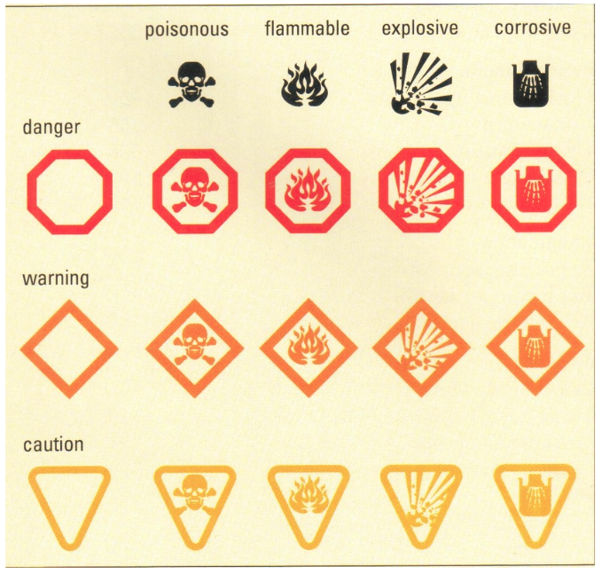
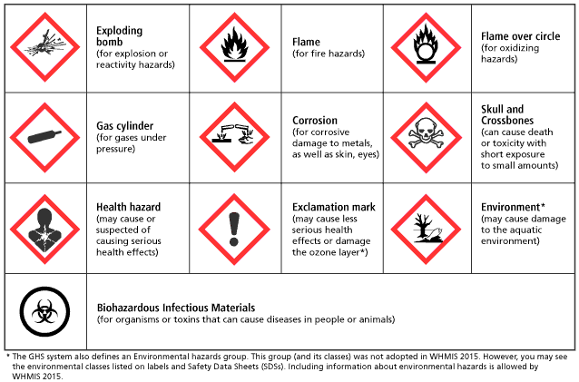
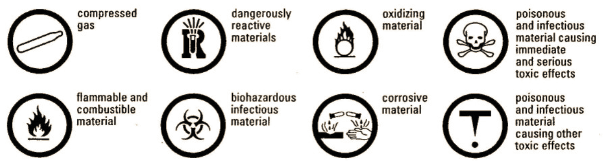
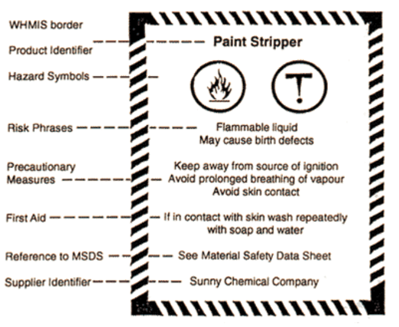
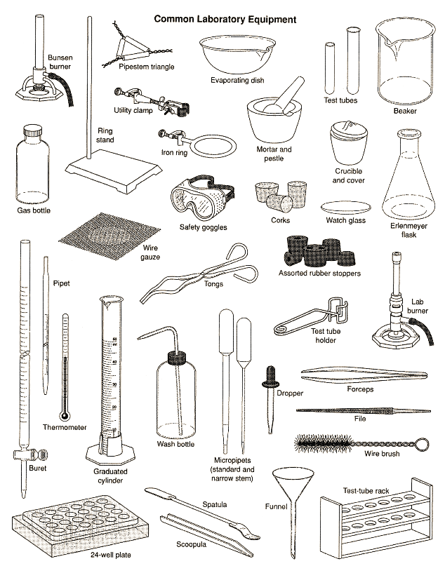
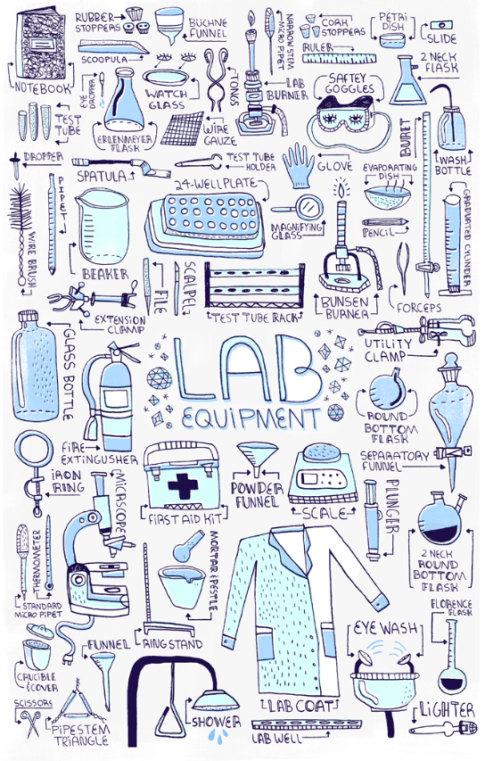

# Safety

## HHPS Symbols

## GHS Symbols

## WHMIS Symbols & Labels

## Lab Equipment Images

## Safety Rules (written shortly)

### Student Responsibilities

1. act responsibly, follow written / spoken instructions
2. read lab procedure before starting lab; *ask teacher for clarifications*
3. inform teacher of any allergies
4. learn location of safety equip.
5. report broken glass to teacher; dispose pieces as directed by teacher w/ care
6. make sure chemical containers are properly labelled
7. don’t enter chemical storage room unless said by the teacher
8. don’t take chemicals out of lab
9. treat preserved specimens with respect; dispose as directed by teacher
10. let teacher know of any injury, accident, or emergency *(severity does not matter)*

### Personal Safety

1. always wear PPE, especially safety goggles (others include: safety gloves)
2. stand up when working w/ chems. or dangerous stuff, to move out of way
3. secure long hair, loose clothing, and jewelry
4. wear a lab apron, coat or proper clothing when working with chems. or bio. stuff
    1. also wear closed-toe shoes
5. carry scalpels and blades pointed downwards
    1. don’t replace blades, teacher replaces them
6. use laser only under direct teacher supervision, only use low-power (class 2)
    1. make sure beam doesn’t go into anyone’s eyes (via direct, reflection)
7. don’t look directly at the sun (even w/ device)
8. don’t taste a chemical
    1. keep hands away from rest of body during exp.
    2. no food, gum, drinks in the lab

### Lab Procedures

1. only teachers should insert glass tubing into rubber stoppers
2. never work in lab w/o teacher supervision
3. keep work area and lab clean, neat and tidy
4. clean up spills immediately
    1. if chemical spill on skin or clothing, rinse affected area w/ lots of water
    2. if chemical go in eyes, wash eyes immed. for at least 10-15 mins or until pro. assistance is reached
5. treat burns immediately by washing them for at least 15 mins
6. use appropriate apparatus by teacher when pipetting, never pipette by mouth
7. don’t smell chem. unless instructed, then only use “hand-waving” method
8. unplug by pulling on plug, not cord
    1. don’t touch electrical stuff with wet/damp hands
    2. don’t let cords hang over edge of table/counter/desk, where someone could trip
9. don’t use broken/cracked glassware, never bring hot glassware in contact w/ cold surfaces
    1. place broken glassware in “Broken Glassware” container
10. follow all proper instructions when using Bunsen Burner
    1. never put anything on flame except for ones instructed
    2. never leave lit burner unattended
11. make sure retort stands holding hot liquids are firmly assembled and on level surface
12. don’t place hot items on surfaces directly, put them on insulating pad
13. read all labels carefully before using chems.; don’t obtain chems. not instructed
14. use seperate scoopulas for seperate chems.
15. don’t mix chems. other than ones specified
16. replace all container lids immediately after use
17. when heating test tube, point end away from yourself and others; never heat directly from bottom of tube
18. for diluting, always pour acid —> water
19. never return chems. to their original container; dispose them as specified
20. don’t dispose chems. down the drain
21. transport chems. safely using containers of right size and shape
22. stay with experi. until finished
    1. when finished, make sure work area is clean and dry, equip. put away, and wash your hands

## External Sources

- https://www.ccohs.ca/oshanswers/chemicals/whmis_ghs/pictograms.html