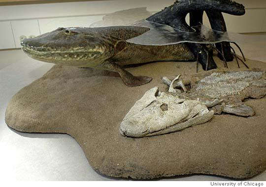
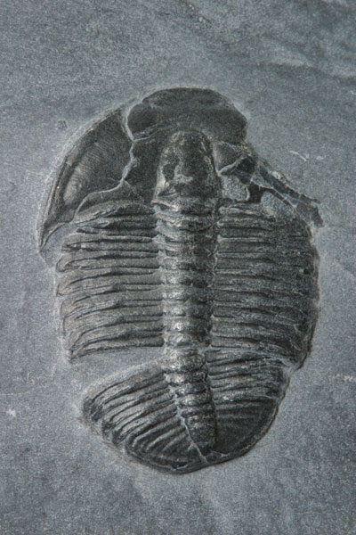
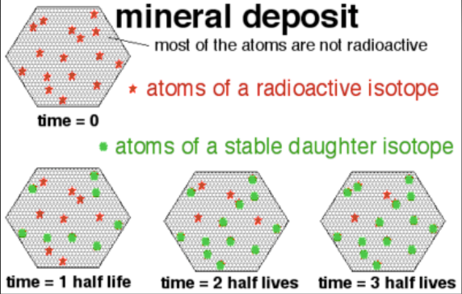

# C1.1 - Evolutionary Theory

## Evolutionary Theory

*Image of Tiktalik, fish-like organism found in Northern Canada*

- All life forms are fundamentally similar at a cellular and molecular level
- Evolution explains life history on Earth
- *Evolution* is the process where organisms change over time
- **evolution:** theory that all species are descendants of ancient species differing from modern-day species

### Theory vs. Hypothesis

- **theory:** set of statements that explain a group or phenonema
- **hypothesis:** suggested explanation of observations, that can be tested by further research or experiments

## Early Theories

- Acceptance of evolutionary theory not universal
- Geological time not understood
- Archbishop James Ussher through the Bible, Torah, and other religious books researched age of Earth
- Ussher's age of Earth: 4004 BCE &mdash; Earth is 6,000 years old
- Living things thought to be immutable (unchanging)

### History of Geological Theories

- Humans are the only species to know their times are limited
  - Driven humans to find an escape to death
- Religion offers time w/o end, place to go after death
- Christians are told they're immortal, death is a phase
- Around 1650, James Ussher using religious books like the Bible, Genesis and the Torah determines beginning of time: 4004 BCE
- **James Hutton** challenged 6000-year-old history by looking at geological evidence
  - i.e. the Grand Canyon in Arizona &mdash; Colorado river flows btwn. 2 states
  - River digs canyon 1 ft. deep / 1000 years through erosion
  - est. 5.5 million years to make canyon
  - Erosion revealed layer of time, layer deposited 1 in. / 1000 yrs
  - 6 in. of canyon = 6000 years
  - Hutton realized that Earth is older than 5.5 million years

## Theories Leading to Evolutionary Theory

### Uniformitarianism &mdash; James Hutton

- **uniformitarianism:** theory that states the Earth was formed entirely through slow-moving processes like erosion and sedimentation, and that these processes continue to shape the Earth today
- Proposed by ***James Hutton***, Scottish geologist
- Molten material is forced up to Earth's surface to form rock
- Rock is then eroded away
- Sediment from erosion washed into the sea and eventually compacts to form sedimentary rock
- **erosion:** removal of surface material (i.e. rocks) through natural forces (i.e. water, wind)
- **sedimentation:** accumulation or depositon of sediments (small fragments) that compact to form a new structure

### ***Principles of Geology*** &mdash; Charles Lyell

- Written by ***Charles Lyell***, English geologist
- Popularized and expanded on Hutton's theory of uniformitarianism
- Found more evidence to support that rocks were formed through slow-moving processes

### Use and Disuse Theory &mdash; Jean-Baptiste Lamarck *+ adaptation*

- **adaptation:** inherited characteristic that improves an organism's ability to survive and reproduce in a particular environment
- Proposed by ***Jean-Baptiste Lamarck***, French naturalist around the 1800s

**GUIDING IDEAS**

1. By using or not using certain body parts, an organism develops certain traits
   1. i.e. giraffes developed long necks because they needed to reach food in tall trees
2. *inheritance of acquired characteristics:* Enhanced developed characteristics will be passed down to that species's offspring
3. *tendency toward perfection:* Organisms continuously change and acquire features in order to be more successful in their environments

**Theory Proven False**

- Acquired characteristic would somehow have to change the DNA of specific genes in order to be inherited
- **NO** evidence of this happening
- Important in analyzing role of environment and explaining evolution as a process of environmental adaption

### *Histoire naturelle, générale et particulière* &mdash; Georges-Louis Leclerc, count de Buffon

- Buffon did comprehensive work on natural history through his book *Histoire naturelle, générale et particulière* (1749-1804)
- Produced an account of the whole of nature
- First modern attempt to systematically present all existing knowledge on natural history, geology and anthropology in one book

## Evidence

- Earth is old (~4 bil years old), made from destroyed stars
- Radiometric dating, caused by energy/particles being given off by nuclei (radiation)
  - Akasta, NWT &mdash; 4 billion year old rock escaped being recycle
- Analysis of fossil record
  - **fossil:** when bone or tissue turn into rock
  - Leonardo DaVinci lived in Tuscany and walked in Italian moutain ranges
  - Found seashell fossils in mountain ranges
  - Evidence for tectonic plate movement &mdash; they push and make the land rise
- **Vestigial organs:** organs that had a use in the past but not anyomore
  - i.e. goosebumps or appendix [questionable] in humans
- **Comparative Development**
  - **Embryology:** study of development
  - All vertabrates have a stage where pharyngenal pouches appear on the side of the throat
- Geographic distribution of species
  - How did frogs get from Africa to South America if they die in salt water?
- Chromosomal analysis
  - Chimpansees have 47 chromosones while we have 46
- Molecular analysis and biology
  - Chemical processes of cells are similar or the same
  - Amino acids that differ in human and gorilla hemoglobin is only 1 in a chain of 146 acids

### Specific Examples

- **Changes in Beak Shape**
  - In medium ground finches, beak size increases during dry years
  - In "wet" years, beak size decreases for abundant vegetation
- **Antibiotic Resistance in Bacteria**
  - Tubercolosis (TB) bacteria was treated using an antibiotic (drug) called Streptomycin, developed in the 1940s
  - 1970s: TB almost completely wiped out
  - 2006: Outbreak of extremely resistant strain of TB in KwaZulu-Natal, South Africa
  - 2009: WHO reports that 1/3 of world population has TB
  - Some TB bacteria developed resistance to their antibiotics and they survived
  - These antibiotic-resistant bacteria reproduced and spread

## Geographic Distribution of Species

### Closely Related but Different

- Finches that Darwin found were all descendants of a single ancestral species from South American mainland
- Finches became geographically isolated and developed characteristics best suited for their particular environment
  - i.e. beak shape and size

### Distantly Related but Similar

Similar selection pressures of species in geographically diff. areas forced them to develop similar traits

## Fossil Record

*Image of a fossil*

- **fossil:** preserved remains of organisms turned into minerals
- Organisms die and become trapped in sediments
- Fossilization is very rare; requires water and no disturbance
- Fossil record is incomplete

## Types of Fossils

- **body fossil:** fossil that preserves the remains of a former organism
- **molds:** imprint left by remains of organism in rock/clay
  - **external mold:** mold outside of remains
  - **internal mold:** mold inside of remains
- **cast fossil:** replica of an organism formed by molds
- **trace fossil:** fossil that preserves the activities of a former organism
  - i.e. dinosaur footprints, ancient worm burrows

## Palaeontology &mdash; Georges Cuvier

- **palaeontology:** study of fossils
- Shallower depositos reveal organisms most similar to those alive today
- Relative age of fossils determined by French zoologist ***Georges Cuvier***
  - Wrote *Tableau élémentaire de l’histoire naturelle des animaux* in 1797
  - *Leçons d’anatomie comparée* (1800-05)
  - Disagreed w/ viewpoints of Lamarck
- Catastrophism responsible for extinction events

## Radioactive Decay

- Allows absolute age of rock to be determined
- Ratiometric dating used to measure amount of daughter isotope in sample
- Decay constant over time
- Carbon-14 testing used for more recent organic remains

## Beginnings of Evolutionary Thinking

- James Hutton proposes that geological change occurs over long period of time
- Charles Lyell writes *Principles of Geology*
- **uniformitarianism** states that Earth continues to change through gradual, uniform processes

## Sources

- Mr. C. Jones
- BiologySource 11
- https://www.britannica.com/science/erosion-geology
- https://www.britannica.com/science/erosion-geology
- https://www.youtube.com/watch?v=9pDaBQnFLTM
- https://www.britannica.com/biography/Georges-Cuvier
- https://www.britannica.com/biography/Georges-Louis-Leclerc-comte-de-Buffon
- https://samnoblemuseum.ou.edu/common-fossils-of-oklahoma/how-to-become-a-fossil/different-kinds-of-fossils/