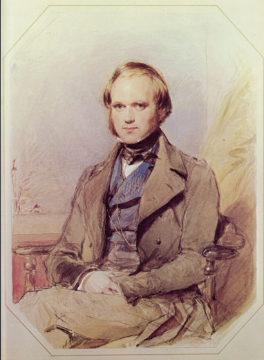
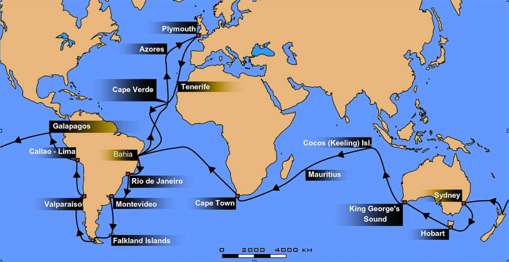
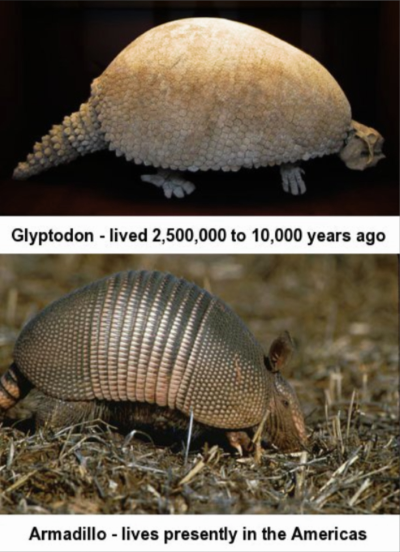
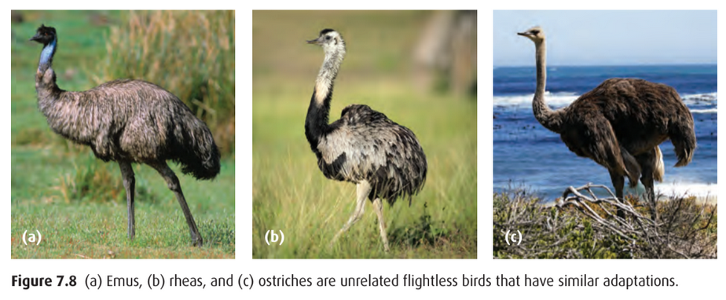
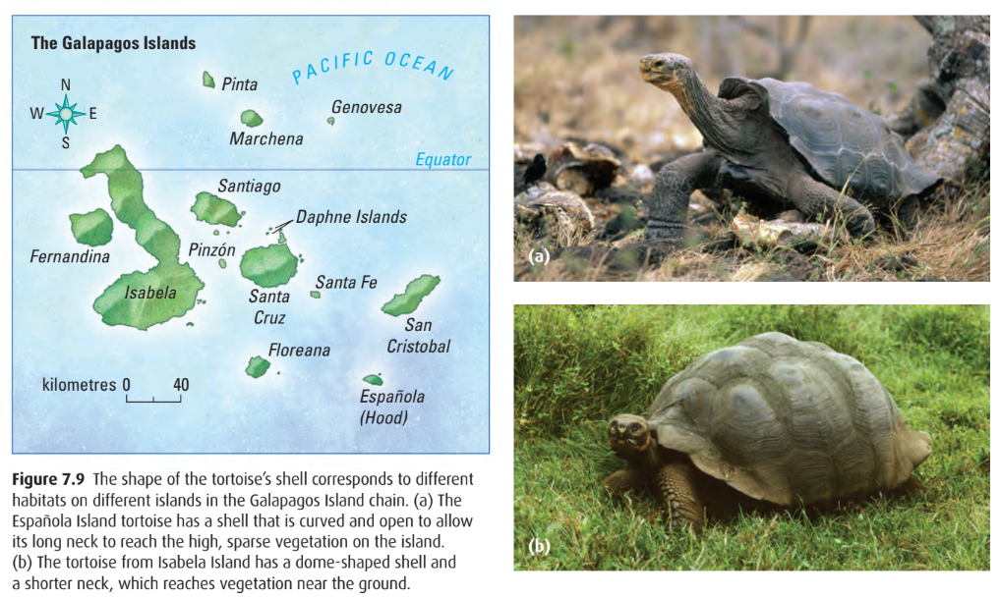
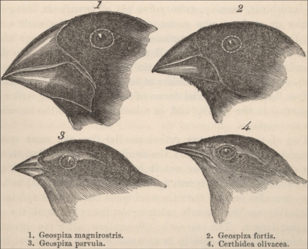
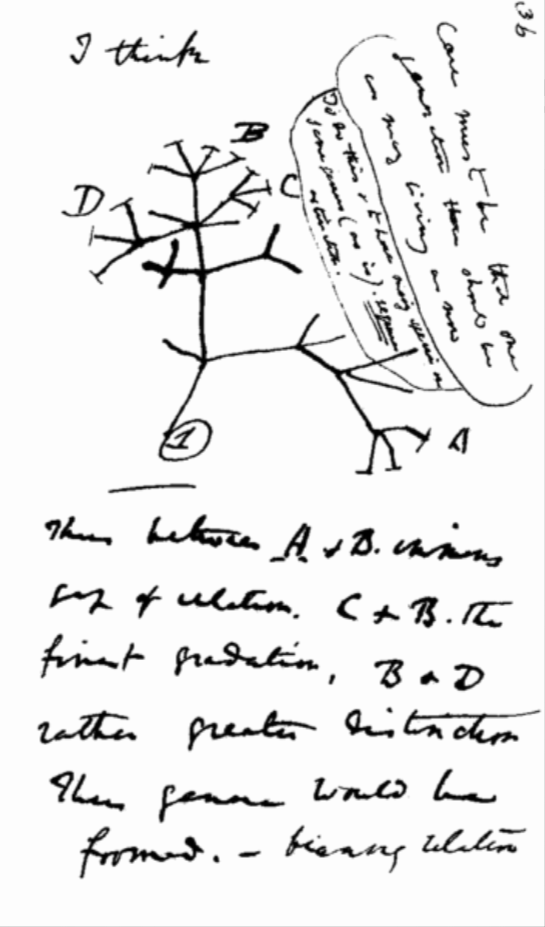
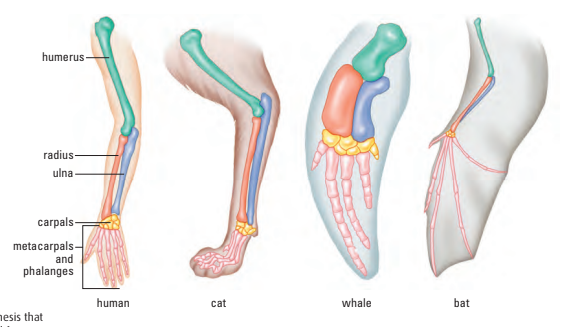
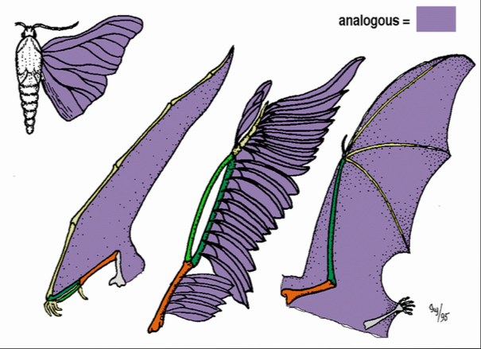
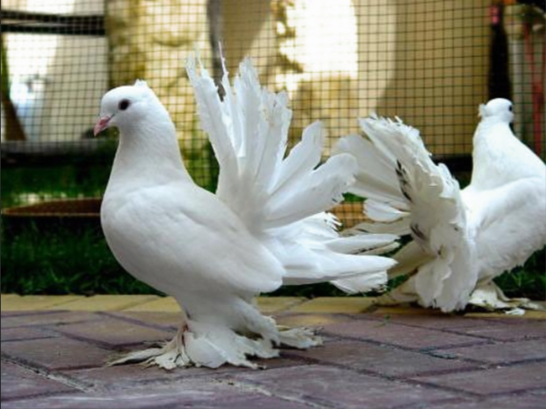

# C1.2 - Darwin

## About Darwin

- Born 1809 in Shropshire, England
- Son of local doctor and Wedgwood (rich family) heiress
- Tried to study medicine and become a priest but...
- ...found natural world more interesting
- Befriends leading naturalists
- Learns how to collect and preserve specimens
- Rich, didn't have to work, rented out property

## Voyage of the HMS Beagle

- Done on a **frigate**: fast, small warship
- Darwin offered job of ship's naturalist
- 5 year trip around the world
- Captain of Beagle: Robert Fitzroy (father of meterology)
- Darwin brought Lyell's *Principles of Geology*
- Journey showed difficulty on relying on Bible as unerring (errorless)

## Findings from the Voyage

- Collected 1000s of speciments
- Collected fossils that resembled existing animals
- Vocanic Galpagos Islands had species similar to South American natives
- Species differed from island to island

### Geological Change Theory

- Darwin read Lyell's *Principles of Geology*
- Personally experienced earthquake while doing field studies in the Andes Mountains of Chile
- Collected fossils of ocean organisms high up in the Andes
- Reasoned that *earthquakes* had gradually lifted the rock containing marine fossils above sea floor

## 3 Patterns in Diversity

### Species Vary Globally

- Distantly related species living in similar habitats across the world acted in similar ways
  - i.e. flightless birds: rheas (South America), emus (Australia), ostriches (Africa)
  - These species live in grasslands
- Some areas have unique organisms not found anywhere else in world
  - i.e. Australia is exclusive home of kangaroos and other marsupials
  - **marsupial:** pouched animals
- Species are distinct from other species in different area
  - i.e. tropical South American lizard more similar to desert S.A. lizard than tropical African lizard

### Species Vary Locally

- Related species in different habitats of a local environment had different traits
- Most obvious on islands like the Galapagos Islands
  - Islands rising farther above sea level have greater rainfall, like Isabela Island
  - Tortoises in Isabela Island have short necks to reach sparse vegetation on the ground
  - Española Island tortoises have long necks to reach vegetation above ground

### Species Vary Over Time

- Fossils discovered of ancient species
- Fossils found by Darwin uniquely South American; some were giant versions of present-day animals
  - i.e. Glyptodon evolved to become smaller that resulted in the present-day armadillo

## Darwin's Finches &mdash; Patterns in Diversity

1. Large beak to crack hard to open nuts
2. Smaller beak to crack small nuts or seeds
3. Even smaller beak for small seeds or insects
4. Tiny beak to eat insects and bugs

- Collected on the Galapagos
- Beaks changed to suit food source
- Descended from mainland ancestor
- Different species found on separate islands
- New species branch out from old ones

## Darwin's Early Tree of Life

## Comparative Anatomy: Homologous and Analogous Structures

- **homolgous structures:** similar structures found in different organisms that share a common origin
  - share a more recent common ancestor
  - i.e. forelimbs of vertabrates like human hand and whale flipper
- **analogous structures:** different structures that perform the same function
  - does not share similar origin or structure
  - i.e. bird and bee wing

*Homologous*

*Analogous*

## Vestigial Structures

- Rudimentary non-functioning structures that are present in reduced form
- Had importance in the past
- Changing environ. no longer favours selection
- i.e. whale pelvis, appendix (questionable)

## Artificial Selection

*Dove, variant of pigeon that won't be favoured in the wild*

- Darwin searches for examples of selection pressures among domestic animals
- Artificial selection breeds pigeons (or other animals) for certain traits
- Selected traits can be bred in relatively few generations
- Environment providces selection pressure in the wild

Dove is white, has easy to see fantail, and its feathery tail can pick up droppings and cause infections.

## Struggle for Survival / Existance + Malthus's *Essay on the Principle of Population*

*Questionable:* Also known as: "survival of the fittest" :question:

- Based on Thomas Malthus's *Essay on the Principle of Population*
  - more individuals are born than the environment can handle
  - population grows faster than the rate at which food and supplies can be produced
  - human suffering due to humans' potential to grow
  - too many people and too few resources lead to war, famine, and disease
- Organisms produce more offspring than are able to survive
- Favourable variations tend to be preserved
- Unfabourable variations die out

## Natural Selection, Descent with Modification, and Survival of the Fittest

- **descent with modification:** species accumulated different adaptations and passed these on to better suit their environment
  - a.k.a. "evolution"
  - natural selection is also called "evolution"
- **fitness:** an indiviudal's ability to survive and reproduce in its specific environment
- **survival of the fittest:** individuals with adaptations that increase their fitness survive and pass on their genes to future gens.
- **Darwin works on his theory**
  - Darwin works meticulously for years to build a case for his theory
  - Publishes *On the Origin of Species* in 1859
  - Individuals vary in population
  - Favourable variations result in traits being passed on
  - Survival is not random
  - Sheer weight of Darwin's evidence made theory hard to counter
- Misconceptions
  - Natural selection does not select traits that are "better"
  - Natural selection has no goal
  - The adaptation that works best in the specific environment is favoured

## Sources

- Mr. C. Jones
- BiologySource 11