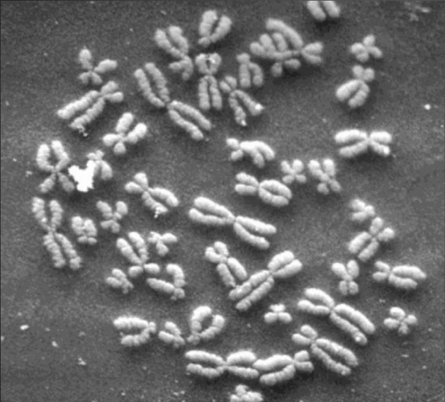
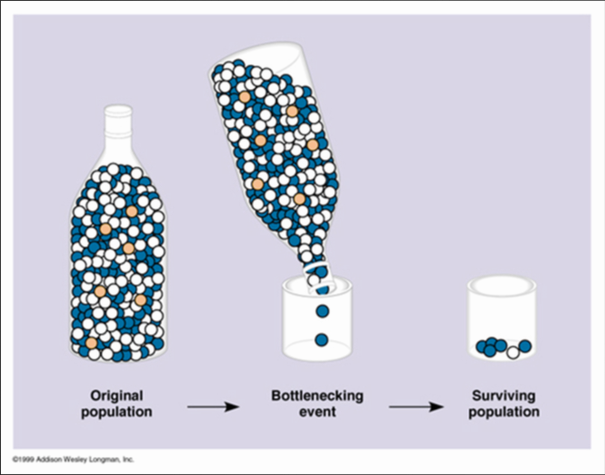
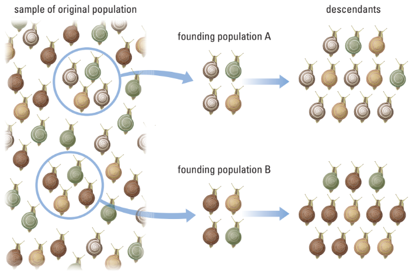
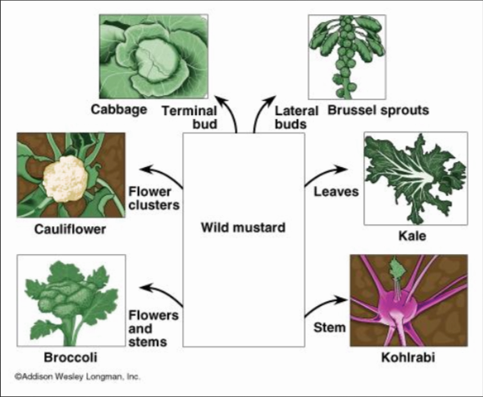
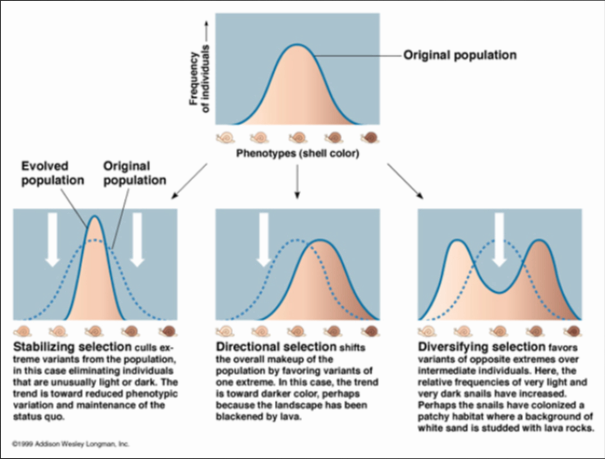
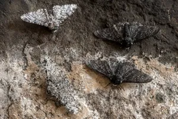

# C1.3 - Genetic Variation and Microevolution

## Modern Synthesis

*Image of Chromosomes of DNA*

- Darwin had no concept of actual mechanism of inheritance
- Genetics later integrated into evolutionary theory
- Called "modern synthesis"
- Organisms vary in # of genes
- Sexual reproduction increases variation
- Variation is a good thing, species more resistant to changes / diseases

## Microevolution and Macroevolution

- **microevolution:** evolutionary changes that occur within a species
- **macroevolution:** evolutionary changes that result in a new species forming

## Mutation

- Source of new alleles
- **allele:** genetic trait
- May be neutral, harmful or beneficial
- Affects fitness of individual
- Harmful mutations usually result in death of gamete
- **gamete:** sex cell / sperm or egg

## Gene Pool and Variation

- **gene pool:** the "reservoir" (current gen.) from which future generations draw their genes from
- Sources of Varaition: mutations and sexual selection
- **Hardy-Weingberg Equilibrium:** populations that do not undergo changes to their gene pools &mdash; 5 conditions:
  1. random mating
  2. large population
  3. no movement in and out of population
  4. no mutations
  5. no natural selection
  
## Genetic Drift (Mechanism of Microevolution)

- **genetic drift:** changes to genetics in small populations
- **bottleneck effect:** catastrophe that dramatically reduces a population
- **founder effect:** individuals leaving a population to establish a new one
- Genes flow between populations during migration

*Bottleneck Effect*

*Founder Effect*

## Phenotypes and Effects of Selection

*Variations / phenotypes of wild mustard*

- **phenotype:** how organism (traits) appear
- Mutations provide variations in traits selected by outside influences
- Natural selection acts on individual phenotypes that are passed on to subsequent generations
- Variable environments favour multiple phenotypes

## Types of Selection &mdash; Mechanisms of Microevolution

### Bell Curves

**bell curve:** frequency compared to any variable

*Bell Curves of Selection*

### Stabilizing Selection

- **stabilizing selection:** selection against individuals exhibiting variation in a trait that deviates from the current average
- Most common form of selection
- Phenotype extremes are select against
- i.e. human birth weights
  - Small babies have less fat (more cold) and take longer to breastfeed
  - Big babies have trouble coming out
  - Humans have trouble coming out of womb than quadropeds (4-legged)
  - Mother has small pelvis and the head has to go out first

### Directional Selection

*Direction selection of dark phenotype of peppered moth during industrial revolution*

Peppered moth used to be lighter in colour, but shifted to darker colours after industrial revolution started polluting the environment with coal dust.

- **directional selection:** selection that favours an increase or decrease in a phenotypic trait
- Follows dramatic change in environment
  - i.e. migration, climate change, pollution
- Individuals at one extreme are more successful in future generations

#### Pesticide Resistance

- A lot of bugs that eat our crops are killed using pesticides (bottleneck event)
- Some bugs however have a mutation making them resistant to the pesticide
- These mutated bugs reproduce and grow
- Pesticide is no longer effective

### Disruptive Selection

- **disruptive selection:** selection that favours 2+ variations that differs from the population average
- Usually at the 2 extremes of a trait
- Environmental change produces two distinct food sources
- i.e. hummingbird bill length
  - 1 species hummingbird in Ontario
  - 2 species hummingbird in Canada
  - some hummingbirds prioritize short flower tubes and others prioritize long flower tubes
  - the average struggles at either

### Other Mechanisms of Microevolution

- sexual selection
- genetic drift
- artificial selection
- **gene flow:** exchange of genes w/ another population

## Types of Selection, Part II

### Reproduction Terminology

- **polygamy:** dominate male w/ subordinate females (common)
- **polyandry:** dominate female w/ subordinate males (rare)
- **monogamy:** paried relationships
  - i.e. Royal Albatross, partners take turns w/ responsibilities and taking care of children
- **sexual dimorphism:** physical differences between sexes

### Sexual Selection &mdash; Mechanicsm of Microevolution

- **sexual selection:** selection that favours any trait that most partners deem valuable
- Continued selection resulted in sexual dimorphism
- Female mates best choice from male competition
  - i.e. peacock tails, fiddler crab claws
- Females have the most to lose from a bad mate
  - Have to raise a child w/ less favourable genes

### Cumulative Selection

- **"The blind watchmaker" theory:** Complex structures are so complex that if one structure is removed, whole structure breaks. That means an "invisible maker" had to have designed these structures.
  - evolutionary theory has more evidence
- **cumulative selection:** evolution of complex features
- Mutations are result of chance, natural selection is not
- Accumulation of favourable mutations result in complex structures like the eye

#### Evolution of the Eye

- At the beginning, eyes could only detect brightness of light
- Over time, more complex structures formed
- Pinhole formed to focus light
- Pinhole gets covered by translucent/transparent structures that acts as a *lens*
- Muscles formed in eye to focus lens on desired object

### Adaptation of Existing Structures into New Ones

- Existing structures are repurposed to fulfill different tasks
- i.e. exoskeleton of a reef lobster protects from predators...
- ... but exoskeleton of scorpion helps it resist water loss and support itself on dry land
- i.e. penguins use their wings not to fly, but to swim rapidly in water

## Altruism

- **altruism:** selfless concern for the well-being of others
- One organism benefits from another's behaviour to their detriment
- *detriment:* to lose smth.
- Species help other species because they indirectly pass their genes on
  - Better treatment to others returns back to improve the fitness of an animal group as a whole
- Examples of altruism
  - insect colonies like bees
  - birds
  - monkeys (grooming)
  - humans
- Kin selection increases chance of genes being passed on 

## Sources

- Mr. C. Jones
- BiologySource 11
- https://www.britannica.com/animal/peppered-moth
- https://en.wikipedia.org/wiki/Altruism
- https://www.youtube.com/watch?v=4SXHMm5I-68