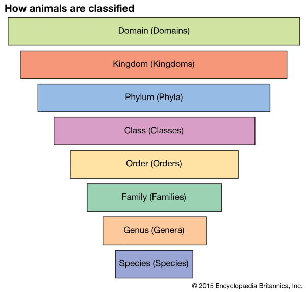
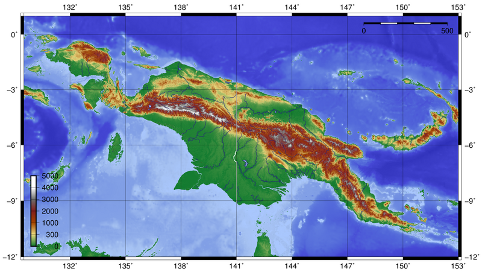
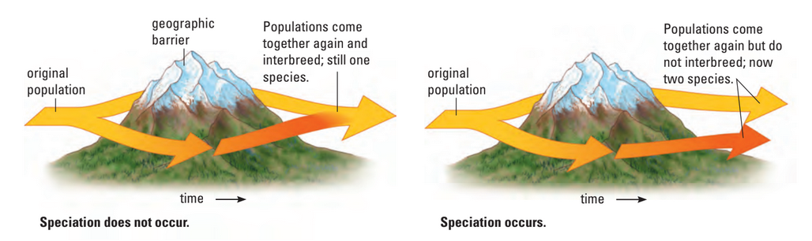

# C1.4 - Speciation

## What is a species?

- **species:** members of a population that can interbreed and produce viable offspring
  - known as the ***biologocial species concept***
  - *limitation:* does not include asexually reproductive species or fossils
- Reproductively isolated
- No gene flow through different species
- Species differentiated by appearance or morphology
- **morphology:** change in form
- **genus:** a "clan name" for living things, what group a species belongs to

### Taxonomy of Life

In order: domain, kingdom, phlyum, class, order, family, genus, species

## Binomial Nomenclature of Life

- Designed by Carolus Linnaeus [Latinized name] (1707-78), Swedish botanist
- *botanist:* person who studies plants
- **binomial nomenclature:** naming system (of life) involving two names
- **THE NAMING SYSTEM**
  - *Genus species*
  - i.e. *Homo sapien*
- Puts species w/ most similarities closest together
- Linnaeus's first book had 12 pages
- 12th ed: 1,500 pages

## Speciation + Hybrids

- **speciation:** evolutionary formation of new species
- **microevolution:** evolutionary changes that occur within a species
- **macroevolution:** evolutionary changes taht result in a new species formation
- **hybrid:** offspring that results from mating of individuals from two different species

## Reproductive Isolating Mechanisms

- Speciation is a result of reproductive isolation
- Prevents individuals from different (or same, but separated) species from mating together
- **Prezygotic mechanisms** prevent fertilization
- **Postzygotic mechanisms** prevent zygote from becoming a healthy or fertile adult
- **zygote:** the individual that forms when sperm cell meets egg cell
- **fertility:** ability to produce healthy offspring

### Ecological / Geographic Isolation

- **ecological / geographic isolation:** species occupying seperate habitats or niches
- Usually seperated by dramatic barriers to travel
- Species do not encounter one another and can't mate together
  - i.e. rodent populations at diff. altitudes, or species seperated by mountain range

*New Guinea topology, central red line is the mountain range, New Guinea Highlands*

*Speciation diagram*

### Habitat Isolation

- **habitat isolation:** similar species reproductively isolated due to adapting to habitats in the same general location
- Examples
  - 2 species of three-spined stickleback fish in B.C. lakes: one lives off of snails at seafloor whereas others feed off plankton near the surface
  - 2 species of garter snake: one lives on land, other lives on water
  - 2 species of oak tree: one grows in sandy soil, but other grows in loamy soil

### Temporal Isolation

- **temporal isolation:** isolation that occurs when reproductive cycles occur at different times
- Reproductive cycles occur at different times
- Species overlap geographically but flowering time or mating seasons do not
  - i.e. certain cacti flower at night, others at daytime

### Mechanical Isolation

- **mechanical isolation:** isolation from structural / physical incompatibilities of reproductive or sexual organs
- Structural differences in reproductive organs
- **arthropod:** phlyum of invertabrates w/ jointed exoskeletons
  - includes insects, crustaceans, arachnids
- Arthropod penis shape prevents mating between closely related species
- Orchids are adapted to specific pollinators, preventing species cross-pollination

### Other Forms of Isolation

- **behavioural isolation:** isolation when species have different relationship or mating behaviours
  - i.e. Eastern and western meadowhawks are seperate species because they have different relationship rituals, including songs to attract mates
- **gametic isolation:** isolation when sperm and eggs of different species are unable to recognize / incompatible with each other
- **hybrid inviability:** hybrid produced is unhealthy, underdeveloped, and/or weak
- **hybrid infertility:** hybrid produced is healthy, but cannot reproduce

## Hybrids

- **hybrid:** offspring of gentically dissimilar parents
- Postzygotic isolation
- Hybrid zygote may develop into a healthy adult
- Offspring usually sterile
- i.e. mule
- In plants, hybrid vigor may result
- **hybrid vigor:** when hybrid plant produces larger flowers or fruits

## Effect of Human Activities

- Humans introduced new non-native predators while exploring new places
- Non-native predators kill off a lot of native species
- Some species mistake human pollution for food or get stuck in human activities like fishing nets or plastic bags
- Examples of endangered species
  - kakapo, flightless parrot, endangered due to pets and livestock, easy prey
  - leatherback turtle, get caught in fishing equipment, eat plastic bags thinking they are jellyfish, and they and eggs are hunted in breeding grounds in Central / South America

## Parapatric Speciation

- Parent species occupies a continous habitat within same geographical area
- Population enters a new niche and becomes reproductively isolated
- Two populations live side by side or continously
- i.e. Two species of frogs live on wetlands and drylands. Over time, they adapt to their environment and can't interbreed

## Ring Species

- Form of parapatric speciation
- Connected series of neighbouring populations that can interbreed
- However, two end populations are so different that they can't interbreed anymore

## Sources

- Mr. C. Jones
- BiologySource 11
- https://www.britannica.com/science/taxonomy