# C1.5 - History of Life and Modern Additions to Evolution

*PART I: History of Life*
---

## The Early Earth

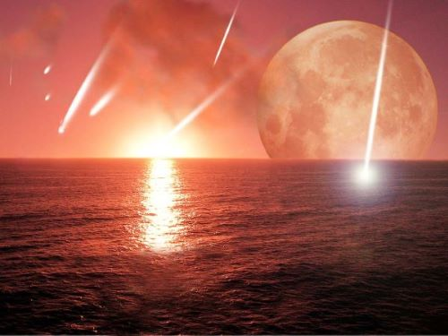

- Characterized by extreme heat, high UV, radio and electrical activity
- Primitive atmosphere contained nitrogen (N2), carbon dioxide (CO2), carbon monoxide (CO), ammonia (NH3), methane (CH3)
- Asteroid impacts common
- Surface gradually cools, water vapour condenses forming oceans

## Miller-Urey Experiment

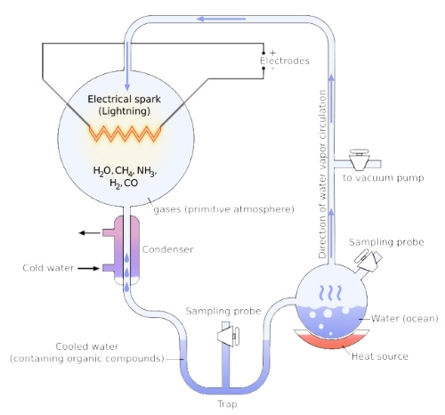

- First life forms arose by **primary abiogenesis theory**
- **primary abiogenesis theory:** theory where life arose from no life
- Complex organic molecules form spontaneously
- **organic molecules:** molecules that contain carbon
- Miller-Urey experiment recreated early atmosphere
- Sugars, amino acids, and nitrogenous bases created (building blocks of life)
- **Thermal proteinoids:** protein-like molecules formed abiotically from amino acids

## The Oldest Fossils

- 400 my after Earth's formation: Earth's crust begins to cool and solidify
- 3.5 bya: life on Earth confirmed
- **stromatolites:** layered rocks that form when certain [[c2.2-kingdoms-bacteria|prokaryotes]] bind thin layers of sediment together
- perhaps life in simpler forms began 3.9 bya

## Protocells

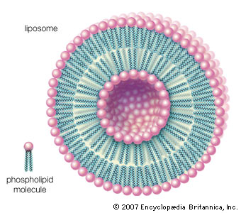

- All living things composed of cells
- Compartmentalization necessary
- ***liposomes:*** lipid membrane
- Lipid membranes form spontaneously
- Membranes may act as semi-permeable barriers

## Early Life

- RNA world? No DNA?
- Oldest fossils 3.5B yrs. old
- Oldest life perhaps may have formed in deep sea hydrothermal vents
- Cyanobacteria-like organisms (blue-green)
- Anaerobic and chemoautotrophs
- **anaerobic:** can break down glucose to energy w/o oxygen
- **chemoautotroph:** makes own energy through chemical reactions
	- believed that oldest fossilzed prokaryotes evovled from them
- Eukaryotic cells (complex cells w/ nucleus) arise through *endosymbiosis*
- **endosymbiosis:** organism that lives within body/cells of another organism

## Endosymbiotic Theory

- **eukaryotes:** cells w/ membrane-bound organelles, nuclei, and complex organelles like mitochondria
- Infolding of membrane formed endoplasmic reticulum and nucleus
- **heterotroph:** organism that ingests organic carbon to produce energy
- Consumption of heterotrophic cell formed mitochondria
- Consumption of photosynthetic cell formed chloroplasts in plants

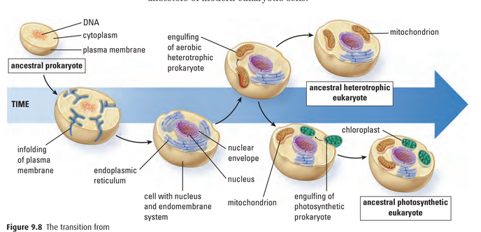

## The Cambrian Explosion

- Multicellular organisms arise 750 mya
- 565 mya: Animal kingdom undergoes dramatic increase in diversity
- All major animal groups arise in Cambrian explosion
- Early animals preserved in *Burgess Shale*

*Cambrian Explosion illustration*

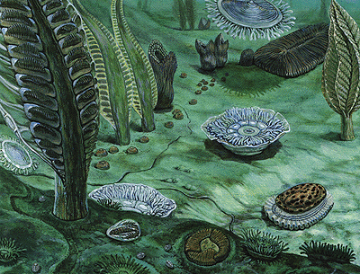

*Burgess Shale*

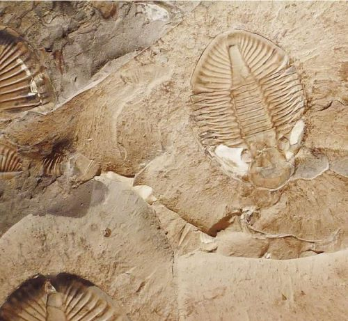

## Extinction Events

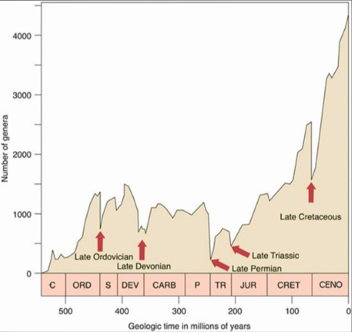

- Geological time divided into *5 **eras***, subdivided into ***periods*** and ***epochs***
- **mass extinction:** brief episodes of great species loss 
- 5 major extinction events
- 65 mya: Cretaceous extinction ends the age of dinosaurs and gives rise to mammals
	- meteor strike near land mass that became Yucatan Peninsula, Mexico
	- polluted sky w/ debris for months
	- dinosaurs thrived on Earth for 150 my
	- all dinos gone, except those that evolved into birds
- end of Permian period
	- 90% of marine animals lost
- **pseudoextinction:** the species never went extinct, they just evolved
- positive side: adaptive radiation of survivors forming new biodiversity
- 6th great extinction?

## Fossil Record and Geologic Time Scale

- **geologic time scale:** scale that organizes Earth's geological history into distinct blocks of time
- **era:** block of time
- **period:** block formed by dividing era

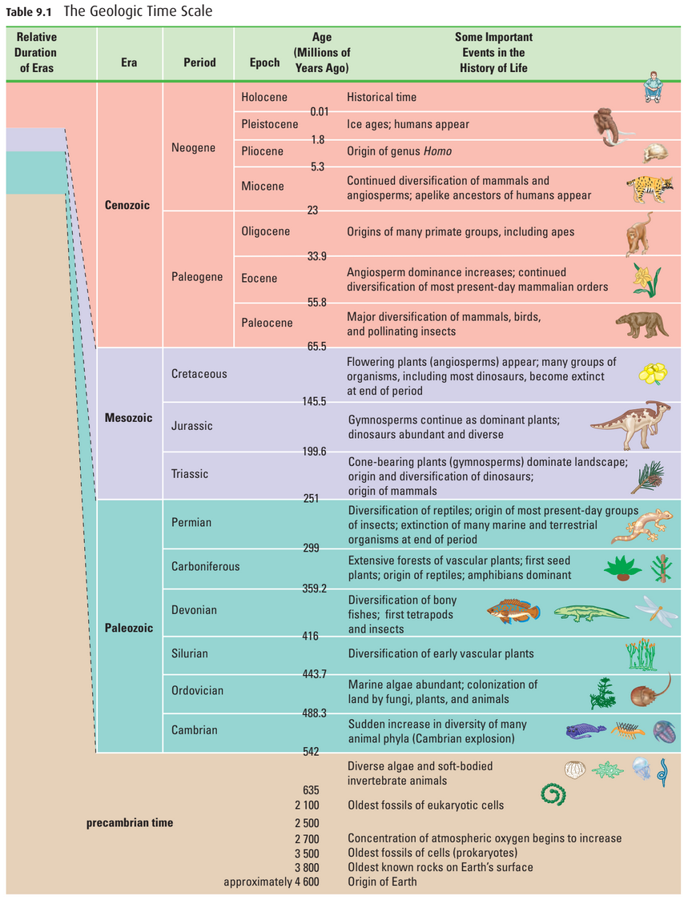

## Continental Drift

- Earth's continents move on plates floating on hot mantle
- **continental drift:** movement of continents
	- N.A. and Europe currently drifting apart ~2 cm/yr.
- solution to many biological puzzles
	- i.e. matching Mesozoic fossils in W. Africa and Brazil
	- same fossil in parts of world separated by 3,000 km of ocean?
	- evidence makes sense if part of one land mass during that time
	- explains why life on Australia is so diff. from rest of world

### Formation and Breakup of Pangaea

- 250 million years ago, continents formed one landmass called Pangaea ("all land")
- shorelines reduced, sea levels dropped, shallow seas drained
- many marine habitats destroyed
- inland areas became drier with extreme climates
- species that evolved separately were forced to compete
- led to mass extinctions
- 180 million years ago, Pangaea began breaking apart
- continents drifted and became isolated
- species evolved separately on different land masses
- marsupials survived in isolated Australia
- placental mammals dominated other continents
- explains Australia’s unique marsupial diversity

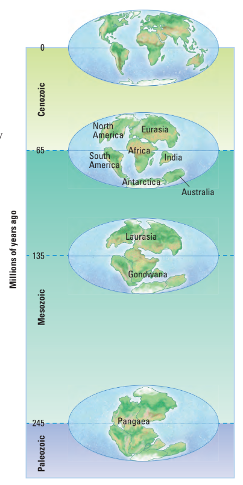

## Phylogeny

#### Please see [[c2.1-diversity-of-life|Diversity of Life]]

## Human Disruption &mdash; Bison Skull Hunting and Processing

Bisons hunted w/ rifles which are accurate and have fairly fast reloads

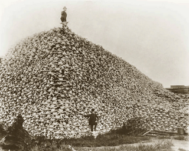

*PART II: Modern Additions to the Evolutionary Theory*
---

## Rate of Evolution

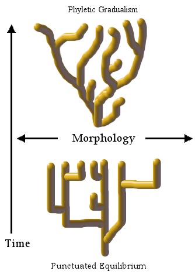

- **gradualism:** evolution of species by gradual accumulation of small genetic changes over a long period of time
  - asserts slow, gradual change
  - small changes accumulate in species over time
  - first developed by Charles Darwin
  - *limitation:* in fossil record, species would arise abruptly, persist in rock for thousands/mil. of years, then disappear suddenly
- **punctuated equilibrium:** species often diverge in sudden bursts of rapid evolutionary change
  - developed in 1972 by paleontologists *Niles Eldridge* and *Stephen Jay Gould*
  - large changes occur rapidly followed by little change
  - term comes from idea that long periods of little evolutionary changes (equilibrium) are broken (punctuated) by shorter bursts of speciation

**FUN FACT:** Okapis and giraffes share the same evolutionary common ancestor

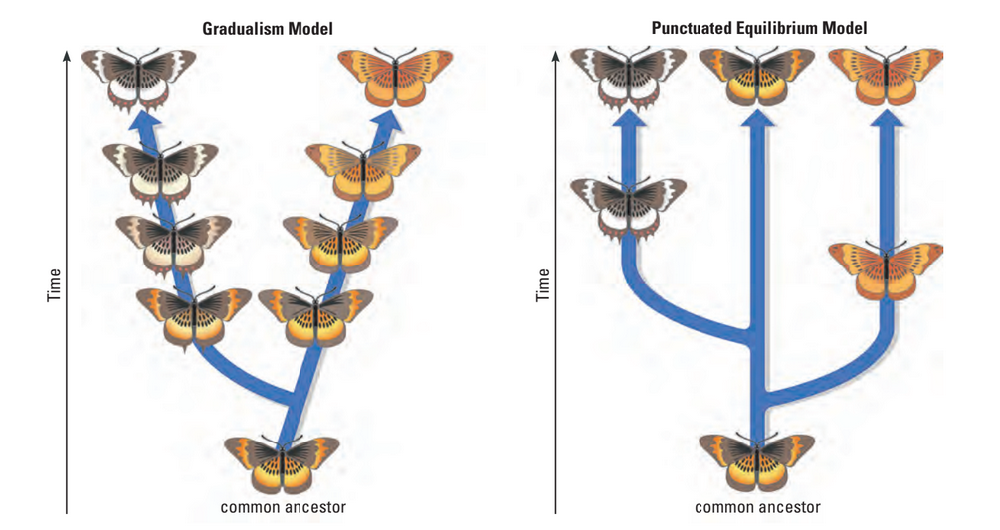

## Divergent and Convergent Evolution

- **divergent evolution:** evolution that creates species diverging in similarity
- **adaptive radiation:** when one species gives rise to many distinct species
  - caused by small founding group colonzing new environment and adapting to its environment over generations
  - the new group changes and loses compatibility with original group
- **convergent evolution:** distantly-related species develop similar adaptations, "analogous structures"

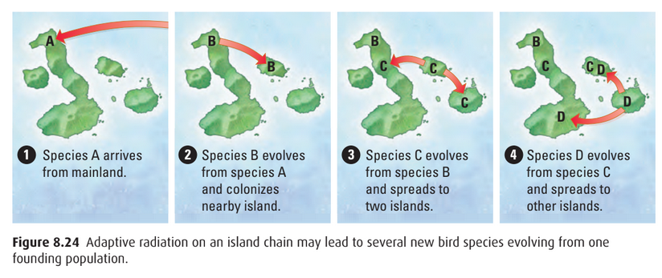

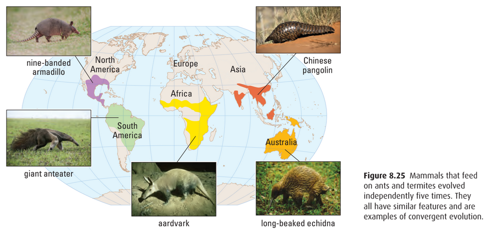

## Co-Evolution and Mimicry

- **co-evolution:** one species evolves in response to another species' evolutionary changes
- **mutualism:** when two species support each other in order to survive
  - i.e. flowers and insects have a mutual relationship w/ each other; insects get food and flowers get pollinated
- Plants evolved toxins to prevent insects from eating them, but insects also evolved to resist these toxins to eat them again
  - i.e. milkweed plants produce toxins, but monarch caterpillar can handle toxins and store them so that they aren't eaten
- **mimicry:** one species evolves to represent another species to gain a survival advantage
  - i.e. hoverfly looks like a wasp, and predators avoid both to avoid a poisonous sting

## Sources

- Mr. C. Jones
- BiologySource 11