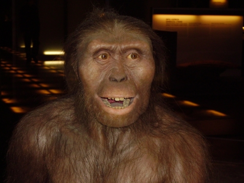

# C1.6 - Human Evolution

## Early Primate Ancestors

- 60 mya: Ancestral mammals develops flattened molars, grasping hands and feet, forward-facing eyes
- **primate:** mammals w/ grasping hands and feet w/ opposable first digits
- Arboreal (tree) adaptations
- Plant diet
- Developed shoulder and hand movements
- Binocular vision

## Primate Phylogeny

- **phylogeny:** study of periodic events in biological life cycles
- Early primates gave rise to 2 distinct lines: prosimians and anthropoids
- **prosimians:** most primitive living species of primates, retains early characteristics of primates
  - species like lemurs and lorises (lush babies)
  - usually dog-sized or smaller
- **anthropoids:** primate species with evolved traits
  - like monkeys, apes, and humans
- Anthropoids branch into old and new world monkeys
- **Hominoids** lack tails, have relatively large brains, use simple tools

## Emergence of the *Hominidae* (upright man)

- Bonobo chimpanzee (*Pan paniscus*) is the closest living relative to humans
- Hominoids appear approx. 4 mya
- **hominid:** humans and all their ancestral species that arose after split from ancestral chimpanzees
- Advantage gained by bipedalism (most likely sexual)
- **bipedalism:** ability to walk on 2 feet
- Greater efficiency, freeing of hands, vision over tall grass
- *Ardipethicus ramidus*: oldest known bipedal species
	- 4.6 mya
	- 1st discovered in 1992
	- 15 years to fully understand place in human evolution
	- oldest fossils found in Ethiopia

## *Australopithecus afarensis*

- Early biped
- Lived 3.5 mya
- 1 m tall, ape like features
- Lucy most famous representative of species
- Gave rise to two hominid lineages

## *Homo habilis*

- First of Homo genus
- Lived 2.2 - 1.6 mya
- Larger brains, smaller jaws and teeth, and longer legs than *A. afarensis*
- Brain size approx. 1/2 of modern humans'
- 1st ancestor to use stone tools

## *Homo erectus* and *Homo eargaster*

- Lived 1.9 - 1.4 mya
- Body proportions similar to modern humans
- Used stone tools and fire
- Spread into Europe and Asia
- *H. eargaster* sometimes characterized as subspecies of *H. erectus*
- Evolved into *H. heidelbergensis*, *H. neandrethalensis*, and *H. sapiens*

## *Homo neandrethalensis*

- Lived 350,000 - 30,000 ya
- Stocky species, pronounced brow ridges
- Large brains
- Fashioned tools, practiced inhumanation, complex speech
- Extinction, absorption, or evolution?

## *Homo sapiens*

- First appeared in Africa 130,000 ya
- **Monogenesis hypothesis:** all humans arose from a common ancestor
- Large brains, complex speech, inventive and ingenius
- **Dexterous:** Skillful in the use of hands
- Long childhood dependency
- Produced art (Venus of Willendorf)

## Out of Africa Theory

- Modern humans leave Africa 65,000 ya
- Displace other *Homo* species
- Mitochondrial and Y chromosome tracking
- Founder effect visible in populations outside of Africa
- Most recent common ancestor of humans
    - Mitochondrial Eve 200,000 ya
    - Y-Chromosomal Adam 60,000 ya 
- Interesting Facts
  - If no son, y-chromosomal lineage dies out
  - Mitochondrial Eve mated w/ diff. heidelbergensis
  - All of your mitochondria from mother

## Human Ancestor Skull Chart

## Sources

- Mr. C. Jones
- https://www.youtube.com/watch?v=xRGDjpXqO8U&t=48s