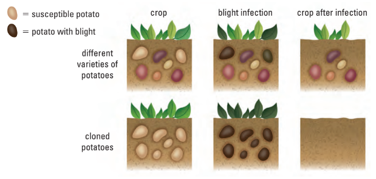

# C1.7 - Applications of Evolution

## Medical Application

### Monitoring Mutations in Pathogens

* mutations in pathogens help predict and prevent disease outbreaks
* influenza virus mutates rapidly
* flu causes thousands of deaths each year
* scientists monitor flu strains yearly
* vaccines are made each year to match common strains
* a pandemic is a disease outbreak over a large area
* 2009 H1N1 was a global pandemic
* bubonic plague in 1340s killed one-third of Europe’s population
* no antibiotics existed during the plague

### Alleles and Disease Resistance

* bacteria and viruses can mutate and become drug resistant
* some humans naturally resist certain infections
* 20% of Europeans carry D32 allele of CCR5 gene
* D32 allele helped resist past plagues and HIV
* D32 not found in African and Asian gene pools
* malaria increased sickle-cell allele in affected regions
* 1 in 25 Europeans carry cystic fibrosis allele
* 2 copies cause disease with early death
* 1 copy may give resistance to bacterial diseases like cholera and typhoid
* cholera was once widespread in Europe with high fatality
* survival advantage kept cystic fibrosis allele in gene pool

### Influencing Disease Frequencies

* natural selection may not affect some disease alleles
* adult-onset diseases appear after reproduction
* Huntington’s disease starts in early to mid forties
* affected individuals may already have passed on the allele
* modern medicine can reduce or increase allele frequencies
* genetic testing can help people avoid passing on disease alleles
* treatments help people with diseases like cystic fibrosis live longer
* longer life allows reproduction and transmission of alleles

## Evolution in Agriculture

### Slowing Pesticide Resistance

* developing new pesticides is expensive and short-term
* **refugia:** local environments that have not been affected by regional ecological change
	* unsprayed areas in agricultural fields
* sprayed areas kill all but pesticide-resistant insects
* refugia allow both resistant and sensitive insects to survive
* interbreeding dilutes resistance if the allele is recessive
* fewer resistant offspring over generations
* keeps resistance levels low in the population
* reduces the need for new pesticide development
* similar approach used to slow antibiotic resistance in bacteria

### Genetic Diversity in Crops

* crops are selected for specific traits
* farmers plant large numbers of the same variety
* Irish farmers relied only on the lumper potato
	* lumpers were clones with no genetic variation
	* low diversity increases vulnerability to disease
	* potato blight destroyed the entire crop in 1840s
	* 1 in 8 people died from starvation
* growing diverse varieties could have reduced impact
* single-variety planting still common today
* 1970 US corn crop hit by fungal infection
* 1980s grapevine pest (*Phyllorexia vitifoliae*) destroyed 800,000 hectares in California
* Cavendish banana is now at risk due to low diversity

### Genetic Diversity in Livestock

* artificial selection reduces genetic diversity in livestock
* farm animals bred for specific traits over centuries
* creates genetically uniform breeds like white leghorn chickens
* white leghorns bred for egg production
* reduced diversity makes them vulnerable to disease
* outbreaks can wipe out entire populations
* increasing diversity requires breeding with other breeds
* modern tech like artificial insemination boosts desired traits
* semen from prized males can be frozen and shipped
* allows one male to father many offspring
* maintains traits but lowers genetic diversity within breed