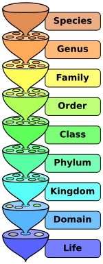
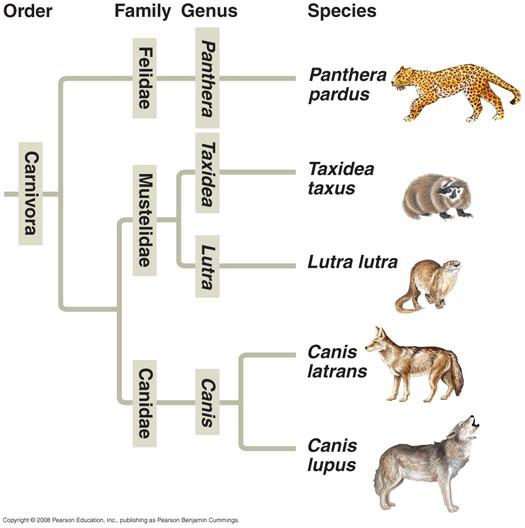
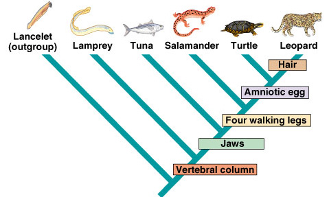
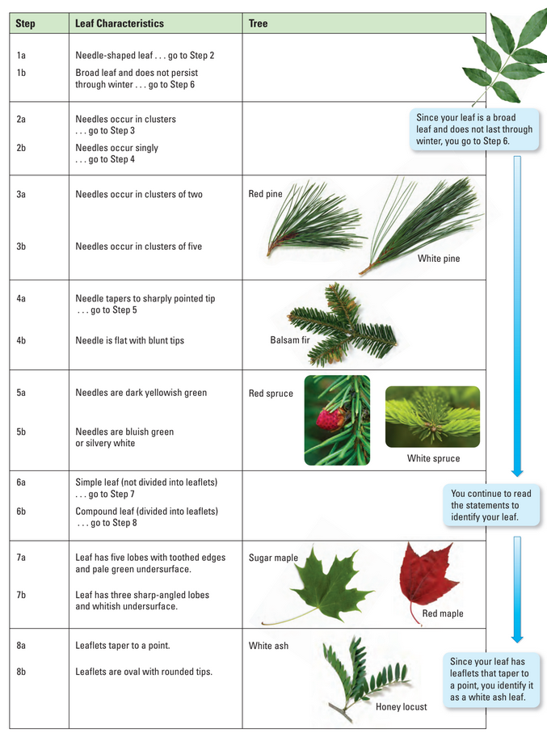

# C2.1 - The Diversity of Life

## Organizing Life: Criteria

- Morphology
- Habitat/niche
- Locomotion
- Colour
- Evolutionary history
- Food source

## Statistics

- 1.5 mil. species of animals named
- 1000s more animals being named each yr.
- All species named so far believed to be <20% of all living animals
  - <1% of animals, incl. those that lived in the past
- ~7.5 mil. animal species on Earth
- Best guess; do not include bacteria, protists, fungi and plants

## Examples of Species Richness

|Region|Area (sq. km)|Bird Species|Tree Species|
|-|-|-|-|
|Panama|15|443|1,320|
|Costa Rica|15|410|1,668|
|Ecuador|15|480||
|Peru|50|554|1,370|

- 1980s: Entolomologist Terry Erwin sampled 19 tropical trees
- Collected 955 species of beetle
- Extrapolated that there was ~30 mil. animal species in world
- **entolomologist:** person who studies insects
- **mammologist:** person who studies mammals

## Biodiversity

- **biosphere:** zone on Earth where all life exists
- **gene:** units of inherited information that determine specific characteristics or functions
- **biodiversity:** variety of life in the world
	- product of mil. of yrs. of evolution
- **symbiotic relationship:** two organisms work together and help each other

### Honeybees

- Honeybees
	- North America used to have 4,000 diff. native pollinators
	- settlers brought honeybees around 1800s
	- honeybees outcompeted native pollinators
	- if honeybees die, who is going to pollinate the plants?
- **Mysterious Disappearance of Honeybees**
	- pesticides?
	- *Varroa* mite (sucks on bee's blood until bees become weak and die)
		- contains viruses like Israeli acute paralysis virus (IAPV)
		- IAPV immobilizes bees and ultimately kills them

### Levels of Biodiversity

- **genetic diversity:** sum of all different forms of genes present in a particular species
	- allows for population resistance against disease / predators
	- farmers often grow genetically similar crops of wheat to max. food production
		- same equip., fertilizers, techniques
		- vulnerable to diseases and pathogens
- **species diversity:** variety of species and relative abundance of species in given area
	- allows ecosys. to survive environ. changes
- **ecosystem diversity:** diverse range of habitats, various organisms that live in habitats, and relationships that connect them

## Different Views of Environment and Ecosystems

- **instrumental value:** ecosystem's sources of economic wealth
  - i.e. food, timber, fuel, medicine
- Sources of inderect economic wealth
  - i.e. pollination, genetic info., recreation
- Cultural value for Aboriginal groups
- **intrinstic value:** value that cannot be measured in monetary terms
- Ecosystems and their components have a value that cannot be measured in dollars and cents
- Plants and animals have a value purely in themselves

> "A thing is right when it tends to protect the health and integrity of ecosystems…. It is wrong when it tends otherwise." &mdash; *Aldo Leopold, 1949*

### Value of Biodiversity

- Insects, bats, birds, and other animals pollinate flowering plants and crops.
- Micro-organisms make nutrients available and break down toxic substances in water and soil.
- Ecosystems cycle carbon, nitrogen, and oxygen.
- Ecosystems clean air, purify water, control erosion, prevent floods, and modify climate.

**keystone species:** species that have disproportionately large effect on ecosystems in which they live

## Taxonomy

- **taxonomy:** science of naming and classifying organisms
- ***Cf.* systematics:** science of determining evolutionary relationships among organisms
- Nested hierarchial system w/ defined levels of organization
- **taxon:** defined level in organization of life
  - pl. taxa
- 8 recognized taxa
  - In order from broadest to most specific:
  - Domain, Kingdom, Phylum, Class, Order, Family, Genus, Species
- 3 Domains: *Bacteria*, *Archaea*, *Eukarya*
- 6 Kingdoms: *Eubacteria*, *Archaebacteria*, *Protista* (protists), *Plantae* (plants), *Fungi*, *Animalia* (animals)

## Classification Example

| |Leopard|Modern Humans|
|-|-|-|
|Domain|*Eukarya* (eukaryotes)|*Eukarya* (eukaryotes)|
|Kingdom|*Animalia* (animals)|*Animalia* (animals)|
|Phylum|*Chordata* (chordates)|*Chordata* (chordates)|
|Class|*Mammalia* (mammals)|*Mammalia* (mammals)|
|Order|*Carnivora* (carnivores)|*Primates* (primates)|
|Family|*Felidae* (felines)|*Hominidae* (hominids)|
|Genus|*Panthera* (panthers)|*Homo* (mankind)|
|Species|*P. pardus* (leopard)|*H. sapiens* (wise)|

## Binomial Nomenclature

- **binomial nomenclature:** Latin 2-part unique naming sys. used to classify species
- **binomial:** two-part Latin name
- also known as a species' **scientific name**
- Developed by Carolus Linneaus in the 1750s
- Order of naming: *Genus species*
- Species: members of a populaton that can interbreed and produce viable offspring
- i.e. *Canis familiaris* (the family dog)
- Linnaeus grouped species according to their *morphology*
- **morphology:** study of form and structure of organisms

### Importance

- malaria (deadly disease) spread through mosquito bites
- insecticide to mass kill mosquitos failed to control disease
- classification and targeting of specific mosquitos controlled disease
- *Anopheles maculipennis* (mosquito) carries malaria

## Phylogeny (*from Evolution in Textbook*)

- **phylogeny:** *evolutionary history* of a species or group of organisms
- Organisms can be arranged by evolutionary relationship on a **phylogenetic tree** or a **cladogram**
- **phylogenetic tree:** diagram that reflects the hypotheses of evolutionary relationships
	- **node:** point where tree splits; repr. common ancestor

### Cladistics

- **cladistics:** determine sequence of branches in phylogenic tree via clades
- **derived characters:** homologous structures in a clade
- **cladogram:** diagram that specified derived characters of clades
- A clade on a cladogram represents one branch on a phylogenic tree
- **clade:** group of a common ancestor and all descendants
- All organisms in a clade must have homologous structures that do not occur outside the clade

### Phylogeny and HIV Evolution

- Case in Libya (1998)
	- Police arrest group of doctors and nurses
	- charge w/ bioterrorism bcz. they believe ppl. intentionally infected children w/ HIV
- Scenario 1: Medics Could've Infected Children
	- new strains would've developed from single strain after 1998
- Scenario 2: Infections Began Before Medics Arrive
	- lineages of HIV split before medics arrive
	- ✅ 2nd scenario correct
	- *causes:* dirty needles and poor hygiene practices
- Libyan court convicted 6 medics to death
	- eventually transferred back to Bulgaria
	- recieved presidential pardons and set free

### Phylogenetic Tree

### Cladogram

## Dichotomous Keys

- **dichotomous key:** tool used to identify unfamiliar organisms
	- *dichotomous* greek for "to cut in two"
- Used to identify organisms down to the species level
- Like a roadmap to a specific destination
- More accurate than a field guide

## Human Impact on Biodiversity

- **dead zones:** areas w/ low levels of oxygen in water that cannot support life
	- dredging (removal) and development for farming, roads, and housing reduces biodiversity
	- fertilizer runoff creates dead zones in water
	- ecosystems like Great Lakes can recover with proper care
	- agreements like the Great Lakes Water Quality Agreement have helped reduce damage
- **extinct:** when there are no alive individuals of a species left
	- mass extinction period taking place (evidence below)
	- 12% of 9,900 known bird species endangered
	- 300 / 20,000 plant species in risk (N.A.)
	- 37% of known fish have become extinct / at risk

### Threats to Biodiversity

- **habitat loss:** loss of habitat (place to live)
	- **habitat fragmentation:** alteration of small areas within large region; creating patchwork of altered and original habitats
		- i.e. roads split habitat into two
	- Forest Stewardship Council work to conserve and protect forest habitats
- **invasive species:** non-native species that harm ecosystems where they are introduced
	- i.e. kudzu (Jap. plant) in N.A. (brought to control erosion)
	- emerald ash borer (arrived in wood packing material)
	- Asian carp
	- zebra mussels (emptying of ship ballasts)
- **pollution:** introducing contaminants that harm ecosystems
	- i.e. coal power, pesticides
- **overexploitation:** using resources faster than they can reproduce
	- i.e. cod fishing (479,141 tons &rarr; 12,490 tons catched from 1988 - 95)
- **climate change:** long-term changes of weather patterns
	- Potential Effects
		- disease outbreaks (i.e. from insects)
		- plant migration
		- animal migration
		- extreme weather
		- increased CO2 levels (changes pH of water)
		- water availability and qty.
- **synergistic effects:** combination of several harmful human activities

### Conserving Biodiversity

- **conservation biology:** application of biology to counter loss in biodiversity
	- The Convention on Biological Diversity signed by 161 countries incl. Canada
	- **ex-situ conservation:** protecting species by removing them from their natural habitats
		- i.e. storage of seeds
		- zoos
		- botanical gardens and reserves
		- *last resort*
	- **in-situ conservation:** protecting species in their natural habitats
		- i.e. establishing protected areas
		- restoring habitats
- **ecological footprint:** estimate of all the land and water needed to produce the resources you consume and to absorb the wastes you produce
	- avg. Canadian uses 8.9 ha
	- 17 football fields
	- would need 5.7 Earths if everyone lived like that
