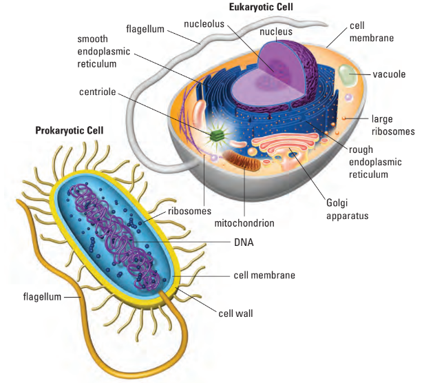
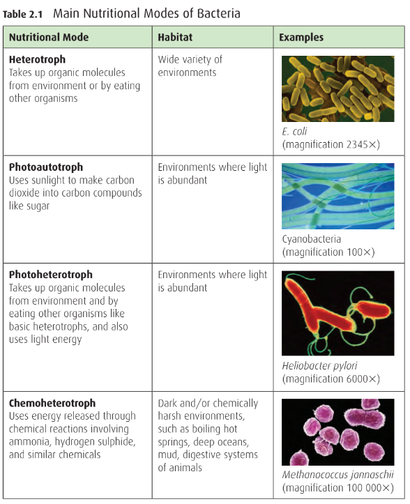
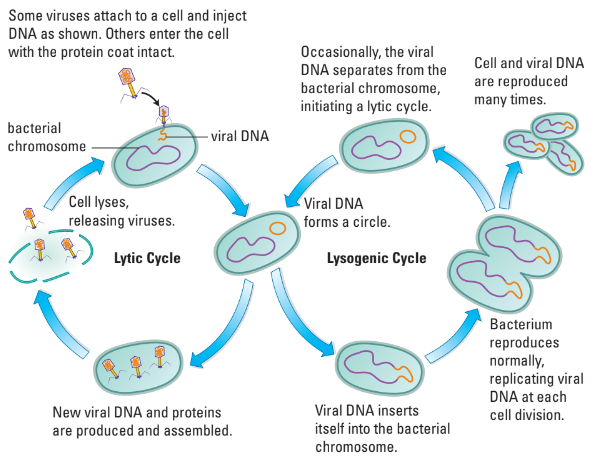

# C2.2 - Kingdoms Archaebacteria and Eubacteria

## Prokaryotes and Eukaryotes

- Two basic types of cells
- Characterized by size and type of organelle
- **Prokaryotes** are bacteria
- **prokaryotes:** cells w/o nucleus and membrane-bound organelles
- **eukaryotes:** cells w/ nucleus and membrane-bound organelles
- **unicellular:** organism consisting of just one cell
- **multicellular:** organism consisting of many cells
- All other organisms classified as **eukaryotes**
- Prokaryotes thought to be first forms of life on Earth

## Major Differences between Two Types

| Prokaryotes                             | Eukaryotes                                      |
| --------------------------------------- | ----------------------------------------------- |
| No nuclear membrane                     | Defined nuclear membrane                        |
| Small amounts of DNA                    | Large amounts of DNA                            |
| Single, circular chromosome w/o protein | Numerous chromosomes w/ associated proteins     |
| No membrane-bound organelles            | Diverse # and type of membrane-bound organelles |
| Asexual reprod. by binary fission       | Reproduction by mitosis and meiosis             |

## Kingdom Archaebacteria (Old Bacteria)

- Once thought to be closest living relatives to cells
- Live in extremely harsh environments
- i.e. Dead Sea, Great Salt Lake, acidic hot springs, animal gut

### Archaebacteria Locations

Grand Prismatic Spring, Yellowstone Park

Rio Tinto River, Spain

Dead Sea

***The orange stuff is the archaebacteria thriving.***

## Kingdom Eubacteria (True Bacteria)

- Exist everywhere
- May either be autotrophs or heterotrophs
- Some cause disease
	- i.e. tuberculosis (TB) caused by *Mycobacterium tuberculosis*
		- airborne
		- grows in lungs when inhaled
		- triggers immune sys. to destroy large areas of tissue
	- i.e. strep throat (*Streptococcus pyogenes*)
	- i.e. diphtheria (*Corynebacterium diphtheriae*)
	- i.e. many STDs and certain types of food poisoning
- Some are beneficial and essential
	- mouth bacteria prevent other harmful organisms from growing there
	- gut bacteria break down food
	- in exchange, you house bacteria and provide them w/ resources
	- key role in cycling nutrients
		- i.e. decomposition
		- i.e. nitrogen cycle
		- i.e. oxygen supply

### Cell Walls and Staining

- Cell walls contain peptidoglycan
- **Gram-positive:** Thick walls stain purple
	- cell walls mostly contain peptidoglycan
- **Gram-negative:** Thin walls stain pink
	- cell walls have less peptidoglycan
	- have additional outer membrane
- *Grams* used for classification

**Gram-positive bacteria**

**Gram-negative bacteria**

### Classification of Eubacteria

- Classified by ability of cell wall to take up stain and cell shape
- Cell shape may be spherical or rod-shaped
- Rod-shaped bacteria may be extended, forming irregular or spiral shapes
- **3 Important Characteristics for Classification**
	- cell shape
	- cell wall structure (stain)
	- motility
	- **motility:** method of movement

### Motility of Bacteria

- half of all prokaryotes lack structures for movement
- **flagella:** long whip-like structures
	- used to propel bacteria
- spiral-shaped bacteria use corkscrew motion to move

### Spherical Bacteria

- **cocci:** spherical bacteria (Greek: berries)
- Plural *cocci*, singular *coccus*
- Variation in
- *Monococcus*: singular
- *Diplococcus*: double
- *Streptococcus*: chain
- *Staphylococcus*: clump

#### Examples

*Diplococcus neisseria gonorrhoeae*

harmful to humans, evolved resistance to antibiotics

*Streptococcus pneumonia*

Causes pneumonia, inflammation of lungs affecting alveoli

Methicillin-Resistant *Staphylococcus areus* (MRSA)

### Rod-Shaped Bacteria

- **bacilli:** rod-shaped bacteria (Latin: stick)
- Plural *bacilli*, singular *bacillus*
- Exist singly or in clumps
- Variation in ***Cell Shape***
	- *spirilla*: spiral-shaped
	- *spirochaetes*: tightly coiled
		- largest spiral-shaped bacteria
		- Greek for "long hair"
		- incl. bacteria that cause Lyme disease
	- *vibrio*: comma-shaped
	- filamentous: long filaments
- **spirochetes** are sometimes considered a third type instead of under bacilli

#### Examples

*Bacillus anthracis* (Anthraxx)

*Spirilla* bacteria

*Treponema pallidum* (syphilis)

eats bones

*Vibrio cholerae* (cholera)

Causes disease from drinking dirty water

## Obtaining Nutrition

- **autotroph:** organism that produces own food (using light, water, CO2 and other chems.)
- **heterotroph:** organism that consumes other organisms / organic molecules for food
- **photoautotroph:** autotroph that uses sunlight for photosynthesis
	- makes CO2 into carbon compounds like sugar
- **chemoautotroph:** autotroph that gains energy from chemical reactions
	- inorganic molecule oxidization
	- involves ammonia, hydrogen sulfide, similar chems.
- **photoheterotroph:** heterotroph that also uses light energy
- **aerobic:** gains energy/food by processing oxygen
- **anaerobic:** doesn't need oxygen to gain energy/food
- **anoxic:** depleted of / lacking oxygen

## Viruses

- **virus:** microscopic germs that infect a host in order to replicate
- not living because non-cellular
	- use DNA and ribonucleic acid (RNA)
	- also adapt to changing conditions and mutate
	- cannot reproduce w/o a host

### Structure and Function

- virus structure is suited for entering host cells and reproducing
- viruses contain DNA or RNA surrounded by a protein coat
- some viruses have outer membranes that help them merge with host cells
- viruses vary in shape and size
- classified based on the **type of cell** they infect
- viral protein coat acts like a key to enter specific host cells
- most viruses infect only one specific type of cell
	- i.e. HIV infects only T cells of the immune system
- **bacteriophages:** viruses that infect specific bacteria
	- used in biotechnology
- some viruses like avian flu can infect many cell types across species

### Reproduction

1. unload genetic material
2. take control of cell process
3. replicate

#### Lytic Cycle

1. Virus attaches to host cell and injects its DNA
	- causes host cell's enzymes and synthesis machinery to make copies of viral DNA and proteins
2. Replicate virus
	- viral proteins and nucleic acids assemble themselves inside host cell
	- many copies made
3. Release
	- once there are 20-500 virus copies, cell can no longer hold them
	- celll bursts open

#### Lysogenic Cycle

- viral genes incorporated within host cell's DNA
- viral DNA replicated each time host cell reproduces
- environ. change in temp. or pH triggers viral DNA to separate from host DNA and start **lytic cycle**

## Climate Change

- climate change affects diversity and interactions of prokaryotes
- rising sea levels push salt water into peat wetlands
- peat wetlands contain methane-producing bacteria vital to ecosystem health
- sulphate-metabolizing bacteria and archaea increase with salt water exposure
- these microbes release toxins that kill surface vegetation and destroy peat
- salt water exposure shifts microbial populations, reducing methane bacteria
- loss of peat habitat forces species to die or relocate
- peat disintegration releases carbon dioxide and methane into the atmosphere
- contributes to global warming
- reduces peat soil available for farming and gardening