# C2.2 - Kingdoms Archaebacteria and Eubacteria

## Prokaryotes and Eukaryotes

- Two basic types of cells
- Characterized by size and type of organelle
- **Prokaryotes** are bacteria
- All other organisms classified as **eukaryotes**
- Prokaryotes thought to be first forms of life on Earth

## Major Differences between Two Types

| Prokaryotes                             | Eukaryotes                                      |
| --------------------------------------- | ----------------------------------------------- |
| No nuclear membrane                     | Defined nuclear membrane                        |
| Small amounts of DNA                    | Large amounts of DNA                            |
| Single, circular chromosome w/o protein | Numerous chromosomes w/ associated proteins     |
| No membrane-bound organelles            | Diverse # and type of membrane-bound organelles |
| Asexual reprod. by binary fission       | Reproduction by mitosis and meiosis             |

## Kingdom Archaebacteria (Old Bacteria)

- Once thought to be closest living relatives to cells
- Live in extremely harsh environments
- i.e. Dead Sea, Great Salt Lake, acidic hot springs, animal gut

### Archaebacteria Locations

Grand Prismatic Spring, Yellowstone Park

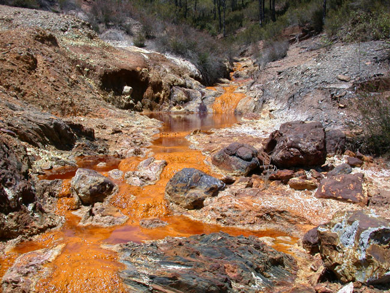

Rio Tinto River, Spain

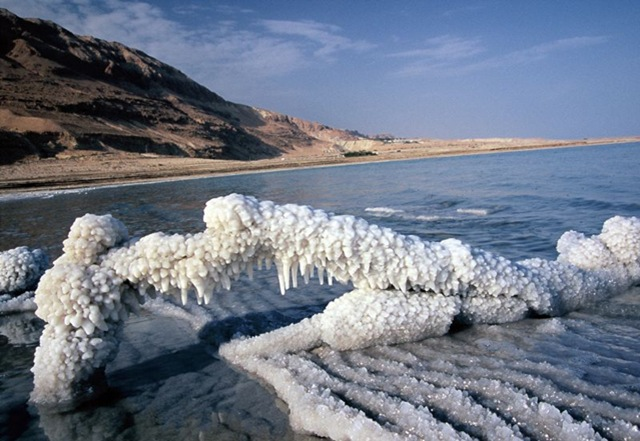

Dead Sea

***The orange stuff is the archaebacteria thriving.***

## Kingdom Eubacteria (True Bacteria)

- Exist everywhere
- May either be autotrophs or heterotrophs
- Cell walls contain peptidoglycan
- **Gram-positive:** Thick walls stain purple
- **Gram-negative:** Thin walls stain pink
- *Grams* used for classification

**Gram-positive bacteria**

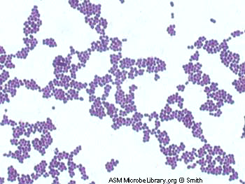

**Gram-negative bacteria**

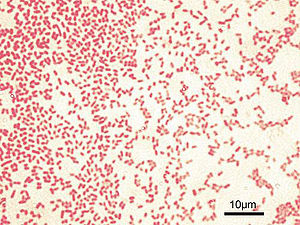

## Classification of Eubacteria

- Classified by ability of cell wall to take up stain and cell shape
- Cell shape may be spherical or rod-shaped
- Rod-shaped bacteria may be extended, forming irregular or spiral shapes

## Spherical Bacteria

- Plural *cocci*, singular *coccus*
- *Monococcus*: singular
- *Diplococcus*: double
- *Streptococcus*: chain
- *Staphylococcus*: clump

### Examples

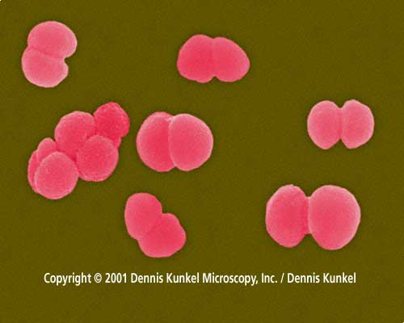

*Diplococcus neisseria gonorrhoeae*

harmful to humans, evolved resistance to antibiotics

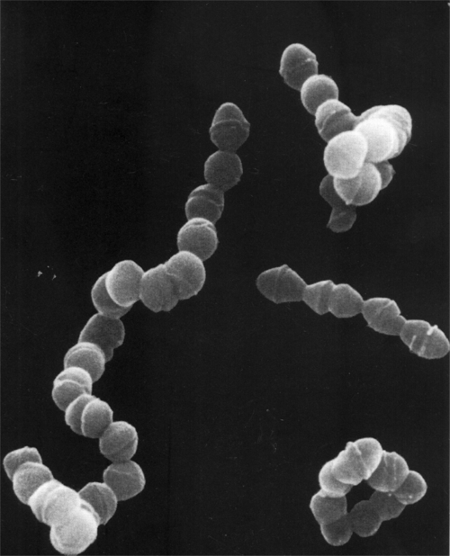

*Streptococcus pneumonia*

Causes pneumonia, inflammation of lungs affecting alveoli

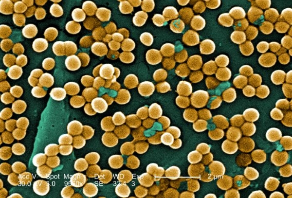

Methicillin-Resistant *Staphylococcus areus* (MRSA)

## Rod-Shaped Bacteria

- Plural *bacilli*, singular *bacillus*
- Exist singly or in clumps
- Variation
  - *spirilla*: spiral-shaped
  - *spirochaetes*: tightly coiled
  - *vibrio*: comma-shaped
  - filamentous: long filaments

### Examples

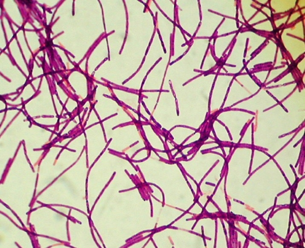

*Bacillus anthracis* (Anthraxx)

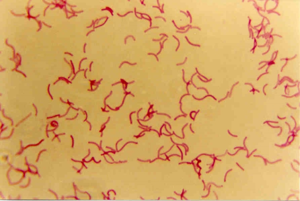

*Spirilla* bacteria

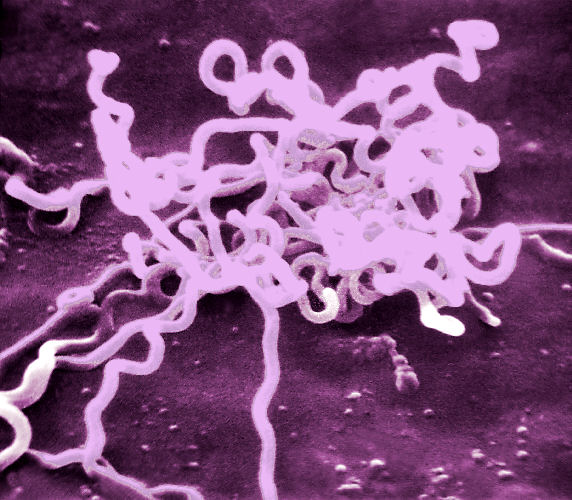

*Treponema pallidum* (syphilis)

eats bones

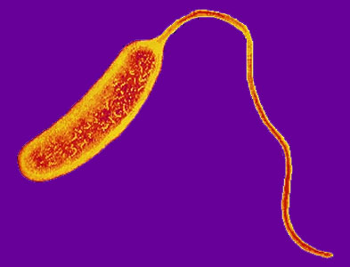

*Vibrio cholerae* (cholera)

Causes disease from drinking dirty water

## Important Terms

- **autotroph:** organism that produces own food (using light, water, CO2 and other chems.)
- **heterotroph:** organism that consumes other organisms for food
- **chemoautotroph:** autotroph that gains energy from inorganic molecule oxidization
- **aerobic:** gains energy/food by processing oxygen
- **anaerobic:** doesn't need oxygen to gain energy/food
- **anoxic:** depleted of / lacking oxygen