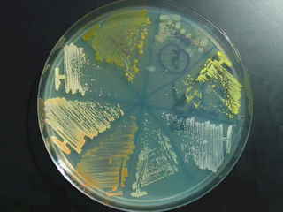
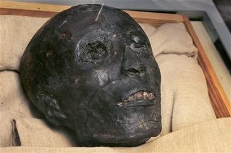
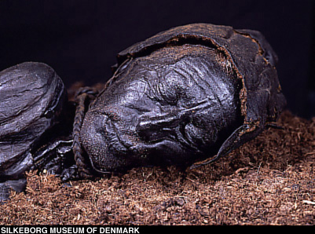
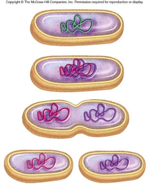
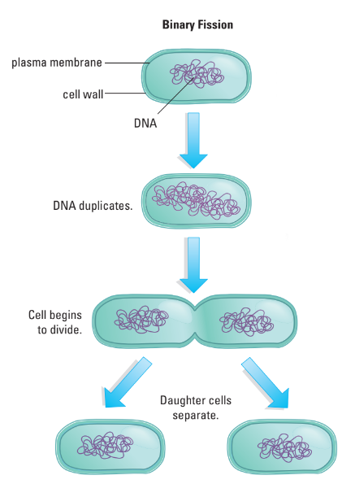
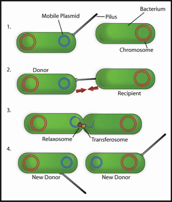
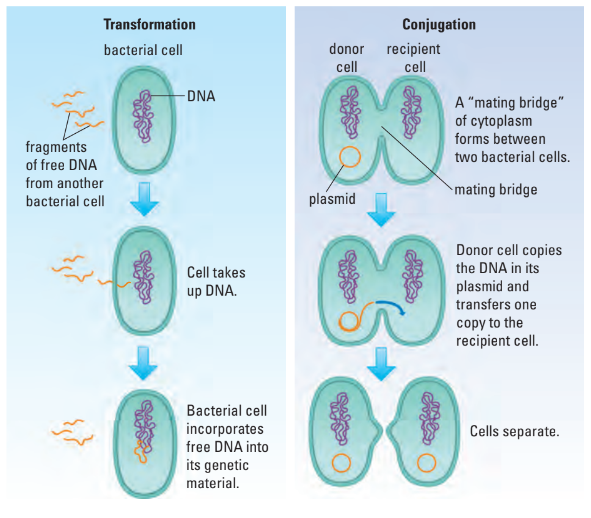

# C2.3 - Bacterial Growth

## Culturing Bacteria in Lab

- Bacteria studied on media called agar
- Nutrient agar has all nutrients required for growth of most bacteria
- Bacterial colonies form on agar
- Contain millions of individual bacteria
- Characteristic shapes depending on species

## Conditions Inhibiting Bacterial Growth

### Temperature

- Most bacteria live best at 28-36 &deg;C
- Human take steps to limit bacterial growth by:
  - boiling
  - refrigerating
  - freezing
  - pasteurizing
- Animals raise their body temp. to slow bacterial infections
- **permafrost:** permanently frozen, helps preserve (no bacteria decomp.)
- **pasteurization:** boil, then cool down to slow bacterial growth

### (Lack of) Moisture

- Bacteria must have wet/moist environments to grow
- Lack of moisture = bad for bacteria
- i.e. dehydrated food

### Mummification

**King Tut Before**

**King Tut After 3,300 Years**

- Body got dark from oxidization
- **natron:** natural salt in Egpyt used to dehydrate Mummy
- **mummia:** oil used to preserve mummies
- Moist organs removed
- Mummies protected from tomb robbing
- **Key Point:** Body was preserved through dehydration and chemical processes

### Radiation

- Uses electromagnetic radiation (X-Rays, UV light) and gamma rays
- Interferes with DNA replication and either slows or stops bacterial reproduction
- e.g. irradiated food and water

### Chemicals

- Extreme pHs and salts kill bacteria or cause them to go dormant
- e.g. canned foods, salted meats, household cleaners and antibiotic compounds

### Bog People

**Tollund Man Before**

**Tollund Man After 2,300 Years**

- Bog preserves human
- Tannic acid turned human skin into leather

## Bacterial Reproduction

- Bacteria reproduce at exponential rates
- Population doubling by **binary fission** can occur every 20-60 mins.
- **binary fission:** seperation of the body into two new bodies
- Bacteria reproduce asexually
- Bacteria can exchange genetic information through conjugation or transformation

*Diagram of binary fission:*

### Bacterial Conjugation

- **bacterial conjugation:** asexual process where bacterial DNA is transferred to another bacterium
- DNA loop called a **plasmid** transferred
- Plasmid donated to other cell via tube called a **pilus**
- Plasmid can exist either on its own in cell cytoplasm or integrated into larger, circular chromosome
- Genetic mutations and DNA transferring causes strains like multidrug resistant TB

### Other Methods of Bacterial Surival

- **transformation:** bacteria take up pieces of DNA from environ.
	- sources: nearby dead bacteria
- **transduction:** bacteria receive new genetic material from bacteriophage injection
- **endospore:** dormant stage of bacteria
	- when resources too limited
	- thick internal wall circles DNA and small amount of cytoplasm
	- outer cell disintegrates
	- can absorb water and grow again when environ. more favourable

## How Do Bacteria Communicate?

- **quorum sensing:** the use of chemical signals by bacteria to communicate with each other
- Allows bacteria to act in unison, like a multicellular organism
- Quorum sensing controls:
	- virulence: degree to which bacteria can infect its host
	- biofilm formation
	- DNA exchange
- Significant for medicine, leading to develop new antibiotics that target this communication system