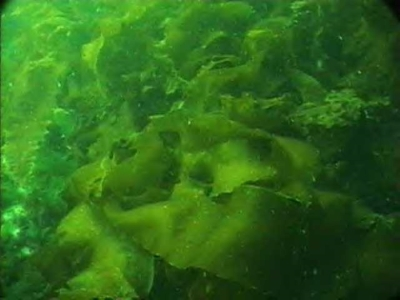

# C2.4 - Kingdom Protista

## Background

- Appear early in fossil record
- All eukaryotes
- Most microscopic and unicellular
- Three main groups
  - Plant-like protists
  - Animal-like protists
  - Fungi-like protists
- Kingdom of convienience
  - Can't group them? Put them in protist kingdom

## Plant-like Protists

- Contain chlorophyll for photosynthesis
- "chloro" = Greek for green
- Mostly multicellular but w/o tissues
- Found in aquatic or damp environments
- Group consists of 4 divisions

### Division Chlorophyta (Green "Plant")

- Green algaes
- **phytoplankton:** unicellular green algae
- Primary producers in aquatic environments
- Supplies 67% of global oxygen supply

### Division Phaeophyta

- Brown algaes
- Sea weeds
- Most crude oil derived from brown algae that lived mil. of yrs. ago

### Division Rhodophyta

- Red algaes
- Sea weeds
- Sources of agar used in:
  - drug capsules
  - gels
  - cosmetics
  - ice cream
  - toothpaste
- Eaten as nori and dulce

### Division Chrysophyta

- Golden algae and diatoms
- Diatoms produce silica (sand) shells
- Diatom sediment called **diatomaceous earth** used as abrasive and insecticide
  - To an insect, breathing in diatoms is like breathing in razor blades

## Animal-like Protists

*Euglena*

Legend: flagellum: invisible tail, light detector: brown dot, green: chlorophyll

- All unicellular heterotrophs found in aquatic or moist environments
- 3 main phyla classified by locomotion or parasitism

### Phylum Sarcomastigophora

*Amoeba*

- Subphylum Sarcodina (the amoebas)
  - use pseudopods (false feet) to encircle and engulf prey
  - creates vacuole around prey, replaces water w/ digestive enzymes
- Subphylum Mastigophora (the flagellated protozans)
  - *self-flagellate:* to whip yourself

#### Amoeba Anatomy

### Phylum Ciliophora

- The ciliates
- Move extremely fast by small hairs called **cilia**
- i.e. paramecia (sing. paramecium)

#### Paramecium Anatomy

### Phylum Apicomplexa

- Parasitic protozoans, like *Plasmodium* which causes malaria
- Malaria kills ~800,000 people a year
- Affects mostly poor, developing nations
- **Quinine:** class drug for malaria
- Tonic water (had quinine) also used to treat / prevent malaria
- Malaria used to be prominent in S. USA

#### Malaria Lifecycle

#### Malarial Zones

## Fungi-like Protists

- Main division *Myxomycota*
- Plasmodial slime moulds
- Exist as thin streaming masses
- Live in moist environments like rotting logs
- Consume bacteria, yeast, fungi, decaying plant and animal matter
- Many nuclei
- Capable of sexual reproduction