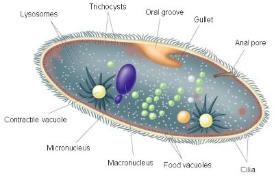

# C2.4 - Kingdom Protista and Eukaryotes

## Background

- **protist:** eukaryote that isn't a plant, animal, or fungi
- Appear early in fossil record
- All eukaryotes
- Most microscopic and unicellular
- Three main groups
	- Plant-like protists
	- Animal-like protists
	- Fungi-like protists
- Kingdom of convenience
	- Can't group them? Put them in protist kingdom

## Structure and Function

- protists have diverse structures and functions
- found in many habitats including oceans, soil, snow, and even air
- most are unicellular and free-living
- some are colonial or multicellular like kelp
- multicellular protists have specialized cells
- protists have eukaryotic cell structures with nucleus and organelles
- eukaryotic structure is shared by all non-bacteria and non-archaea
- cell structure alone does not define protists
- traditional protist kingdom may be split into several kingdoms
- nucleic acid comparisons help identify evolutionary branches
- evidence of protist evolution is still incomplete
- term protist remains useful despite classification debates
- protists likely evolved from ancient prokaryotes
- plants, animals, and fungi evolved from protists

## Origin of Eukaryotes

- "theory," not proven
- eukaryotic cells evolved from combination of
	- infolding
	- serial endosymbiosis
- **Infolding**
	- plasma membrane fold inwards
	- formed
		- endoplasmic reticulum (ER)
		- Golgi apparatus
		- nuclear envelope
- **serial endosymbiosis**
	- prokaryotes engulfed by host cell
	- prokaryotes are not digested
	- over time, they evolve and form symbiotic relationship w/ host cell
	- perform cell's metabolic tasks

*Origins of eukaryotes*

## Motility

- **pseudopodia:** streaming cytoplasm into cellular extensions
	- i.e. amoebas
	- *pseudopods* (false feet)
- **flagella:** long hair-like projections extending out of cell membrane
- **cilia:** shorter hair-like projections that cover entire cell membrane or large clusters
- **zooflagellates:** heterotrophic protists w/ flagella
- **ciliates:** protists w/ cilia
- **spores:** reproductive cells released by organisms
	- often found in protists relying on passive modes of transportation

*Analogy of flagella vs. cilia*

## Plant-like Protists

- **algae:** plant-like protists
- can undergo population explosions producing harmful algae blooms
- many unicellular, some live in colonies, others are multicellular
- Contain chlorophyll for photosynthesis
- "chloro" = Greek for green
- Mostly multicellular but w/o tissues
- Found in aquatic or damp environments
- Group consists of 4 divisions

#### Other Classifications (textbook)

- classified by differences in
	- cell walls
	- types of photosynthetic pigments
	- structure
	- types of storage carbohydrates
	- sequences of nucleic acids
- **dinoflagellates:** unicellular protists w/ cell wall made of cellulose and 2 flagella
- **plankton:** communities of mostly microscopic organisms that drift / swim near surface of ponds, lakes, and oceans

### Division Chlorophyta (Green "Plant")

- Green algaes
- **phytoplankton:** unicellular photosynthetic green algae
- Primary producers in aquatic environments
- Supplies 67% of global oxygen supply

### Division Phaeophyta

- Brown algaes
- Sea weeds
- Most crude oil derived from brown algae that lived mil. of yrs. ago

### Division Rhodophyta

- Red algaes
- Sea weeds
- Sources of agar used in:
  - drug capsules
  - gels
  - cosmetics
  - ice cream
  - toothpaste
- Eaten as nori and dulce

### Division Chrysophyta

- Golden algae and diatoms
- Diatoms produce silica (sand) shells
- Diatom sediment called **diatomaceous earth** used as abrasive and insecticide
  - To an insect, breathing in diatoms is like breathing in razor blades

## Animal-like Protists

*Euglena*

Legend: flagellum: invisible tail, light detector: brown dot, green: chlorophyll

Many scientists incl. *Euglena* w/ plant-like protists

- **animal-like protists:** heterotrophic protists that capture and ingest food
- All unicellular heterotrophs found in aquatic or moist environments
- 3 main phyla classified by locomotion or parasitism

### Phylum Sarcomastigophora

*Amoeba*

- Subphylum Sarcodina (the amoebas)
  - use pseudopods (false feet) to encircle and engulf prey
  - creates vacuole around prey, replaces water w/ digestive enzymes
- Subphylum Mastigophora (the flagellated protozans)
  - *self-flagellate:* to whip yourself

#### Amoeba Anatomy

### Phylum Ciliophora

- The ciliates
- Move extremely fast by small hairs called **cilia**
- i.e. paramecia (sing. paramecium)
- cilia sweep food into oral groove
- food pushed into food vacuole and digested
- vacuole passes through organism to anal pore to release wastes

#### Paramecium Anatomy

#### Ciliate Anatomy *Explained*

### Phylum Apicomplexa

- Parasitic protozoans, like *Plasmodium* which causes malaria
- Malaria kills ~800,000 people a year
- Affects mostly poor, developing nations
- **Quinine:** class drug for malaria
- Tonic water (had quinine) also used to treat / prevent malaria
- Malaria used to be prominent in S. USA

#### Malaria Lifecycle

#### Malarial Zones

## Fungi-like Protists

- **fungi-like protists:** heterotrophic protists that feed mostly on decaying organic matter
- Main division *Myxomycota*
- **plasmodial slime moulds:** large, branching fungus-like protist
- **cellular slime moulds:** decomposers that live mainly on decaying organic matter
- **water moulds:** decompose dead plants and matter in freshwater habitats
- **plasmodium:** single mass of cytoplasm undivided by cell membranes or cell walls that contains many nuclei
- Exist as thin streaming masses
- Live in moist environments like rotting logs
- Consume bacteria, yeast, fungi, decaying plant and animal matter
- Many nuclei
- Capable of sexual reproduction

## Reproduction

- Various strategies
- Amoebas, paramecia, and most ciliates
	- make copy of genetic material and divide into 2 genetically identical cells
	- lack genetic diversity
- Paramecia
	- exchange genetic material via conjugation
	- creates genetic diversity

## Climate Change

- carbon dioxide in water forms carbonic acid
- lowers pH of aquatic environments
- most organisms have an optimum pH range
- large organisms tolerate pH changes better than small ones
- phytoplankton are sensitive to pH changes
- phytoplankton form the base of aquatic food chains
- their decline could collapse ocean food webs