# C2.5 - Kingdom Plantae

## Evolution

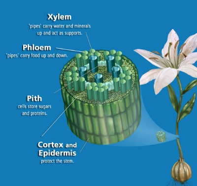

- Photosynthetic organisms clustered around nutrient rich shoreline
- Turbulent shoreline resulted in the evolution of multicellular organisms with strong cell walls, holdfasts, tissues
- Land had abundant light, carbon dioxide, oxygen
- Early plants developed water retention and collection systems, roots, leaves with a waxy cuticle, stomata, vascular system (xylem and phloem tubes)
- **xylem:** 'pipes' carry water and minerals up and act as supports
- **phloem:** 'pipes' carry sap (root foot) down
- **pith:** cells store sugars and proteins
- **cortex** and **epidermis** protect the stem

## Evolution Continued

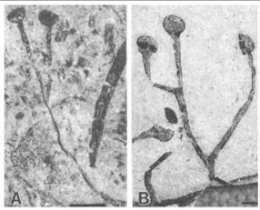

*Cooksonia fossil*

- Plants evolved from green algae and share common characteristics
- Invasion of land 430 mya
- *Cooksonia* fossils one of earliest and simplest plants known

## The Bryophytes: Liverworts, Mosses, and Hornworts

- Found in moist environments
- Relatively unspecialized plants
- NON-VASCULAR plants (no xylem or phloem)

### Division Hepatophyta: The Liverworts

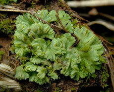

- hepato = liver-related
- Simplest plants, small, and inconspicuous
- Lack stomata, cuticle
- Evolutionary branch seperate from other plants
- Sexual reprod. by sports, asexual reprod. by fragmentation
- **fragmentation:** reproduction by breaking plants apart for new plants to grow

### Division Bryophyta: The Mosses

3 classes: *Bryidae* (true mosses), *Sphaginidae* (peat mosses), *Andreaeidae* (granite mosses)

### Class *Sphaginidae*: The Peat Mosses

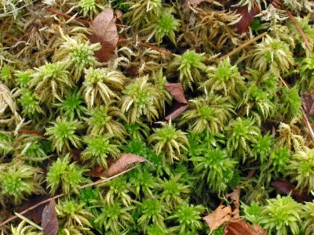

- Form densely packed peat bogs in cold and temperate regions
- Peat bogs cover 1% of World's land surface area
- Bogs highly acidic, pH 4 or less
- Peat formed by compression of dead moss
- Peat is absorbent because of pores in dead plants
- Peat can absorb 20x its own dried mass (cf. cotton 4-6x)

#### Uses of Peat

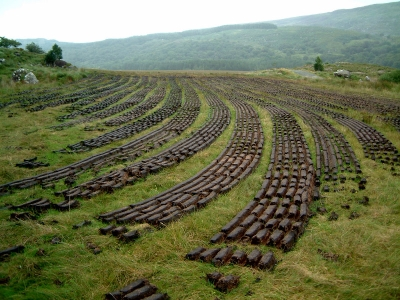

- Wound dressings (pre-WWI)
- **Horticulture:** agriculture of plants
- Industrial fuel
- Domestic heating

## Seedless Vascular Plants

- No flowers or seeds!
- Evolution of conducting tubes (xylem and phloem) solved problem of water and food transport
- Plants could now grow larger
- 4 Divisions

### Division *Sphenophyta*: The Horsetails

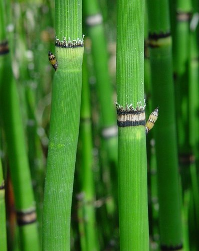

- Mostly extinct, reached max. diversity 300 mya
- One genus survives: *Equisetum*
- Jointed stems, rough texture from ribs strengthened by silica
- 'Scouring rushes'

### Division *Pterophyta*: The Ferns

- 11,000 species species, abundant since Carboniferous
- Most diverse group
- Anatomy: fiddleheads, fronds, rhizomes (underground stems)
- Asexual reprod. by fragmentation
- Sexual reprod. by spores

## Seeded Vascular Plants

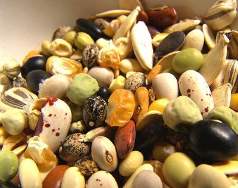

- Seeds responsible for domination of these plants
- Why? Seed has survival value
  - Guaranteed to grow when planted under right conditions
- Seed protects and feeds plant embryo
- Overall advantage over spores
- 2 types
  - *Gymnosperms* (naked seed)
  - *Angiosperms* (vessel seed)

## *Gymnosperms*: The Naked Seed

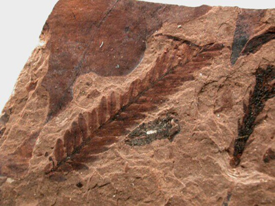

- 4 divisions
- Male gametophyte is the pollen grain
- Transfer of pollen to female gametophyte called pollination

### Division *Coniferophyta*: The Conifers

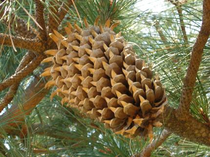

- Includes pines, spruces, junipers, cedars
- Thin needle-like leaves and thick waxy cuticle reduces water loss
- Well-developed roots
- Basis of many ecosystems
- Economically important in building pulp and paper

### Division *Cycadophyta*: The Cycads

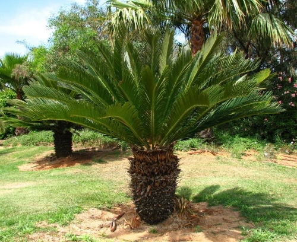

- Palm-like tropical and subtropical plants
- Mesozoic era 'Age of Dinosaurs and Cycads'
- i.e. Sago Palm

#### Cycad Fossil

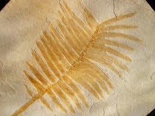

### Division *Ginkgophyta*: The Ginkgos

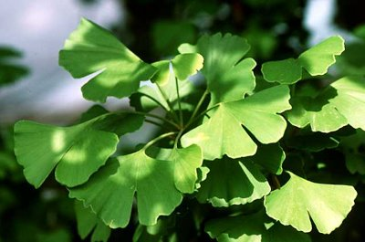

- One survivor: *Gingko biloba*, the Maidenhair Tree
- Slow growing tree w/ fan-shaped leaves
- Living trees grown in Chinese and Japanese temples
  - no ginkgos left in the wild

#### Gingko Fossil

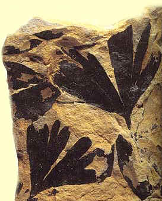

### Division *Gnetophyta*

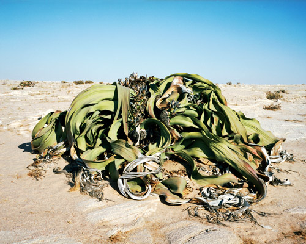

*Welwitschia*

- Consists of genuses:
  - *Gnetum* &rarr; tropical trees
  - *Ephedra* &rarr; dry climate shrubs
  - *Welwitschia* &rarr; one species of two-leaved desert plant

## Angiosperms

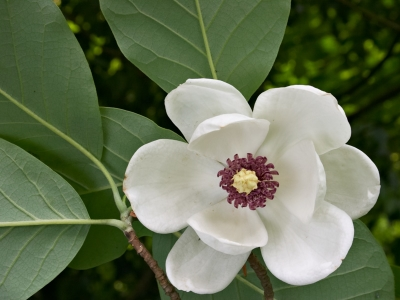

- The flowering plants
- Over 250,000 species
- Seeds enclosed by fruit
- Reproduce asexually and sexually
- Sexual repro. produces genetic variability

### Classification

- One division: *Anthophyta*
- Two classes
  - *Monocots*: one seed leaf, i.e. corn
  - *Dicots*: two seed leaves, i.e. bean
- Evolution closely tied w/ insects and other pollinators
- Major food source for humans

#### Monocots vs. Dicots Diagram

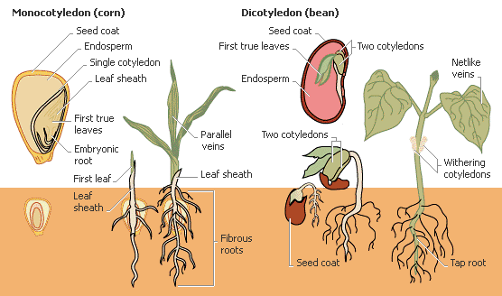

### Anatomy of Flower: Diagram

### Plant Secondary Metabolites

- 'The plant/insect chemical arms race'
- Plants produce poisonous compounds or bad-tasting compounds
  - i.e. nicotine, caffeine
- Examples
  - Coffee
  - Tea
  - Tobacco
  - Opium
  - Payote (hallucinogen)
  - Marijuana