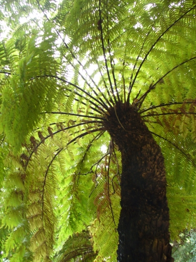
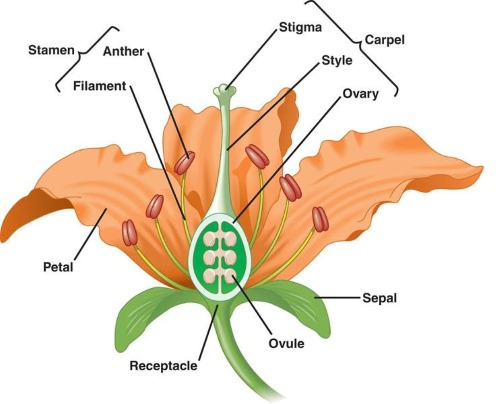

# C2.5 - Kingdom Plantae

## What are Plants?

- Plants are eukaryotic
- Plants have cell walls that contain the carbohydrate cellulose
- Plants carry out photosynthesis, using the pigment chlorophyll to transform sunlight into chemical energy

### Importance

- base of almost all food chains
- provide food, fuel, fiber
- basis of medicines
	- aspirin
	- quinine
	- morphine
- release oxygen
- cycle nutrients
- regulate ecosystem processes to
	- clean air
	- purify water
	- absorb carbon
	- detox. soil
- some can clean up pollution
	- i.e. Indian mustard plant
	- can bind Pb, Cr, Cd (cadmium), Ni, Zn, Cu, Se
	- used to clean major pollution leaks

## Evolution

- Photosynthetic organisms clustered around nutrient rich shoreline
- Turbulent shoreline resulted in the evolution of multicellular organisms with strong cell walls, holdfasts, tissues
- Land had abundant light, carbon dioxide, oxygen
- Early plants developed water retention and collection systems, roots, leaves with a waxy cuticle, stomata, vascular system (xylem and phloem tubes)
- **xylem:** 'pipes' carry water and minerals up and act as supports
- **phloem:** 'pipes' carry sap (root foot) down
- **pith:** cells store sugars and proteins
- **cortex** and **epidermis** protect the stem

*Cooksonia fossil*

- Plants evolved from green algae and share common characteristics
- Invasion of land 430 mya
- *Cooksonia* fossils one of earliest and simplest plants known
- ***Key Evolutionary Characteristics***
	- formation of **embryo** (reprod. structure that develops into plant)
	- ability to stand upright and grow tall
		- to get as much sunlight as pssible
	- tissues to transport nutrients, waste, and water
	- strategies to reduce water loss
	- strategies to disperse reproductive structures without water currents
	- **lignin:** chemical that hardens cell walls

#### Major Periods of Plant Evolution

| Time Period | Key Evolutionary Event                                                                     | Examples Today                        |
|-------------|--------------------------------------------------------------------------------------------|---------------------------------------|
| 475 mya     | Primitive plants evolve from algae; no leaves, stems, seeds, or rigid tissue               | Mosses                                |
| 425 mya     | Plants develop **lignin** and **vascular tissues**; can grow upright and farther from water| Ferns                                 |
| 365 mya     | **Seeds** develop; protect embryos and allow wider land spread                             | Seed plants (gymnosperms)             |
| 135 mya     | **Flowers** appear; help with reproduction and seed dispersal                              | Flowering plants (angiosperms)        |

## Alternation of Generations

- life cycle alternating between [[c4.4-cell-cycle|diploid]] and [[c4.4-cell-cycle|haploid]] forms
- each form distinct, multicellular gens.
- **alternation of generations:** alternation between haploid and diploid forms
- Haploid Generation
	- **gametophyte:** plant gametes (egg / sperm cells)
	- prod. of egg and sperm cells
- Diploid Generation
	- **sporophyte:** plant spores
	- prod. of spores

## Green Algae

- modern relatives of plant ancestors
- found in shallow fresh water
- originally classified as *Protista*
- many green algae have been found to be plants
	- have cell walls
	- and photosynthetic pigments
	- identical to plants

## The Bryophytes: Liverworts, Mosses, and Hornworts

- **bryophytes:** seedless non-vascular plants
- Found in moist environments
- Relatively unspecialized plants
- grow close to the ground in damp locations for easy water access
- **NON-VASCULAR plants:** plants *without* xylem or phloem
- no seeds, stems
- no rigid support structures
	- i.e. lignin-reinforced cell walls
- gametophyte dominant generation
	- sperm flagellated and must swim towards eggs

### Division Hepatophyta: The Liverworts

- hepato = liver-related
- Simplest plants, small, and inconspicuous
- Lack stomata, cuticle
- Evolutionary branch seperate from other plants
- Sexual reprod. by sports, asexual reprod. by fragmentation
- **fragmentation:** reproduction by breaking plants apart for new plants to grow

### Division Bryophyta: The Mosses

3 classes: *Bryidae* (true mosses), *Sphaginidae* (peat mosses), *Andreaeidae* (granite mosses)

### Class *Sphaginidae*: The Peat Mosses

- Form densely packed peat bogs in cold and temperate regions
- Peat bogs cover 1% of World's land surface area
- Bogs highly acidic, pH 4 or less
- Peat formed by compression of dead moss
- Peat is absorbent because of pores in dead plants
- Peat can absorb 20x its own dried mass (cf. cotton 4-6x)

#### Uses of Peat

- Wound dressings (pre-WWI)
- **Horticulture:** agriculture of plants
- Industrial fuel
- Domestic heating

## Seedless Vascular Plants

- No flowers or seeds!
- **vascularization:** formation of xylem and phloem
- Evolution of conducting tubes (xylem and phloem) solved problem of water and food transport
- Plants could now grow larger
- Underside of gametophyte
	- sperm and egg producing structures
	- sperm flagellated and swim through film of water to eggs
	- sporophyte dominant generation
- 4 Divisions

### Division *Sphenophyta*: The Horsetails

- Mostly extinct, reached max. diversity 300 mya
- One genus survives: *Equisetum*
- Jointed stems, rough texture from ribs strengthened by silica
- 'Scouring rushes'

### Division *Pterophyta*: The Ferns

- 11,000 species species, abundant since Carboniferous
- Most diverse group
- Anatomy: fiddleheads, fronds, rhizomes (underground stems)
- Asexual reprod. by fragmentation
- Sexual reprod. by spores

*Each brown “dot” on the underside of this fern leaf is made up of many capsules that each contain large numbers of spores.*

## Seeded Vascular Plants

- Seeds responsible for domination of these plants
- Why? Seed has survival value
  - Guaranteed to grow when planted under right conditions
- Seed protects and feeds plant embryo
- Overall advantage over spores
- 2 types
  - *Gymnosperms* (naked seed)
  - *Angiosperms* (vessel seed)

## *Gymnosperms*: The Naked Seed

- **gymnosperms:** plants that bear "naked" seeds
- "naked" seeds not protected and enclosed in ovary
- 4 divisions
- diploid sporophyte gen. more highly developed than haploid gen.
	- i.e. pine tree is sporophyte
	- gametophytes live in cones
- **pollen grain:** small male gametophytes that contain cells that develop into sperm
	- adaptation to dry land
- Male gametophyte is the pollen grain
- Transfer of pollen to female gametophyte called pollination

### Division *Coniferophyta*: The Conifers

- Includes pines, spruces, junipers, cedars
- Thin needle-like leaves and thick waxy cuticle reduces water loss
- Well-developed roots
- Basis of many ecosystems
- Economically important in building pulp and paper

### Division *Cycadophyta*: The Cycads

- Palm-like tropical and subtropical plants
- Mesozoic era 'Age of Dinosaurs and Cycads'
- i.e. Sago Palm

#### Cycad Fossil

### Division *Ginkgophyta*: The Ginkgos

- One survivor: *Gingko biloba*, the Maidenhair Tree
- Slow growing tree w/ fan-shaped leaves
- Living trees grown in Chinese and Japanese temples
  - no ginkgos left in the wild

#### Gingko Fossil

### Division *Gnetophyta*

*Welwitschia*

- Consists of genuses:
  - *Gnetum* &rarr; tropical trees
  - *Ephedra* &rarr; dry climate shrubs
  - *Welwitschia* &rarr; one species of two-leaved desert plant

## Angiosperms

- **angiosperms:** plants that produce flowers
	- means "enclosed seed"
- The flowering plants
- Over 250,000 species
- Structures to prevent water loss and improve reprod. on land
- Flowers most effective reprod. and speed dispersal structures in *Plantae*
	- adaptations to attract insects or other animals
	- transfer of pollen flower to flower
	- ovary develops into fruit after pollination
- Seeds enclosed by fruit
- **fruit:** ripened ovary of a flower
	- attract animals to eat them
	- seeds usually remain undigested and spread through wastes
	- other fruits stick to animals
	- maple keys adapted for wind dispersal
	- coconuts adapted for water dispersal
- Reproduce asexually and sexually
- Sexual repro. produces genetic variability

### Classification

- One division: *Anthophyta*
- Two classes
  - *Monocots*: one seed leaf, i.e. corn
  - *Dicots*: two seed leaves, i.e. bean
- Evolution closely tied w/ insects and other pollinators
- Major food source for humans

#### Monocots vs. Dicots Diagram

### Anatomy of Flower: Diagram

### Plant Secondary Metabolites

- 'The plant/insect chemical arms race'
- Plants produce poisonous compounds or bad-tasting compounds
  - i.e. nicotine, caffeine
- Examples
  - Coffee
  - Tea
  - Tobacco
  - Opium
  - Payote (hallucinogen)
  - Marijuana

## Climate Change

- **transpiration:** plants giving off water vapour
	- moves lots of water from ground to atmosphere
- rainforests produce high water vapour, causing rain
- deforestation reduces precipitation
- nearby farmland gets less rain, needs irrigation
- local microclimates and species diversity affected
- ecosystems may recover if damage stops
- heavy deforestation may prevent rainforest regrowth