# C2.6 - Kingdom Fungi

## Overview, Structure, and Function

- Heterotrophic decomposers
- Consist of hyphae
- **hyphae**: tightly-packed filaments
	- have cross-walls (most fungi)
	- **cross-walls:** additional cell walls that divide long filaments into many separate end-to-end cells
- **mycelium:** interwoven *hyphae* mass
- **fruiting body:** reproductive structure
	- usually visible part of fungi appearing above ground
- Surface to volume area of *hyphae* and substrate very high allowing maximum absorption
- Cell walls composed of **chitin**

*Structure of fungi*

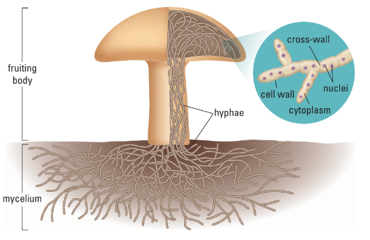

## Diversity and Importance of Fungi

- fungi are more closely related to animals than plants
- they are heterotrophic and absorb nutrients from the environment
- use enzymes to break down organic matter outside their bodies
- require oxygen to survive
- include mushrooms, moulds, yeast, truffles, rusts
- over 100,000 known species with wide diversity
- important decomposers recycling carbon and nitrogen
- help plants by recycling nutrients and forming symbiotic relationships
- some fungi are parasites that harm plants and animals
	- cause many plant diseases and human infections like ringworm and athlete’s foot

## Division *Zygomycata*

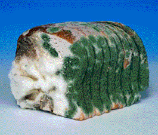

- Common terrestrial moulds
- Live on decaying plant and animal matter
- Some are plant parasites
- Capable of sexual and asexual reprod.
- i.e. *Rhizopus stolonifer*, black bread mould

## Division *Ascomycota*

- Diverse group incl.
  - moulds
  - plant parasites like
    - powdery mildew
    - Dutch elm disease
  - ergot
  - yeasts
  - morels
  - truffles
- Terrestrial and aquatic
- Capable of sexual and asexual reprod.

### Examples

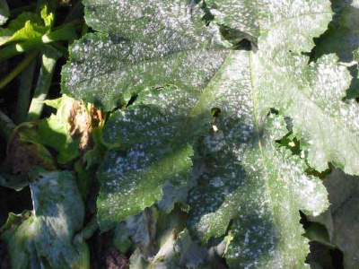

*Powdered mildew*

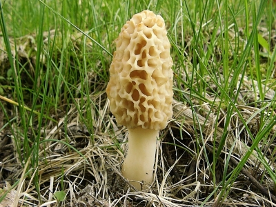

*Morel mushroom*

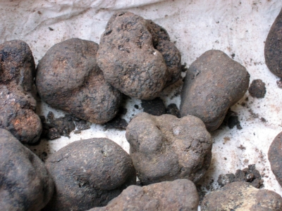

*Truffle mushrooms*

## Division *Basidiomycota*

- Mushrooms, toadstools, puffballs, rusts and smuts
- Grow spore-producing bodies called *basidia*
- Sexual reproduction only

### Examples

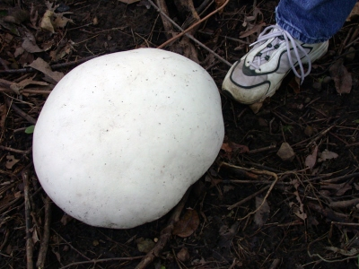

*Giant puffball*

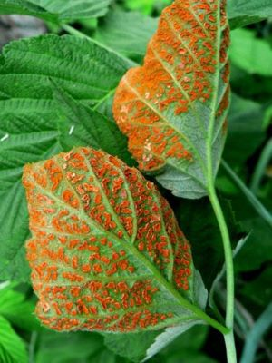

*Orange rust fungus*

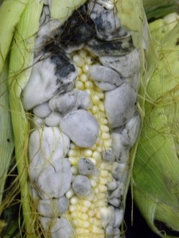

*Corn smut*

## Mycorrhizae

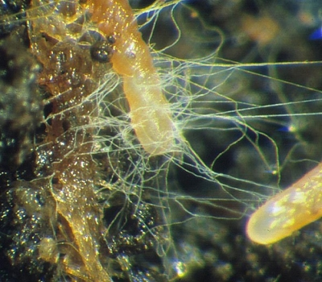

- **mychorrhizae:** fungi that form symbiotic relationships with plant roots
- Help plant to absorb nutrients like phosphorous and trace minerals
- Act like extension of plant roots
- Fraction of diameter of plant root
	- can penetrate into places where plants cannot
- Plant provides food to fungi
- Plant typically grows poorly in sterile environments

*Diagram of mycorrhizae*

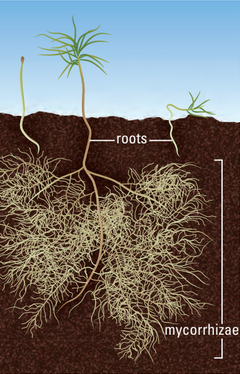

## Lichens

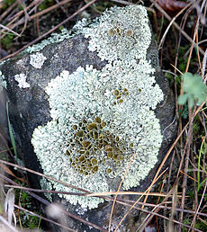

- Mutualistic, symbiotic association between fungi and green algae
- Algae provide food for symbiont
- Fungi provide protection, structure and mineral nutrients
- Inhabit harsh environments but sensitive to pollution

### Examples

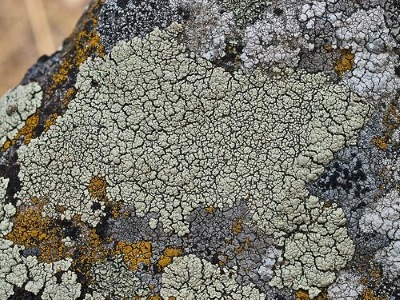

*Crustose* (Encrusted) Lichens

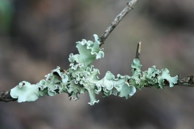

*Foliose* (Leafy) Lichens

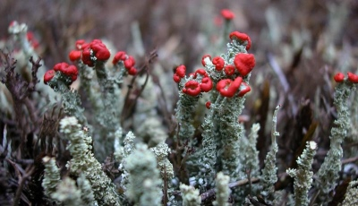

*Fruticose* (Shrubby) Lichens

## Chytridomycota

- **chytridomycota:** fungi w/ flagellated spores
- chytrids

## Reproduction

### Asexual

- piece of hyphae breaks off and releases spores
- **spore:** [[c4.4-cell-cycle|haploid]] cell that help fungi reproduce
	- spread by wind and can withstand unfavourable conditions for long time
	- capable of germinating and producing hyphae or yeasts in favourable conds.

### Sexual

- 2 different sexes in fungi: + and -
- opposite haploid hyphae grow toward each other and fuse to form [[c4.4-cell-cycle|diploid]] zygospore
	- 1 chromosome from each parent "hyphae"
- Club and sac fungi (i.e. mushrooms, puffballs, morels)
	- joining of two genetically diff. hyphae produces **dikaryotic** hyphae
	- **dikaryotic:** containing two nuclei per cell
		- one from each "parent" hyphae
	- eventually, dikaryotic nuclei fuse and form single diploid nucleus
	- diploid nucleus then divides into haploid spores (cycle repeats)

*Reproduction of black bread mould (R. stolonifer)*

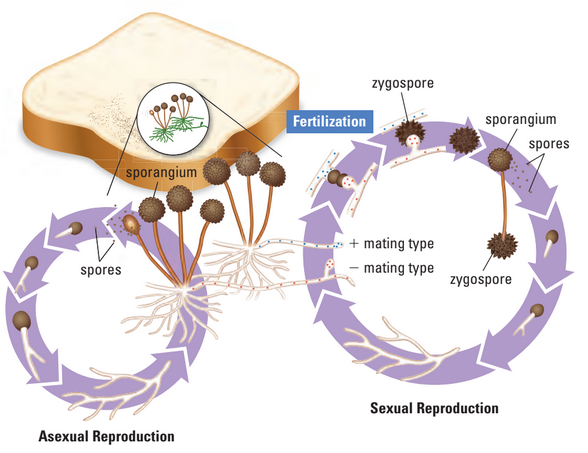

## Climate Change

- rising temperatures are shifting plant ranges north
- plants migrate faster than soil organisms like fungi and insects
- new soil conditions may not support plant-fungi symbiosis
- disrupted symbiosis can reduce plant success
- air pollution has destroyed half of western Europe's mycorrhizae
- loss of fungal webs could impact entire soil ecosystems