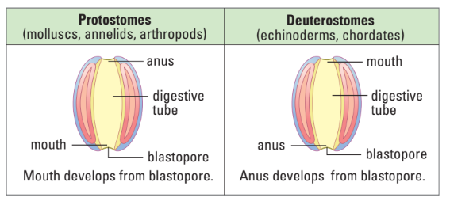
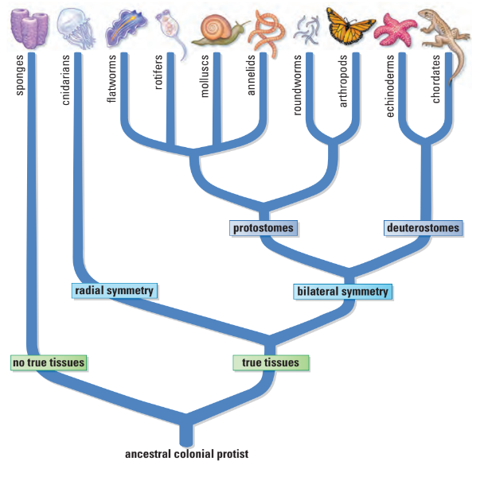
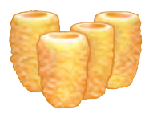
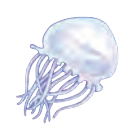
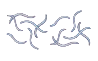
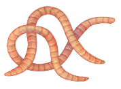
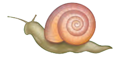
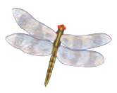
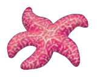
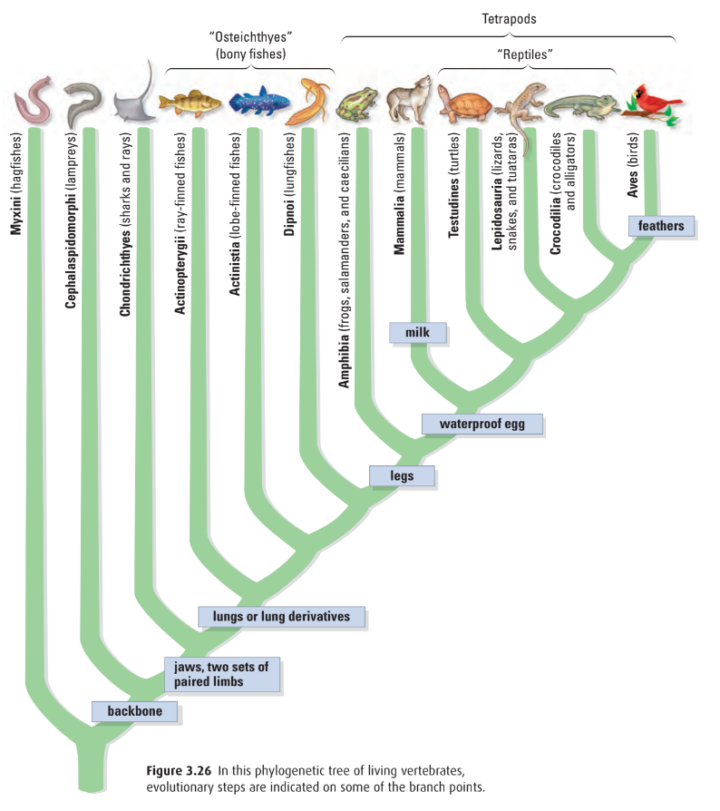

# C2.7 - Kingdom Animalia

## Overview

- **zoology:** study of animals
- Multicellular, no walls, all heterotrophs
- Able to:
  - ingest food
  - circulate oxygen throughout body
  - dispose of undigested food and metabolic wastes
- Each species has...
	- **bauplan / body plan:** animal blueprint or master plan
	- incl. structural details and features like
		- type of symmetry
		- presence of body cavity
		- embryological devel.
		- segmentation
		- presence of head
		- \# of limbs
		- mobility
		- presence of backbone
- \>1 mil. animals in 35 phyla
- [[../U3 - Physiology/c3.1-internal-sys|Levels of Organization (4 Types of Tissues)]]

## What are Animals?

- Animals are eukaryotic
- Animal cells lack cell walls
- Animals are multicellular
- Animals are heterotrophs that ingest food
- Animals are motile at some point in their life cycle
- Animals form a blastula during embryological development
- **blastula:** hollow ball of cells

## Major Groups of Animals

- **invertebrates:** animals w/ no backbone (i.e. earthworm)
- **vertebrates:** animals that have notochord and backbone at some point in life cycle
- **notochord:** skeletal rod of connective tissue running beneath spinal nerve chord

## Body or Germ Layers

- **body or germ layers:** cells in embryo that give rise to specific tissues in adult
- 3 Types &mdash; def. begins w/ *gives rise to*
  1. **ectoderm:** skin and nervous system
  2. **endoderm:** lining of gut
  3. **mesoderm:** organs, muscles
     - lacking in less developed animals

## Body Cavities

- **coelom:** fluid-filled space between body wall and gut, derived from mesoderm
  - animals that have it: humans
- **pseudocoelom:** cavity that lacks true mesoderm lining of true coelom
  - animals that have it: Nematodes (roundworms)

## Embryological Development

- begin life as zygote when sperm fertilize egg
- blastula forms eventually
- infolding of cells occurs at particular spot in ball
- infolding eventually pushes all the way through hollow ball forming tube that connects both ends
- tube develops into *digestive tract*
- **blastopore:** first opening in digestive tract during devel.
	- **protostome:** animal whose blastopore develops into a mouth
		- protos = "first", stoma = "mouth"
	- **deuterostome:** animal whose blastopore develops into an anus

## Symmetry

- **asymmetrical:** no symmetry in organism
	- i.e. sponges
- **radial symmetry:** organism may be divided into multiple identical sections
  - i.e. jellyfish, starfish
- **bilateral symmetry:** organism has mirror-image right and left sides
	- organism has a true head region; concentration of nervous tissue in head
	- well-adapted for movement (streamlined to move quickly)
	- **cephalization:** development of distinct head w/ sense organs
	- i.e. fish, mammals, squirrels

### Segmentation and Limbs

- **segment:** repeating parts in animals
	- in many bilaterally symmetrical animals
	- **annelid:** segmented worms
		- i.e. earthworms
	- diff. sections like head, thorax, and abdomen of insects can also be specialized for specific functions
- **paired limbs:** external paired body part that extends from main body
	- in many animals w/ bilateral symmetry and cephalization
	- uses: movement, defence, sensory
	- examples
		- antennae
		- mouthparts
		- wings
		- gills
		- legs
		- fins
		- arms
		- certain parts of tail

## Phylogenic Tree of Animals

## Invertebrates

### Porifera

- **support:** protein (spongin) or mineral-based needle-like structures  
- **movement:** adults are sessile (anchored in place)  
- **nervous:** none  
- **reproduction:** asexual (budding), sexual (male and female in same individual), zygotes develop into flagellated larvae

### Cnidaria

- **support:** fluid in gastrovascular cavity gives body shape  
- **movement:** contraction of fibers arranged in microfilaments  
- **nervous:** nerve net  
- **reproduction:** asexual (budding), sexual (male and female in same individual)

### Platyhelminthes

- **support:** true muscle tissue running along body  
- **movement:** uses longitudinal muscles  
- **nervous:** primitive brainlike ganglia (nerve clusters) and ventral nerve cords  
- **reproduction:** asexual (fragmentation and regeneration), sexual (male and female in same individual)

### Nematoda

- **support:** exoskeleton called cuticle, must be shed to grow  
- **movement:** all muscles are longitudinal, causes thrashing movements  
- **nervous:** central brainlike ganglion, nerve cords to front and rear  
- **reproduction:** sexual, most have separate males and females, mostly internal fertilization

### Annelida

- **support:** fluid-filled compartments, muscles arranged circularly and longitudinally  
- **movement:** body segmentation enables complex movement  
- **nervous:** two ventral nerve cords connect to segmental ganglia, cerebral ganglia in head  
- **reproduction:** sexual (male and female in same individual)

### Mollusca

- **support:** mantle produces shell in most, muscular foot for movement  
- **movement:** movement by muscular foot  
- **nervous:** nerve ring around esophagus, with attached nerve cords  
- **reproduction:** sexual, internal fertilization (external in polychaetes), most species have both sexes

### Arthropoda

- **support:** protein and chitin exoskeleton, muscles attached to interior knobs  
- **movement:** jointed appendages allow complex movements  
- **nervous:** ventral nerve cord with several ganglia, two cords fuse into larger brain ganglion  
- **reproduction:** sexual, separate sexes, internal fertilization

### Echinodermata

- **support:** endoskeleton of hard plates, water vascular system  
- **movement:** water vascular system operates tube feet  
- **nervous:** nerve ring with nerve cords along each arm  
- **reproduction:** sexual, separate sexes, gametes released externally in water

## Invertebrate Bodily Processes

### Amoebocytes (Multi-purpose Cells)

* **Digestion**: These cells take in food, break it down, and move the nutrients around the sponge.
* **Circulation**: These multi-purpose cells handle the movement of substances.
* **Excretion**: These multi-purpose cells also deal with getting rid of waste.
* **Gas Exchange**: Gases move in and out at the cell level, mainly by spreading out (diffusion).

### Animals with a Simple Gut (Gastrovascular Cavity)

* **Digestion**: Food is processed in a simple pouch with one opening that acts as both mouth and anus. Nutrients spread to the cells lining this pouch.
* **Circulation**: In flatworms, this simple gut is branched, helping to spread nutrients.
* **Excretion**: Most waste moves from cells into the surrounding water. Cells with tiny hairs (cilia) push fluid containing waste out through branched tubes.
* **Gas Exchange**: There are no special breathing parts. Gases move across cell membranes, helped by the movement of fluids within the simple gut.

### Animals with a Body Cavity (General)

* **Circulation**: There's no dedicated system for moving blood. Nutrients are carried by the fluid within the body cavity.
* **Excretion**: A special gland or tube connected to an opening helps maintain water balance and remove some waste.
* **Gas Exchange**: Gases move across cell membranes.

### Animals with a Complete Gut (Tube with Mouth and Anus)

* **Digestion**: Food goes through a full tube with a mouth at one end and an anus at the other, having specialized parts like a stomach and intestine for processing.
* **Circulation**:
    * **Closed system**: Blood stays within vessels, pumped by a heart, and carries oxygen with hemoglobin.
    * **Open system (most species)**: A heart pumps fluid that flows freely within the body cavity.
* **Excretion**:
    * Special tubes (metanephridia) filter and remove waste from the blood.
    * Other specialized tubes (nephridia) also remove waste from the blood.
* **Gas Exchange**:
    * Moist skin acts as a breathing surface; oxygen from the skin is moved by the blood system.
    * In water, special structures called gills (in the mantle cavity) are used for breathing. This mantle cavity can also function as a lung on land.

### Insects and Spiders

* **Circulation**: A heart pumps fluid (not true blood) that flows freely within the body.
* **Excretion**: Special tubes (Malpighian tubules) remove waste from the body fluid.
* **Gas Exchange**: Aquatic forms have feathery gills. Land forms breathe through a network of tubes (tracheal tubes) throughout the body, while spiders have specialized structures called book lungs.

### Animals with a Simple Gut (Short Digestive Tract with Mouth and Anus)

* **Circulation**: Fluid in the body cavity moves nutrients around.
* **Excretion**: No special waste removal organs. Waste diffuses out from the body fluid and through a water-based internal system.
* **Gas Exchange**: A water-based internal system helps with gas exchange.

## Vertebrates

- **vertebrae:** series of skeletal segments in a backbone
	- sing. *vertebra*
- **amniotes:** animals that produce amniotic eggs or can reproduce on land
	- incl. reptiles, birds, and mammals
- **amniotic egg:** waterproof egg w/ shell, which allows vertebrates to reproduce on land

### Phylogenic Tree

## Project Notes

Refer to slides for better clarity on Canva

## Project: Class *Reptilia* &mdash; Reptiles

### Defining Characteristics

- vertebrate
- **internal fertilization:**  fertilization of egg happens inside body
- scales cover part or all of the body
- reptiles known to shed their scales throughout their lifetime
- reptile scales contain beta-keratin
- typically cold-blooded
  - change temp. by moving to warmer or colder environments
- if reptile lays eggs (most of them do), they lay soft-shelled eggs
- has lungs for breathing, no gills
- adapted to terrestrial environment
- reptiles produce amniotic eggs
- **amniotic eggs:** eggs w/ a special membrane and a shell to prevent embryo dehydration
  - allows reptiles to lay eggs on land

### Evolutionary Origins

- Oldest known common ancestor to both reptiles and amphibians: *Casineria*
- reptiles said to derive from a common ancestor during the Middle Pennsylvanian Epoch (~312-307 mya)
- earliest undisputed reptile: *Hylonomous* and *Paleothyris*
- sister group to reptiles taxonomically: *Synapsida* (mammal-like reptiles)
- for mil. of yrs., reptiles and synapsids were similar
  - but over time, their lifestyles diverged and mammals arose from synapsids
- huge diversification of reptiles during the golden age of the dinosaurs, or the Mesozoic Era (biped dinosaurs were a thing)
- “Age of Reptiles,” the Mesozoic Era (251-65.5 mya)
- The earliest snakes evolved during the Middle Jurassic Epoch (174.1-163.5 mya)

### Example: Massassauga Rattlesnake

Scientific name: *Sistrurus catenatus*

- Ontario’s only venomous snake  
- Length: 47.2- 47.6 cm
- Grey to brownish grey with darker blotches along back and several rows of alternating blotches along sides; blotches edged in white
- Pit on each side of head between eye and nostril for heat sensing
- Distinct segmented rattle
- Tail thick, squarish; does not taper to a point like all others
- Does not always rattle a warning; relies on pattern and remaining motionless to go undetected
- Heavy-bodied; often found coiled
- Belly black
- Lives in different types of habitats including tall grass prairie, bogs, marshes, shorelines, forests and alvars
- Cold-blooded (ectothermic); require open areas to warm themselves in the sun 
- Skin covered with scales; Dry smooth texture; keeled (ridged down the center) giving it a rough appearance 
- Move by muscular contraction with the help of elongated scales on their abdomen 
- Vestigial left lung, one functional lung 
- No limbs, external ears, or eyelids

### Example: Snapping Turtle

Scientific name: *Chelydra serpentina*

#### Physiology

- Largest freshwater turtle in Canada
- Average shell length: male: 36 - 43 cm / female: 28 - 37 cm
- Mass, male: 10 - 20 kg / female: 5 - 9 kg
- Appearance: Large, prehistoric-looking
- Shell relatively flat and brown during adulthood
- Shell color: black, olive, or brown (often covered in algae/moss)
- Skin colour: grey, brown, black / underside: white, cream, tan
- Triangular spikes along tail
- Prominent shell ridges
- Long neck and large head
- Webbed feet with long claws
- Sex determined by incubation temp. of embryos during a specific time of development
- Males produced at 23 - 28 C
- Females develop at cooler or warmer temps.
- They can see wider ranges of colors than humans 
- Tetrachromacy color vision: E.g. they can see multiple shades of red

#### Habitat &amp; Behaviour

- Native to southern Canada from eastern Saskatchewan to Nova Scotia, also found in eastern U.S.
- Active from April to Sept.
- Spend most of life in shallow waters (hide in mud and leaf litter, breathe with nose exposed)
- Not strong swimmers
- Usually walk on bottoms of ponds and rivers
- Nesting Season: Early to mid-summer
- Females travel overland to find nesting sites
- Frequently use man-made structures:
- Gravel road shoulders
- Dams
- Aggregate pits

#### Cool Facts

- Algae often grows on shell, helping with camouflage  
- Cannot retract fully into shell; instead, they snap at threats  
- Poorly known in wild  
- Some over 100 years (based on Algonquin Park data)  
- Take 15–20 years to reach maturity → adult deaths severely impact population  
- High risk of being hit by vehicles  
- Eggs near urban/agricultural areas often eaten by predators

## Project: Class *Amphibia* &mdash; Amphibians

### Defining Characteristics

* can exploit both terrestrial and aquatic environments  
* name derived from Greek word *amphibios*, meaning "living a double life"  
* typically has moist skin  
* typically rely heavily on respiration (breathing) through the skin  
* known to possess a double-channeled hearing system  
* green rods in retinas to discriminate hues and two-part teeth  
* eggs typically laid in water, young larvae develop in aquatic environment before moving out of environment

### Evolutionary Origins

*Tiktaalik*

* first appeared ~340 mya during the Middle Mississippian Epoch  
* the earliest groups to diverge from ancestral fish-tetrapod (fish w/ 4 feet) organisms, like the Tiktaalik  
* Early tetrapods developed joints, stronger skeletons, and a flexible neck to support land movement  
*  transition from fins to limbs took over 80 million years, beginning in the Devonian Period  
* Tiktaalik: intermediate form between fishes having fins and terrestrial animals having legs  
* fossil evidence shows that amphibians arose from a lobe-fished lung ancestor \~365 mya  
* amphibians were dominant land vertebrates for over 100 my, known as the "Age of the Amphibians"  
* Frogs and salamander-like species appeared in the Triassic and Jurassic periods, with modern families emerging in the Cenozoic Era  
* arrived during evolution of animals from aquatic environs. toward terrestrial environs.

### Example: Golden Poison Dart Frog

Scientific name: *Phyllobates terribilis*

* Considered one of the most toxic animals on Earth  
* Size: 4.7 - 5.5 cm, Mass: 30 g  
* Protruding eyes, No tail and claws  
* Named *terribilis* to warn about its terrible poison  
* Habitat: Tiny plot in Chocó rainforest on Pacific Coast of Columbia  
* Has enough poison to kill 20,000 mice  
* Smooth, moist skins, colour: yellow, orange, pale green  
* Lives up to 10 years  
* Large eyes compared to body size  
* Short vertebral columns  
* Gets poison from poisonous food, insects and plants  
* Cutaneous respiration (through skin)  
* Males dance to attract females, attracted females fight each other to get male, female rubs snout and back of frog before they mate  
* Eggs laid on forest floor, male carries hatched tadpoles into a water source  
* Diet controls insect populations and prevents overconsumption of plants