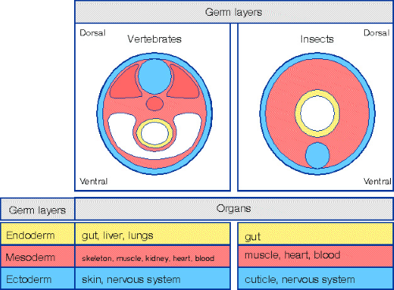
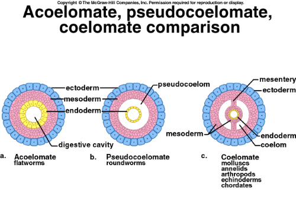
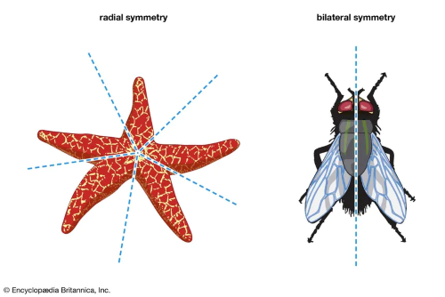
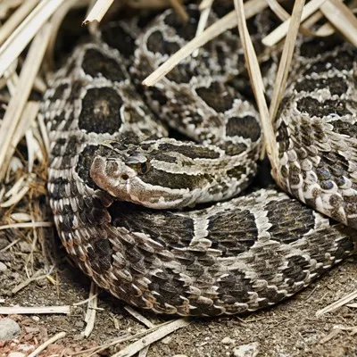
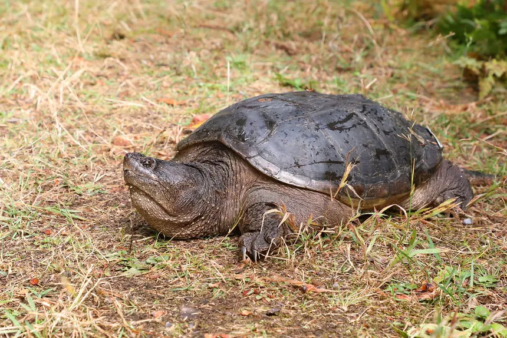
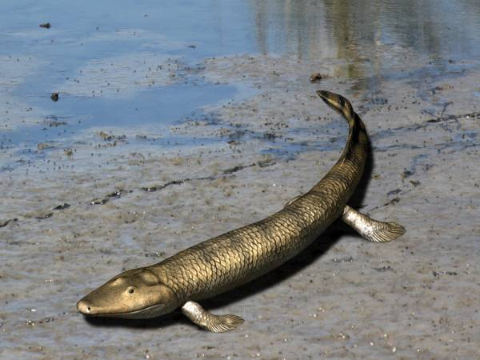

# C2.7 - Kingdom Animalia

## Overview

- **zoology:** study of animals
- Multicellular, no walls, all heterotrophs
- Able to:
  - ingest food
  - circulate oxygen throughout body
  - dispose of undigested food and metabolic wastes
- **bauplan:** animal blueprint or master plan

## Broad Classification

- **invertabrates:** no backbone (i.e. earthworm)
- **vertabrates:** have notochord at some point in life cycle
- **notochord:** skeletal rod of connective tissue running beneath spinal nerve chord

## Body or Germ Layers

- **body or germ layers:** cells in embryo that give rise to specific tissues in adult
- 3 Types &mdash; def. begins w/ *gives rise to*
  1. **ectoderm:** skin and nervous system
  2. **endoderm:** lining of gut
  3. **mesoderm:** organs, muscles
     - lacking in less developed animals

## Body Cavities

- **coelom:** fluid-filled space between body wall and gut, derived from mesoderm
  - animals that have it: humans
- **pseudocoelom:** cavitiy that lacks true mesoderm lining of true coelom
  - animals that have it: Nematodes (roundworms)

## Symmetry

- **radial symmetry:** organism may be divided into multiple identical sections
  - i.e. jellyfish, starfish
- **bilateral symmetry:** organism has a true head region; concentration of nervous tissue in head
  - i.e. fish, mammals, squirrels

## Project Notes

Refer to slides for better clarity on Canva

## Project: Class *Reptilia* &mdash; Reptiles

### Defining Characteristics

- vertebrate
- **internal fertilization:**  fertilization of egg happens inside body
- scales cover part or all of the body
- reptiles known to shed their scales throughout their lifetime
- reptile scales contain beta-keratin
- typically cold-blooded
  - change temp. by moving to warmer or colder environments
- if reptile lays eggs (most of them do), they lay soft-shelled eggs
- has lungs for breathing, no gills
- adapted to terrestrial environment
- reptiles produce amniotic eggs
- **amniotic eggs:** eggs w/ a special membrane and a shell to prevent embryo dehydration
  - allows reptiles to lay eggs on land

### Evolutionary Origins

- Oldest known common ancestor to both reptiles and amphibians: *Casineria*
- reptiles said to derive from a common ancestor during the Middle Pennsylvanian Epoch (~312-307 mya)
- earliest undisputed reptile: *Hylonomous* and *Paleothyris*
- sister group to reptiles taxonomically: *Synapsida* (mammal-like reptiles)
- for mil. of yrs., reptiles and synapsids were similar
  - but over time, their lifestyles diverged and mammals arose from synapsids
- huge diversification of reptiles during the golden age of the dinosaurs, or the Mesozoic Era (biped dinosaurs were a thing)
- “Age of Reptiles,” the Mesozoic Era (251-65.5 mya)
- The earliest snakes evolved during the Middle Jurassic Epoch (174.1-163.5 mya)

### Example: Massassauga Rattlesnake

Scientific name: *Sistrurus catenatus*

- Ontario’s only venomous snake  
- Length: 47.2- 47.6 cm
- Grey to brownish grey with darker blotches along back and several rows of alternating blotches along sides; blotches edged in white
- Pit on each side of head between eye and nostril for heat sensing
- Distinct segmented rattle
- Tail thick, squarish; does not taper to a point like all others
- Does not always rattle a warning; relies on pattern and remaining motionless to go undetected
- Heavy-bodied; often found coiled
- Belly black
- Lives in different types of habitats including tall grass prairie, bogs, marshes, shorelines, forests and alvars
- Cold-blooded (ectothermic); require open areas to warm themselves in the sun 
- Skin covered with scales; Dry smooth texture; keeled (ridged down the center) giving it a rough appearance 
- Move by muscular contraction with the help of elongated scales on their abdomen 
- Vestigial left lung, one functional lung 
- No limbs, external ears, or eyelids

### Example: Snapping Turtle

Scientific name: *Chelydra serpentina*

#### Physiology

- Largest freshwater turtle in Canada
- Average shell length: male: 36 - 43 cm / female: 28 - 37 cm
- Mass, male: 10 - 20 kg / female: 5 - 9 kg
- Appearance: Large, prehistoric-looking
- Shell relatively flat and brown during adulthood
- Shell color: black, olive, or brown (often covered in algae/moss)
- Skin colour: grey, brown, black / underside: white, cream, tan
- Triangular spikes along tail
- Prominent shell ridges
- Long neck and large head
- Webbed feet with long claws
- Sex determined by incubation temp. of embryos during a specific time of development
- Males produced at 23 - 28 C
- Females develop at cooler or warmer temps.
- They can see wider ranges of colors than humans 
- Tetrachromacy color vision: E.g. they can see multiple shades of red

#### Habitat &amp; Behaviour

- Native to southern Canada from eastern Saskatchewan to Nova Scotia, also found in eastern U.S.
- Active from April to Sept.
- Spend most of life in shallow waters (hide in mud and leaf litter, breathe with nose exposed)
- Not strong swimmers
- Usually walk on bottoms of ponds and rivers
- Nesting Season: Early to mid-summer
- Females travel overland to find nesting sites
- Frequently use man-made structures:
- Gravel road shoulders
- Dams
- Aggregate pits

#### Cool Facts

- Algae often grows on shell, helping with camouflage  
- Cannot retract fully into shell; instead, they snap at threats  
- Poorly known in wild  
- Some over 100 years (based on Algonquin Park data)  
- Take 15–20 years to reach maturity → adult deaths severely impact population  
- High risk of being hit by vehicles  
- Eggs near urban/agricultural areas often eaten by predators

## Project: Class *Amphibia* &mdash; Amphibians

### Defining Characteristics

* can exploit both terrestrial and aquatic environments  
* name derived from Greek word *amphibios*, meaning "living a double life"  
* typically has moist skin  
* typically rely heavily on respiration (breathing) through the skin  
* known to possess a double-channeled hearing system  
* green rods in retinas to discriminate hues and two-part teeth  
* eggs typically laid in water, young larvae develop in aquatic environment before moving out of environment

### Evolutionary Origins

*Tiktaalik*

* first appeared ~340 mya during the Middle Mississippian Epoch  
* the earliest groups to diverge from ancestral fish-tetrapod (fish w/ 4 feet) organisms, like the Tiktaalik  
* Early tetrapods developed joints, stronger skeletons, and a flexible neck to support land movement  
*  transition from fins to limbs took over 80 million years, beginning in the Devonian Period  
* Tiktaalik: intermediate form between fishes having fins and terrestrial animals having legs  
* fossil evidence shows that amphibians arose from a lobe-fished lung ancestor \~365 mya  
* amphibians were dominant land vertebrates for over 100 my, known as the "Age of the Amphibians"  
* Frogs and salamander-like species appeared in the Triassic and Jurassic periods, with modern families emerging in the Cenozoic Era  
* arrived during evolution of animals from aquatic environs. toward terrestrial environs.

### Example: Golden Poison Dart Frog

Scientific name: *Phyllobates terribilis*

* Considered one of the most toxic animals on Earth  
* Size: 4.7 - 5.5 cm, Mass: 30 g  
* Protruding eyes, No tail and claws  
* Named *terribilis* to warn about its terrible poison  
* Habitat: Tiny plot in Chocó rainforest on Pacific Coast of Columbia  
* Has enough poison to kill 20,000 mice  
* Smooth, moist skins, colour: yellow, orange, pale green  
* Lives up to 10 years  
* Large eyes compared to body size  
* Short vertebral columns  
* Gets poison from poisonous food, insects and plants  
* Cutaneous respiration (through skin)  
* Males dance to attract females, attracted females fight each other to get male, female rubs snout and back of frog before they mate  
* Eggs laid on forest floor, male carries hatched tadpoles into a water source  
* Diet controls insect populations and prevents overconsumption of plants