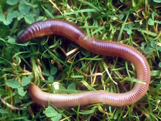

# C3.1 - Internal Systems and Regulation

## Organ Systems

- Human body cells arranged in a hierarchy
- **tissue:** group of specialized cells that work together to perform a specific task
- **organ:** structure composed of different tissues specialized to carry out a specific function
- **organ system:** group of organs that have related functions

## Human Organ Systems

## 4 Types of Tissue

- **epithelial tissue** forms protective structures in body
	- lines outer layer of skin and many organs
	- form glands in body to produce hormones, enzymes, and sweat
- **connective tissue** supports and protects structures in the body
	- also connects two structures together
	- found in
		- tendons (connect muscle to bone)
		- ligaments (connect bone to bone)
		- bones
		- cartilage (stops bones from rubbing on each other)
		- blood
		- fat
- **muscle tissue** allows for movement in body
	- **skeletal muscle:** muscle located in arms, legs, and areas with bones to help us move
	- **smooth muscle:** muscle located in digestive tract to help food move through the digestive system
	- **cardiac muscle:** muscle located in the heart to help the heart move to pump blood
	- smooth and cardiac muscles allow the organs to move
- **nervous tissue** responds to stimuli and sends signals throughout body
	- **stimuli:** factor that causes the body to react to it —> change of bodily activities
	- found in brain, spinal cord, nerves

## Respiration and Gas Exchange

- Essential for all organisms
- Oxygen in → carbon dioxide out
- Different organisms have different gas exchange systems
- All rely on **moist respiratory surfaces**
- **breathing:** ventilation of respiratory system with air

## Respiratory Surfaces

- **respiratory surface:** special, moist membrane where gas exchange occurs
- **cellular respiration:** process that produces energy needed to fuel all cell activities
	- glucose + oxygen → water + carbon dioxide + ATP
- Characteristics of Respiratory Surface
	- very thin and moist → permeable to gases being diffused
	- large surface area to maximize diffusion
	- **diffusion gradient** must be maintained
		- diffusion: high conc. → low conc.
		- relative difference in concentration of oxygen and carbon dioxide in both sides required

## Membrane Diffusion Only

- Found in single-celled and some multi-celled organisms
- Rely on simple diffusion
- Concentration gradient
	- high concentration → low concentration
- i.e. bacteria, protists, flatworms, hydra

## Specialized Respiratory Systems

- Larger organisms require more complex respiratory systems
- Simple diffusion effective only to thickness of few cells
- Systems include:
	- respiratory surface
	- passageways
	- muscular structures associated w/ respiratory surfaces

### I. Skin Respiration

- Moist surface
- Tissue lined w/ capillaries
- Occurs across all of body surface
- Species relying on skin respiration generally small or have flat bodies to have large surface area
- i.e. earthworms

### II. Gills

- **gills:** folds in the body surface specialized for gas exchange
	- feathery tissues in aquatic animals
	- high surface area
	- ventilated w/ oxygen-rich water
	- enables water to flow so that gases can diffuse from water and across respiratory membranes
	- may be combined w/ other functions like feeding (bivalves) and locomotion (octopus)
- i.e. fish

### III. Tracheal Respiration

- **tracheal system:** system of tubes that extend through their bodies
	- **tracheae:** larger entry tubes
	- **tracheoles:** smaller branching tubes from tracheae
- Internal system in insects
- Open to exterior by spiracles
- **spiracle:** valved pores used for breathing
- Internal network of tracheae
- Ventilated through muscular contractions
- Generally, insects don't need circulatory system for gas exchange (diffusion enough)
- Larger insects sometimes pump in more air through rhythmic body movements 
	- ... compressing and expanding the air
- i.e. grasshopper

### IV. Lungs

- **lungs:** internal, thin-walled sacs with a large surface area
- Internal structures connected to exterior by specialized passageways
- 3 components
	- lungs w/ moist respiratory system
	- circulatory system
	- ventilation system
- i.e. terrestrial vertebrates, arachnids (book lungs)
- Inside lungs, oxygen gas diffuses into blood and is transported via vessels across body
- Carbon dioxide diffuses out of blood, enters lungs, and moved out