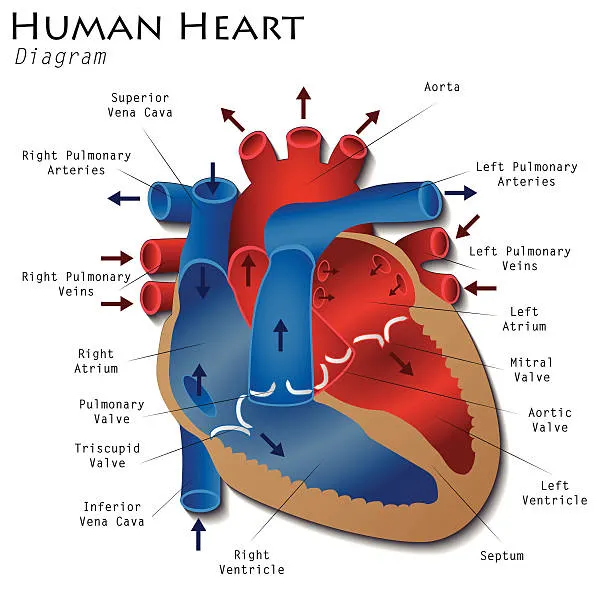
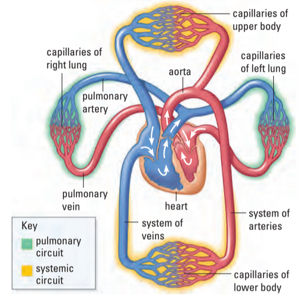
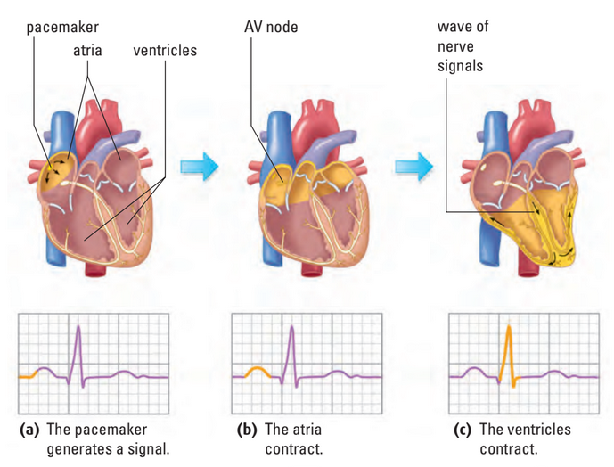
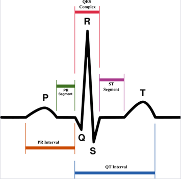
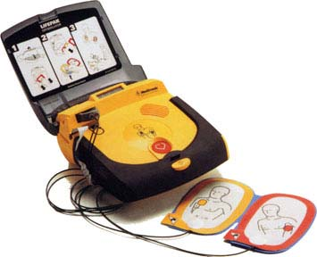

# C3.10 - Mammalian Heart

## About the Heart

- Pumps blood through 160,000 km of blood vessels
- Beats 90k times / day, every day throughout person's lifetime
- Heartbeat consists of...
	- **systole:** rhythmic contraction
	- **diastole:** relaxation of myocardium
- **myocardium:** entire cardiac muscle

## Cardiac Cycle

- 4-chambered heart: L/R **atria** and **ventricles**
- **atria:** receive blood from veins and pumps them into ventricles
- **ventricle:** receive blood from atria and pumps them away from heart
- Two atria contract simultaneously
	- *little pressure generated*
- Two ventricles contract simultaneously shortly after
	- *high pressure generated*
- **mitral / bicuspid valve:** two-part valve that separates left atrium and l. ventricle
- **tricuspid valve:** 3-part valve that separates right atrium and r. ventricle
- **atrioventricular valves:** valves located between atria and ventricles
	- two valves listed above
	- soft "lub" sound
- **semilunar valves:** 2 valves that prevent blood flowing back from...
	- r. ventricle and pulmonary artery
	- l. ventricle and aorta
	- louder "dub" sound
	- **pulmonary valve** between r. ventricle and pulmonary art.
	- **aortic valve:** between l. ventricle and aorta
- Deoxygenated blood from body collected by **superior** *and* **inferior vena cava**
- R. atrium contracts pumping blood to r. ventricle
- R. ventricle contracts and pumps blood to lungs through **pulmonary artery**
- Oxygenated blood in **pulmonary veins** returns to heart via l. atrium
- L. atrium contracts and sends oxygenated blood to l. ventricle
- L. ventricle contracts and pumps blood out through aorta

## 2 Circuits of Bloodflow

### Pulmonary Circuit

**pulmonary circuit:** pathway of blood where blood travels from R. side of heart to lungs

> R. atrium &rarr; R. ventricle &rarr; pulmonary artery &rarr; lungs &rarr; pulmonary vein &rarr; l. atrium

Here, artery has deox. blood and vein has ox. blood

### Systemic Circuit

- **systemic circuit:** pathway of blood where blood is pumped through aorta
- **aorta:** artery that supplies oxygen to all body systems
- **superior vena cava:** vein entering heart from upper body
- **inferior vena cava:** vein entering heart from lower body

> L. atrium &rarr; l. ventricle &rarr; aorta &rarr; body &rarr; vena cava &rarr; r. atrium

#### Blood Supply for Heart

**coronary arteries:** pair of arteries branching from the aorta to supply heart muscle with necessary nutrients

## Control of Heartbeat

- Heart continues to beat when body is asleep / unconscious
- Heartbeat self-regulated
- **sinoatrial (S-A) node:** natural "pacemaker" of heart
	- originates in bundle of fibres in r. atrium
	- fires and contracts atria
	- controlled by both nervous and endocrine system
	- **hormones:** chemical messengers of the body
- Impulse / cardiac action potential spreads to **atrioventricular (A-V) node**
- Ventricles contract
- Bundle of His and Perkinje fibres aid in spread of cardiac action potentials

## Electrocardiograms (ECGs)

*Parts of an ECG*

- **electrocardiodiagram (ECG / EKG):** graph that measures change in voltage between electrical signals of "pacemaker"
- $P$: contraction of atria
- $Q$ to $S$: contraction of ventricles, repolarization of atria (immeasurable)
- $T$: repolarization of ventricles before next firing
- Random contractions of heart cause **fibrillation**
- **defibrillator:** device that applies strong electrical current to heart which may reset the pacemaker
	- ***WILL NOT*** start a stopped heart
- Noradrenaline causes SA node to fire more rapidly
- Acetylcholine slows SA node firing
- Both released through impulses gen. in *medulla oblongata*

*Defibrillator*

## Sources

https://www.istockphoto.com/vector/human-heart-diagram-gm477331500-66758051