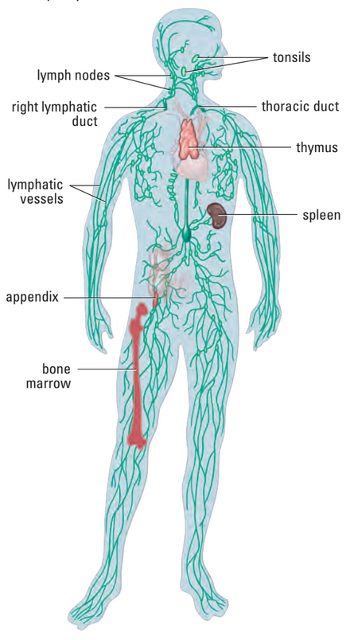

# C3.11 - Circulation and Homeostasis

## Homeostasis

- **homeostasis:** state of internal stability maintained by body
	- normal pH state of blood
	- goal of circulatory system

## Hypertension

- **hypertension:** high blood pressure
- Occurs when BP > 140/90 for ext. period of time
- Increases risk of heart disease
- Diets high in salt and cholesterol increase BP
- BP increases with:
	- age
	- lack of exercise
	- obesity
	- certain ethnicities
		- African
		- Aboriginal
		- South Asian
	- stress
	- excess alcohol
	- smoking
- High cholesterol diets may lead to *arteriosclerosis*
- **arteriosclerosis:** disease where plaques are deposited in arteries
	- leads to obstructions
	- ⚠ possible heart attacks
	- see more in Disorders

## Blood Pressure (BP)

*Device to measure BP*

- BP and heart rate increase from increased O2 demand
- **systolic pressure:** highest pressure resulting from contraction of l. ventricle
- **diastolic pressure:** lowest pressure before another ventricular contraction
- **sphygmomanometer:** pressure cuff used to measure blood pressure
- average: 120/80 mm Hg (120 systolic / 80 diastolic)

## Lymphatic System

- Vascular transport system incl. spleen
- Network of glands and valved vessels
- Contains **lymph**
	- usually clear, colourless, oily fluid
- Helps maintain fluid balance in mammals
- Collects blood plasma that has leaked out of capillaries
- **interstitial fluid:** leaked plasma
- Lymph returned to blood stream through ducts opening onto l. and r. subclavian veins
- Flow of lymph dictated by movement of gut and skeletal muscle
- Involved in immune response
- **Lymphocytes** produced in **lymph nodes**
- **Lymph glands** swell when body fights infection

## Lymphatic System &mdash; PART II

- ~3-4 L of fluid / day leave blood to surround your cells
- **lymphatic system:** organ system that collects fluid leaving capillaries
	- screens them for microorganisms
	- then returns them to the circ. system
- **lymph:** fluid leaked out of circ. system, collected by lymphatic vessels
	- clear, watery fluid made up of
		- protein molecules
		- salt
		- gluocose
		- others
- Lymph collects in system of lymph vessels
	- Have valves to prevent lymph from flowing back toward capillaries
	- Muscle contractions + vessel squeezing + valves &rarr; help move lymph
	- Eventually drains into circ. system near heart
- **spleen:** organ that helps remove old / damaged blood cells, stores platelets and
	- helps control amount of blood and blood cells in body
- Lymph vessels alongside small intest. pick up fats and fat-soluble vits. and transports to blood
- Helps provide immunity
- **thymus:** organ where WBCs mature
- **lymph node:** small, bean-shaped enlargements that filter out harmful organisms and abnormal cells

## Temperature Regulation

- **homeotherm:** body temp. does not fluctuate
	- i.e. lion
- **poikilotherm:** body temp. fluctuates according to environ. factors
	- i.e. tortoise
- Body temp. of 37.5 &deg;C maintained via behavioural and physiological mechanisms
	- Ex. behavioural
		- sitting in shade
		- putting on clothing
	- Ex. physiological
		- Heat loss from skin surface regulated by...
			- vasoconstriction; or
			- vasodilation of blood vessels
		- countercurrent heat exchange system in arms and legs

## Health of Circulatory System

## Plaque

**plaque:** patchwork of cholesterol, calcium, and fat deposits that stick to interior vessel walls

### Dangers

- **atherosclerosis:** narrowing of arteries resulting from plaque buildup
	- pathway narrows &rarr; BP increases
	- *angina pectoris:* chest pains felt from partial blockages
	- occurs when deposits on artery wall harden
	- weakens arterial elasticity
- **heart attack:** stoppage / severe slowdown of blood supply to heart tissue
	- majority cause: atherosclerosis
- **sudden cardiac arrest:** heart suddenly stops functioning
	- most common cause: coronary heart disease

### Disorders

- **arrhythmia:** heart beats irregularly (too slow, too quick)
- **hypertension**
	- above
- **heart failure:** condition where heart cannot pump blood efficiently
	- because it can't fill with enough blood
	- or send blood w/ enough force
- **aneurysm:** bulge in wall of artery
- **stroke:** blood clot forming in artery going to brain

## Choices Helping Cardiovascular Health

- Foods high in fiber
- Low in salt and cholesterol
- **cholesterol:** fat part of cell membranes used to synthesize hormones, bile, and vit. D
	- made by liver
- high-density lipoprotein (HDL)
	- "good cholesterol"
	- removes excess cholesterol from tissues and arteries
- low-density lipoprotein (LDL)
	- "bad cholesterol"
	- becomes part of plaque in arteries
- Maintain healthy weight
- Exercise regularly
- Avoid smoking and inhaling smoke
- Regular health check ups