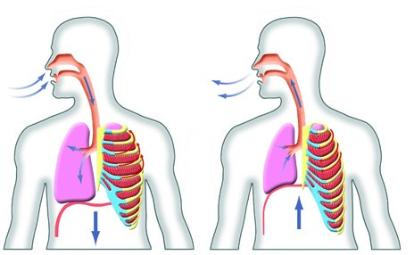
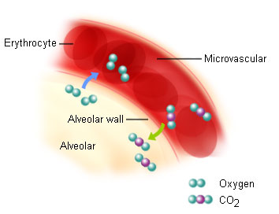
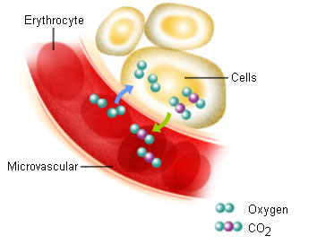
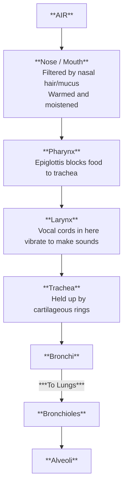
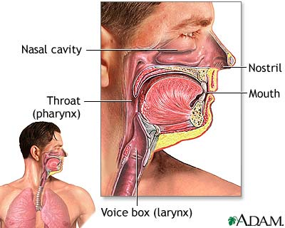
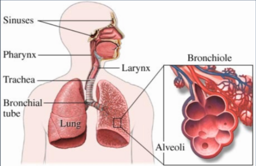
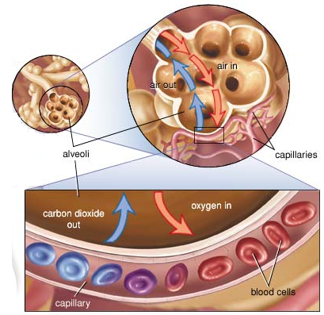

# C3.2 - Mammalian Respiration

## Respiration

- All mammals share the same basic respiratory structure
- Respiration subdivided into 3 activities
	1. **Breathing:** inspiration / inhalation (air in) *[L]* and exhalation / expiration (air out) *[R]*
		
	2. **External Respiration:** exchange of oxygen and carbon dioxide between air and blood
		
	3. **Internal Respiration:** exchange of oxygen and carbon dioxide between blood and cells of surrounding tissue
		

## Respiratory Tract (RT)

- **respiratory tract:** the passageway of which air passes through the body
- Lungs protected deep within body
- Connected to exterior by passageways

### Path of Oxygen in RT (Diagram)

### The Upper RT

- Air enters **nostrils (nares)** or **mouth**
- Air is warmed and moistened by hair and mucus in nose
- Air passes through **pharynx**, **glottis**, and **larynx**
- **pharynx:** junction of esophagus, trachea, nasal cavity, and larynx
- **esophagus:** passageway to stomach
- **glottis:** opening of trachea
- **trachea (windpipe):** flexible passageway to lungs, supported by cartilaginous rings
- **epiglottis:** flap preventing food and liquids passing into the trachea
- **larynx:** voice box housing vocal chords
- **cilia:** microscopic hairs in the body
- Upper RT line w/ cilia that continually pass foreign particles, fluids, and debris up and out of RT

### The Lower RT

- Trachea branches into 2 **bronchi**, one for each **lung**
- Lungs divided into lobes:
	- 3 on right
	- 2 on left
- Bronchi then branch into many **bronchioles**
- Bronchioles end in grape-like clusters of **alveoli**

### RT Lining

- Lined with moist epithelial tissue (from 4 types of tissue)
- Epithelial tissue covered with cilia and fine layer of mucus in trachea and bronchi
- **Mucus** traps foreign particles and removes them from air
- *Cilia* sweep mucus-trapped particles up to pharynx for disposal or swallowing

### Alveoli

- **alveoli:** sacs in lungs where gas exchange takes place
- One cell thick
- Closely associated w/ capillary networks
- Blood takes up oxygen through simple and facilitated diffusion
- Alveoli coated in surfactant to reduce surface tension

---

- Inner surface of each alveolus lined with layer of moist epithelial cells
- Oxygen in air dissolves in film of moisture on these epithelial cells
- Oxygen diffuses into capillaries and binds to hemoglobin on RBCs
- Hemoglobin increases efficiency by creating diffusion gradient
- RBCs transport oxygen throughout the body