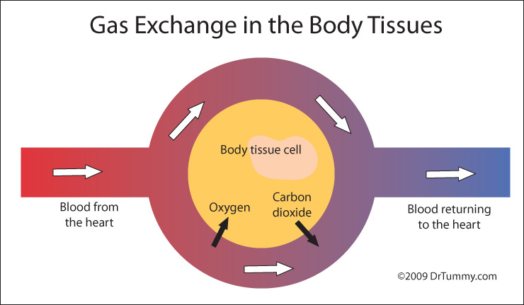
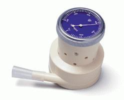
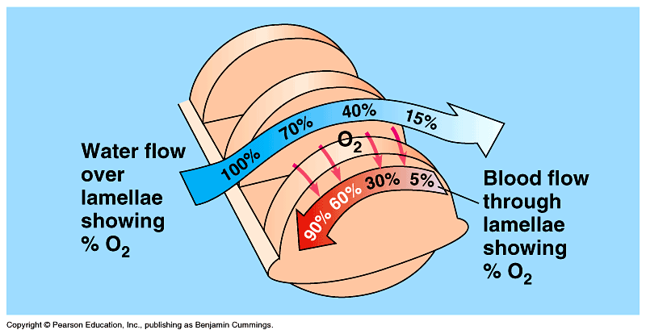
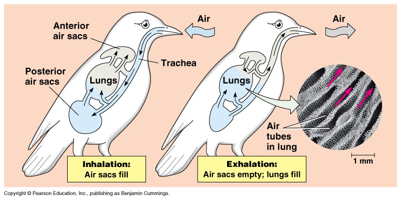

# C3.3 - Mechanisms of Breathing

## Breathing

- **breathing / ventilation:** the process of moving air into and out of your lungs
- Air will flow from high pressure to low pressure
- Associated muscles:
	- intercoastal muscles (between ribs)
	- diaphragm
- Statistics
	- Humans breathe 15 times/min. on avg.
		- \>21,000 breaths / day
	- Lungs about size of football
	- Total capacity of lungs: 6 L avg.
	- 0.6 L of volume used on normal breath
	- Humans can use 20x more oxygen when exercising compared to rest

## Breathing Mechanism and Diaphragm

- **diaphragm:** large dome-shaped sheet of muscle that forms bottom wall of chest cavity
- **Inhalation**
	- Intercoastal muscles contract lifting rib cage up and out
	- Diaphragm contracts and pulls downwards
	- Increases volume of lungs &rarr; reduces air pressure in alveoli
	- Air moves in from high pressure to low pressure
- **Exhalation**
	- Intercoastal muscles relax, rib cage returns to resting position
	- Diaphragm relaxes and moves upward to normal position
	- Decreases volume of lungs &rarr; increases air pressure in alveoli
	- Air moves out from high pressure to low pressure

## Gas Exchange Composition

- Inhaled air
	- 20.94% oxygen
	- 0.04% carbon dioxide
	- 79.02% nitrogen and other gases
- Exhaled air
	- 16.49% oxygen
	- 4.49% carbon dioxide
	- 79.02% nitrogen and other gases

## Lung Capacity

***Spirometer:*** *Device used to measure lung capacity*

- **tidal volume (TV):** air inhaled and exhaled in a normal breath.
- **inspiratory reserve volume (IRV):** the additional volume of air that can be taken in
- **expiratory reserve volume (ERV):** the additional volume of air that can be forced out of the lungs
- **vital capacity (VR):** total volume of air that can be moved in or out of the lungs
- **residual volume:** amount of gas that remains in the lungs no matter what
- **respiratory efficiency:** rate at which oxygen can be transferred to the blood

$$
\begin{equation*}
\ce{VR = TV + IRV + ERV}
\end{equation*}
$$

## Counter-Current Flow: Fish Gills

- Blood vessels of lining gills flow in opposite direction to movement of water
- Increases fish gill efficiency by using dissolved gas concentration gradient
- Most oxygen depleted blood meets most oxygen depleted water
- Oxygen diffuses in by simple concentration gradient
- Blood continues to pick up oxygen as concentration increases

## Counter-Current Flow: Birds

- No alveoli or diaphragm
- **Anterior and posterior air sacs** branch out from lungs like bellows
- No gas exchange occurs in air sacs
- **parabronchi:** tubes acting as respiratory surfaces in birds
- Expansion and contraction of air sacs ventilate lungs
- Air circulates through lungs and air sacs
- Fresh air in contact w/ lungs at all times
- More efficient than humans