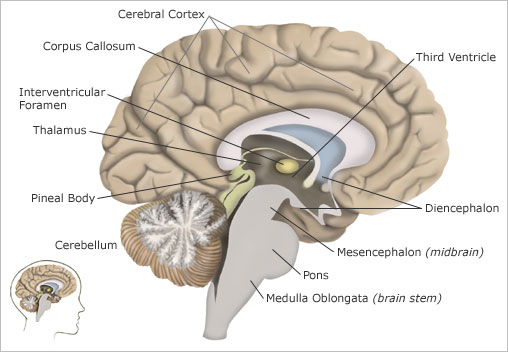
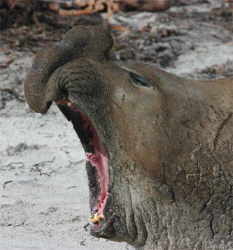
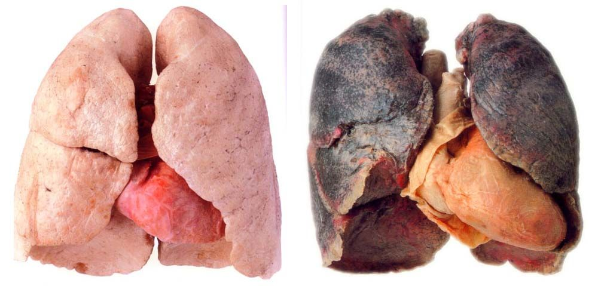

# C3.4 - Control and Regulation of Respiration

## Control of Breathing

- Conscious control for short periods
	- i.e. holding breath underwater
- Concentration of carbon dioxide in body predominately determines breathing rate
	- when CO2 dissolves in water, it forms carbonic acid
- $\ce{CO2}$ rich blood reaches the ***medulla oblongata*** at the base of the brain
- ***medulla oblongata*:** part of brain that sends out nerve impulses to muscles of rib cage and diaphragm to control breathing
- Minor factors in control
	- concentration of oxygen in carotid artery and aorta
	- blood pH
	- lung capacity
- **homeostasis:** state of internal stability maintained by body
	- normal pH state of blood

## Breathing at High Altitudes

- High altitudes: Lower air pressure, proportionally less air than lower altitudes
- Air is thinner or rarified
- Less oxygen available for respiration
- Altitude sickness or hypoxia may result
- Symptoms
	- high breathing rate
	- decrease in blood pH
	- increase in pulmonary blood pressure
	- pulmonary edema
- Short-term adaptions to altitude
	- increased breathing rate
	- increased production of RBCs (increased hematocrit)
- Long-term genetic adaptations
	- short build, short limbs
	- large lung volume
	- high pulmonary blood pressure
	- more alveoli in lungs

## Diving

*Elephant seal*

- Elephant seals dive 400 m, 40 atm. for over 20 mins.
- Sperm whales capable of staying in 2 km depths for >1 h
- Animals experience hypoxia but utilize oxygen stores throughout body
- Heart rate slows (*diving bradycaria*)
- Blood flow diverted to brain and heart

## Respiratory Impairment

- Respiratory system no longer able to adjust to environmental conditions
- **Drowning**
	- **laryngospasm:** larynx closes and person asphyxiates
	- **fresh water drowning:** alveoli collapse, gas exchange ends
	- **salt water drowning:** fluid drawn out from lungs, oxygen can't reach alveoli walls
- **Carbon monoxide poisoning**
	- CO binds to oxygen receptors of hemoglobin w/ more affinity
	- Results in suffocation
- **Smoking**
	- Cilia in trachea paralyzed or killed
	- Mild CO poisoning
	- Smoke particles lodged in respiratory pathways
	- Tar coats lungs, alveoli become brittle
	- *Consequences*
		- coughing, snoring
		- CO poisoning, lung cancer, emphysema
- **Air pollution**
	- varied forms
	- contributes to asthma, smog
- **Diabetes affects your breathing**

### Common Disorders

- **sinusitis:** condition where sinuses become swollen and irritated
	- caused by virus and bacteria
	- **sinus:** moist air space around nose
	- symptoms: stuffy / runny nose, pain / swelling around eyes and cheekbones, pressure in head
- **influenza:** common viral infection of upper respiratory system
	- spread by airborne droplets and contact w/ contaminated objects
	- can develop into pneumonia in more serious cases
- **pneumonia:** infection of lungs where alveoli in lungs fill with fluid, preventing oxygen from reaching blood
	- caused by variety of
		- viruses
		- bacteria
		- fungi
		- parasites

### Other Disorders

- **asthma:** chronic disorder where airways become narrowed
	- when smooth muscles contract in bronchi and bronchioles
	- airway becomes narrow
	- breathing becomes difficult
	- can be life-threatening
	- may be caused by air pollution, cold air, smoke, drugs, and infections
	- **bronchodilator:** drug that causes narrowed airways to expand, delivered often by puffer
- **bronchitis:** infection of bronchioles or airways connecting alveoli and trachea
	- produce excess mucus
	- may cause frequent coughing and difficulty breathing
	- may be chronic when exposed to smoke or pollution
- **emphysema:** "over-inflated lungs"
	- occurs when cilia in airways are damaged
	- bronchioles become clogged &rarr; less air to alveoli
	- air pressure builds up and eventually tear alveoli walls up
	- increased heart and breath rate
	- causes: smoking, exposure to chem. hazards (mines)
- **chronic obstructive pulmonary disesase (COPD):** serious condition combining chronic bronchitis and emphysema
	- usually requires external source of oxygen
- **cystic fibrosis:** fatal genetic disease where abnormally thick mucus blocks airways
	- traps bacteria in lungs and leads to lung tissue infection
- **severe acute respiratory syndrome (SARS):** serious pneumonia-like respiratory disease caused by a coronavirus
	- coronavirus spread through coughing / sneezing
- **Lung Cancer**
	- **tumour:** groups of cancer cells
	- cells in lungs reproduce too quickly
	- 85% of cancers linked to smoking

### Normal Lung (left) vs. Smoker's Lung (right)

