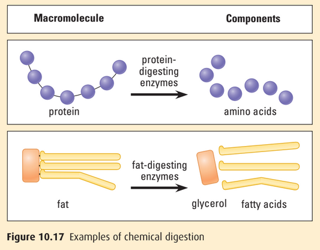

# C3.5 - Digestive System

## Obtaining and Processing Food

- All organisms must have a way of obtaining essential nutrients
- **heterotroph:** organisms that depend on food made by others
- **autotroph:** organisms that can make their own food
- Food must be broken down to a size that can be passed through the cell membrane

## Four Stages of Food Processing

### STEP I: Ingestion

**ingestion:** act of eating / drinking

### STEP II: Digestion

- **digestion:** process of breaking food down into molecules that are small enough for the body to absorb
- **mechanical digestion:** processing food physically (i.e. chewing, chopping) to increase surface area
- **chemical digestion:** breaking down chemical bonds in nutrients of food into smaller molecules
	- occurs during hydrolysis
	- **hydrolysis:** process that breaks bonds into food molecules by adding water in presence of specific enzymes

### STEP III: Absorption

- **absorption:** process where cells absorbs small molecules like amino acids and simple sugars
- occurs in small intestine
- molecules enter blood then transported to body
- joined to make bigger molecules or broken down for energy
- excess molecules converted to fat for storage

### STEP IV: Elimination

**elimination:** process of removing any undigested materials from digestive tract

**feces:** eliminated undigested material (commonly known as poop / shit)

## Feeding Behaviours in Animals

- **filter feeding:** food is filtered from water by straining it
	- i.e. whales (baleen), molluscs (gills)
	- Baleen:

		
- **fluid feeding:** mouthparts adapted for piercing and sucking
	- some also use digestive enzymes to break down their prey outside
	- i.e. spiders, tapeworms, mosquitos
- **bulk feeding:** ingestion of large particles periodically
	- requires development of more complex digestive system
	- i.e. mammals

## Digestion

|Intracellular Digestion|Extracellular Digestion|
|-|-|
|Engulfing of food by pirio/phagocytosis|Common in animals
|Digestion occurs inside food vacuole|Open tube arrangement: mouth and anus (i.e. earthworms)|
| |Closed tube has one opening serving both functions (i.e. sea anemone)|

- **alimentary canal:** digestive tract with two openings (mouth and anus)
	- canal a.k.a. gastrointestinal (GI) tract (*gastro* = stomach)
	- herbivores / omnivores have longer GI tract
	- carnivores have shorter tract
	- vegetation more difficult to digest than meat due to cell walls
	- GI tract much longer in humans and many other animals than dist. between mouth and anus

**phagocytosis:** process where cell engulfs another cell to digest it

***Extracellular Digestion***

