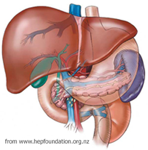

# C3.6 - Human Digestive Tract

## Diagram of Human Digestive Tract

## The Mouth and Dentition

*Teeth*

*Mouth, easier to understand*

- Digestion begins in mouth
- Food is broken into smaller pieces by teeth
- Teeth
	- 4 incisors
	- 2 canines
	- 4 bicuspids
	- 6 molars on lower jaw
- Tongue covered w/ papillae which house the taste buds
- Taste buds detect
	- sweet
	- sour
	- salty
	- umami
	- bitter

	
- Roof of mouth divided into *hard* and *soft* palate
- **Uvula** hangs from back edge of soft palate and prevents food from entering pharynx when swallowing
- **Salivary glands** secrete saliva that contains enzymes such as amylase that start chemical digestive process.
- **saliva:** water liquid that contains digestive enzymes, mucus, and other chemicals to help chemically digest food
- **mucus:** sticky substance that coats and lubricates food to slide down tube without harming lining tissues

## Pharynx

- After leaving mouth, **bolus** enters pharynx
- **bolus:** food ball
- **pharynx:** short tube shared by digestive and respiratory system
- **epiglottis:** cartilage flap that temporarily seals airway to prevent food from entering airway

## Esophagus

- After leaving pharynx, **bolus** enters esophagus
- **esophagus:** muscle-lined tube connecting the mouth and stomach
- Lubricant, **mucin** is secreted to aid in swallowing
- **regurgitation:** food returning up esophagus

## Peristalsis

**peristalsis:** movement of food through wave-like contractions of muscle in digestive system

## Stomach

- **stomach:** elastic muscular, J-shaped sac that helps digest bolus
- Interior lined w/ 1000s of gastric juice secreting glands contained in **gastric pits**
- **gastric juice:** mixture of hydrochloric acid, enzymes like pepsinogen, and mucus
- **Gastric juice** and muscular movements render food into thick liquid called **chyme**
- **chyme:** acidic, nutrient-rich liquid produced by stomach
- Amount of food entering and leaving stomach controlled by 2 sphincters:
	- esophagal -OR-
	- cardiac + pyloric
- Stomach muscles contract, create churning motion to force *chyme* into small intest.

## The Liver

- Large organ, numerous roles
- *hepato-*: related to liver
- **bile:** yellow / greenish alkaline liquid produced by liver
- Produce bile salts (alkaline organic salts) from cholesterol
- Bile emulsified or breaks up fats and activates lipases in small intestine
- Bile stored in gallbladder
- Breaks down old red blood cells producing bile pigments:
	- biliverdin and bilirubin
- Detoxifies the blood
- Converts monosaccharides (animal starch) into glycogen
- Stores vitamins A, D, E, K

## The Pancreas

- Produces **pancreatic juice**
- **pancreatic juice:** clear alkaline liquid that neutralizes acidic chyme and contains enzymes to further break down nutrients
- Produces enzymes such as pancreatic amylase and lipase
- Releases bicarbonate to neutralize acidic chyme in the duodenum
- Frederick Banting found way to preserve pancreatic insulin
	- to treat Type I Diabetes

### Diabetes

1. **Diabetes** – A group of diseases characterized by high blood glucose levels due to issues with insulin secretion, insulin action, or both.

2. **Insulin** – A hormone produced by the pancreas that controls blood glucose levels; discovered by Frederick Banting and Charles Best in 1921.

3. **Type 1 Diabetes** – An autoimmune condition where the pancreas cannot produce insulin; cause is not fully understood and currently not preventable.

4. **Type 2 Diabetes** – A metabolic disorder where body cells do not respond properly to insulin; strongly linked to obesity and lack of physical activity.

5. **Effects of Diabetes** – Includes fatigue, vision loss, kidney disease, heart problems, and high blood pressure due to persistent high blood glucose.

6. **Lifestyle Impact** – Sedentary habits and excess body fat hinder insulin effectiveness, increasing the risk of developing Type 2 diabetes.

## The Small Intestines

- **small intestine:** tube w/ folded walls in the body
- **villi:** folds in the small intestine that increase surface area for absorption of nutrients
- Intestinal glands found within villi
- Villi have finger like projections called **microvilli**
- Gross cylindrical surface of 0-4 m2 (7-8 pgs. of textbook), incl. *villi* and *microvilli*
- Surface area is 300 m2 (doubles tennis court)
- Each **villus** has network of microscopic blood vessels and a small lymph vessel
- **lymph vessel:** structures that carry fluid away from cells
- Subdivided into 3 regions:
	- **duodenum:** fairly short, U-shaped region connecting stomach to small intestine
		- pancreatic and bile ducts open into duodenum
	- **jejunum:** 2.5 m long region that contains more folds and intestinal glands than duodenum
	- **ileum:** 3 m long region that contains fewer and smaller villi which absorbs nutrients broken down in duodenum and jejunum

## Large Intestine

- **large intestine:** 1.5 m long large tube &mdash; subdivided into 4 regions:
	- **caecum:** blind sack, appendix at extreme end
	- **colon:** the main parts of the large intestine that absorbs water and minerals
		- site of bacterial fermentation
		- Food enters...
			- **ascending colon**
			- **transverse colon**
			- **descending colon**
- Feces passes out of colon to **rectum**, then **anal canal** and **sphincter**
- **feces:** undigested food material and other waste products

## Chemical Digestion

- **digestion:** chemical breakdown of food by hydrolysis (adding water molecule)
- Hydrolysis sped up by enzymes:
	- carbohydrases (breaks down carbohydrates)
	- lipases (breaks downfats)
	- proteinases (breaks down proteins)
- Excreted from glands into digestive tract
- Major enzymes involved in digestion:
	- salivary amylase (amylose)
	- pepsin (protein)
	- lipase (fats)
	- maltase (maltose)
	- lactase (lactose)
- Digestive secretions regulated by nerves and hormones
- **hormones:** chemical messengers transported from one part of the body to another through the blood

## Diagnosing Digestive Disorders

### Diagnostic Tools

- **endoscopy:** process where narrow tube inserted into throat and passed into esophagus, stomach, and upper intestine
	- small camera in narrow tube allows doctor to see inside and spot problems
- **biopsy:** cutting of small piece of digestive tissue to view under microscope
- **colonoscopy:** thin, lighted tube w/ camera inserted through rectum to detect unusual growth
- **capsule endoscope:** pill with camera swallowed that takes picture of tract before being eliminated

### Examples of Digestive Disorders

| Condition                      | Description                                                                 | Diagnosis and Treatment                                                                 |
|-------------------------------|-----------------------------------------------------------------------------|------------------------------------------------------------------------------------------|
| Gastroesophageal reflux disease (GERD) | Acid from the stomach frequently flows back into the esophagus.   | Avoid smoking, alcohol, and overeating. Use antacids. Surgery may be needed in some cases. |
| Ulcer                         | Damage to stomach lining causes irritation by acid.                        | Tests like blood, stool, X-ray, and endoscopy identify the ulcer and its cause (often *H. pylori*). |
| Inflammatory Bowel Disease    | Intestines become inflamed and develop ulcers.                             | Believed to be an allergic reaction to foreign substances in the intestines. Treated with medication or surgery. |
| Constipation                  | Stool moves too slowly or becomes too hard due to lack of fiber or other causes. | Eat a high-fiber diet, drink water, and exercise regularly.                              |
| Diarrhea                      | Colon is irritated, reducing water absorption, often due to infection.     | Usually resolves with fluids and nutrition. May be a symptom of a more serious condition. |

## Sources

- https://louis.pressbooks.pub/medicalterminology/chapter/digestive-anatomy/