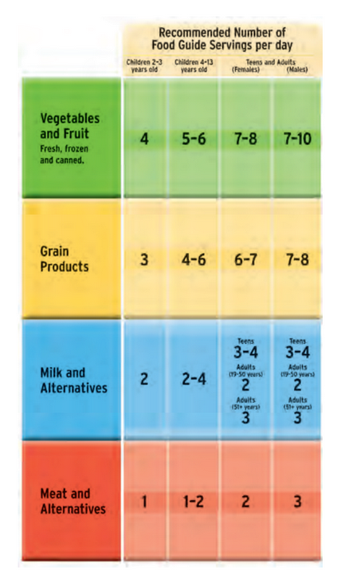

# C3.7 - Choosing a Healthy Diet

## Healthy Diet

- Canada’s Food Guide to Healthy Eating
	- Contains food groups that will provide all daily nutritional requirements
- 1 serving size equal to
	- medium fruit
	- 125 mL vegetables
	- half bagel / small waffle
	- 200 mL milk / yogurt
	- 30 mL peanut
	- 75 g chicken

## Nutrients

### Carbohydrates

- **carbohydrates:** compounds made up of carbon, hydrogen, and oxygen
- major source of energy for humans
- can be used directly or be stored
- 2 types
	- Simple Carbohydrates (i.e. sugars &rarr; fruit, honey, milk)
	- Complex Carbohydrates (i.e. starches &rarr; bread, rice, potatoes)
- **glucose:** main fuel supply for cells
	- used for cellular respiration
	- or for making larger carbs / fat molecules
- **glycogen:** chain of many glucose molecules
- **cellulose / fibre:** complex carbohydrate often found in fruits and vegetables

### Proteins

- **protein:** complex molecule constructed from 20 kinds of **amino acids**
- **amino acid:** organic molecules that compose a protein
- Contribute to almost all day-to-day functions
	- i.e. form hair muscles
	- long-term nutrient storage
	- may defend against harmful microorganisms
	- facilitate inter-cell communication
- **enzyme:** protein that speed up specific chemical reactions without being consumed
- **essential amino acids:** 1 of 8 amino acids that our cells cannot make from other molecules

### Fats

- **fats / lipids:** molecules formed from fatty acids and glycerol
- store energy in body and help body absorb fat-soluble vitamins
- provide body with insulation
- **saturated fats:** fats with single bonds between carbon atoms in fatty acids
	- has max. number of hydrogen atoms
	- high intake promotes buildup of fat deposits within blood vessel walls
- **unsaturated fats:** fats with at least one double bond in a fatty acid chain
	- found in
		- fruits
		- vegetables
		- nuts
		- seeds
		- fish
		- olive / sunflower seed oil
	- important part of healthy diet
- **trans fat:** partially hydrogenated unsaturated fat (processed to accept more hydrogen atoms)
	- solid at room temp.
	- longer shelf life than other unsaturated fats
	- often used in fast food
	- contribute to heart disease and bad health

### Vitamins and Minerals

- **vitamin:** organic nutrient needed in small amounts to regulate body processes and perform chem. reactions
- **organic nutrient:** nutrient that contains carbon
- Types of Vitamins
	- *water-soluble* cannot be stored in body, continuous intake required
	- *fat-soluble* be stored in fatty tissue in small amounts
- **mineral:** inorganic nutrient that don't contain carbon
	- important minerals: Ca, Fe, P, Cu, Na, Zn
- Found naturally in foods like
	- meat
	- eggs
	- dairy
	- whole-grain products
	- tofu
	- green leafy vegetables
	- some fruits

### Water

- Required by every cell to complete its process
- Many of body's chem. reactions happen in water
- **dehydration:** lack of enough water in body

## What are calories?

- **calorie:** amount of energy required to raise temp. of 1 g water by 1 &deg;C
- **dietary calorie (C.):** equal to 1,000 calories
	- calories often used to refer to C.
- Calories of nutrients
	- Fat: ~9 C. / g
	- Carbs and proteins: ~4 C. / g
	- More C-H bonds in fats than carbs / proteins
- Calories needed for basic maintenance + active lifestyle
	- 2,200 calories for female teens
	- 2,500 calories for male teens

## Beneficial Foods

- **nutraceutical:** substance purified from foods and taken as medicine to give health benefits incl. disease prevention
- **functional food:** food that has health benefits incl. disease prevention beyond nutritional benfit
- **probiotics:** foods that contain substances that help promote growth of helpful intestinal bacteria

## Fitness

- 2 classes: cardiovascular and muscular
- Cardiovascular fitness delivers greatest benefits
- Heart rate may indicate level of fitness
- Benefits
	- loss of excess weight
	- lower blood lipids
	- lower BP (blood pressure)
	- increased energy lvls.

## Diets and Dietary Supplements

- Balance of food types must be maintained
- Vegetarians avoid meat and fish on moral or ethical grounds
- Vegans do not consume any animal products
- Diets must be specially planned to incorporate all dietary nutrients
- Vitamins and supplements may be required if diet is lacking in certain nutrients
- A balanced diet will usually not require the use of vitamins

## Drugs and Other Toxins

- **psychoactive drugs:** drugs that affect central nervous sys. and interfere w/ normal functioning of brain
- **LD50:** lethal dose for 50% of test pop.

## Nicotine

- Found in tobacco and its products
- Extremely toxic
	- ORL-RAT LD50 50 mg/kg
- Increases pulse rate and BP
- Interferes with vit. C absorption &rarr; impairs immune response
- Tobacco smoking may result in...
	- hardening of arteries
	- respiratory infections
	- emphysema
	- ulcers
	- cancer

## Caffeine

- Found in many plants incl. coffee and tea
- Toxic
	- ORL-RAT LD50 192 mg/kg
- Acts as a diuretic (dilutes urine)
- Increases BP
- Constricts blood vessels

## Alcohol

- Produced by yeast fermentation
- ORL-RAT LD50 7060mg/kg
- Excessive use problems:
	- physical
	- psychological
	- social problems

## LSD

- LSD: D-lysergic acid diethylamide
- Illegal hallucinogen
- IVN-RAT LD50 16 mg/kg

## Heroin

- Derived from opium poppy *Papaver somniferum*
- Highly addictive illegal narcotic
- Lethal dose varies among individuals
- Users have greater tolerance to the drug
- Injected intravenously
- Intense rush
- Users prone to...
	- liver disease
	- infections
	- collapsed veins
	- hepatitis and HIV infection

## Ecstasy

- Both a stimulant and hallucinogen
- Illegal neurotoxin
- Increases body temp, and
- Blocks serotonin uptake
	- causing insomnia, and
	- insensitivity to pain

## Anabolic Steroids

- Synthetic derivatives of the male hormone testosterone
- Builds muscle tissue in patients
- Used illegally by athletes to boost performance
- Side effects
	- liver damage
	- heart problems
	- high blood pressure
	- mood swings
	- female masculinization