# C3.8 - Circulatory System

## Introduction to Circulatory System

- Responsible for delivering nutrients and oxygen to tissues
- Removes wastes and provides a pathway for hormones and other chemical messengers
- Most multicellular organisms have a fluid-filled vascular system
- Most animals have a vascular system associated with a muscular pump creating a circulatory system

## Internal Transport in Simple Organisms

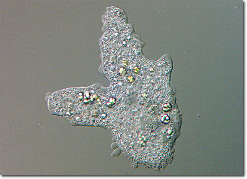

- Unicellular organisms
- Rely on distribution of nutrients through...
	- streaming of circulation of cytoplasm
- i.e. amoeba

## Internal Transport in Simple Animals

- A simple body cavity allows materials to be exchanged between
	- the fluid in the body cavity; and
	- the cells of the body cavity itself
	- i.e. sea anemone
		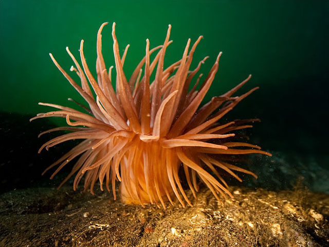
- Branching of body cavity allows greater surface area for absorption
	- i.e. flatworm
		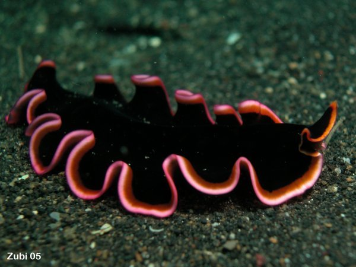

*Sea anemone cross-section*

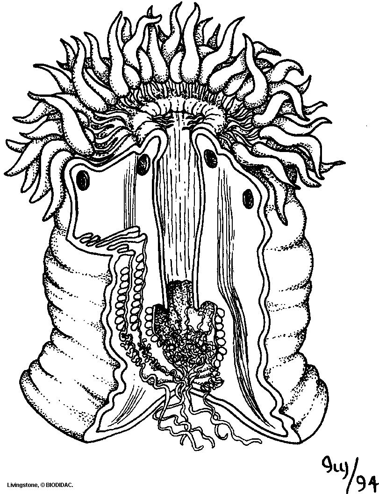

*Flatworm cross-section*

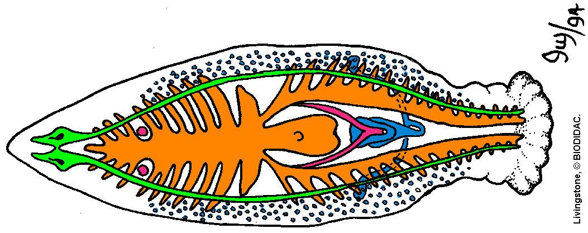

## Open Transport Systems

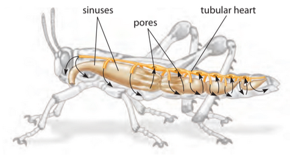

- **open circulatory system:** transport system where blood does not always stay enclosed within blood vessels
- Tubular heart pumps blood through vessels that open into sinuses
- **sinus:** spongy chamber in system
- Blood bathes tissues directly from sinuses
- It then collects in another set of sinuses and goes back to heart
- i.e. insects

*Insect cross-section*

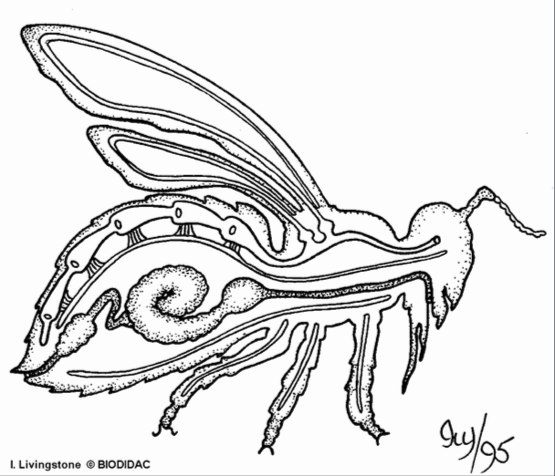

## Closed Transport Systems

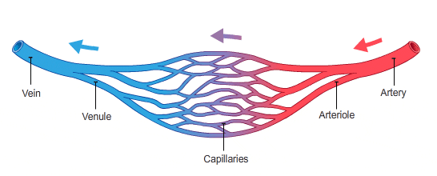

- Blood contained within vessels and pumped around body
- Blood vessels consist of...
	- large vessels for blood collection
	- small vessels for blood distribution
	- capillaries to provide surface area for materials exchange
- More efficient circulation
- Nutrients, gases, and wastes diffuse across thin walls of capillaries
- **cardiovascular system:** closed circulatory system in humans and other vertebrates
	- humans have network of ~100,000 km of blood vessels

*Circulatory system of earthworm*

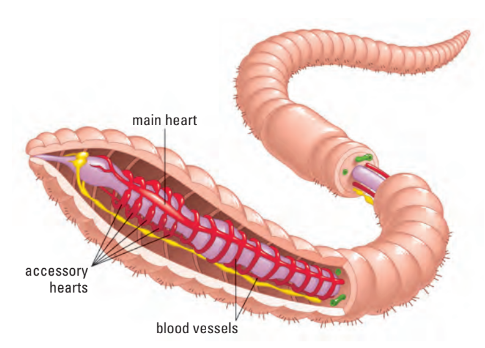

### Circulation in Annelids

- Simplest closed circulatory systems
- 2 main blood vessels connected by aortic arches that act as pumps
	- dorsal vessel
	- ventral vessel
- Blood flows from the dorsal vessel, through the aortic arches, to the ventral vessel
- Numerous capillaries found in the skin for gas exchange w/ environ.
- Respiratory pigment hemoglobin assists in absorption and transport of oxygen

*Earthworm aortic arches*

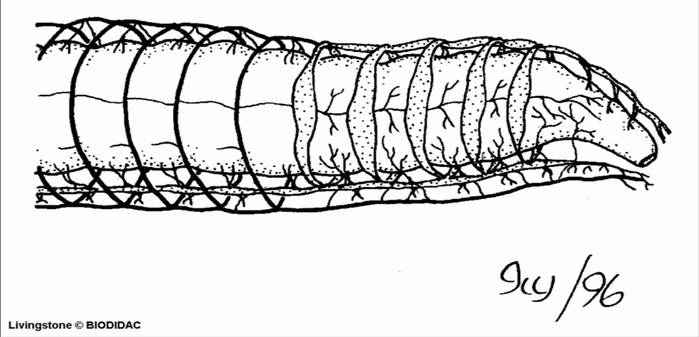

### Circulation in Fish

- 2 chambered heart w/ 2 associated cavities in series (inefficient)
- All chambers are able to contract
- Blood flows in one direction
- Sinus Venosus &rarr; **Atrium** &rarr; **Ventricle** &rarr; Conus
- However, pressure is lost over the gills limiting fish's metabolic rate

*Fish heart cross-section*

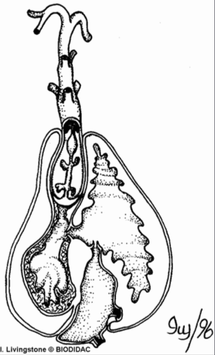

### Circulation in Amphibians

- 3-chambered heart: left and right atrium, ventricle
- Blood pumped to lung and then back to the heart &rarr; distributed to body
- 3 chambers allow blood to be pumped 2x / cycle
- Only some blood is pumped twice &rarr; **incomplete double circulation**
- Oxygenated and deoxygenated blood mix in ventricle reducing efficiency

*Amphibian heart*

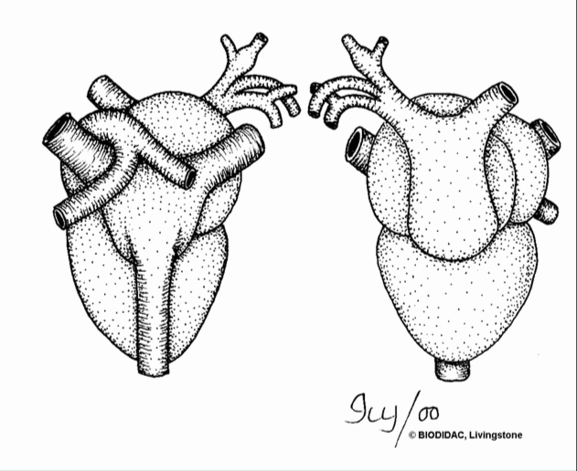

### Circulation in Reptiles

 - Non-crocodilians &rarr; partially divided ventricle
	 - i.e. snakes, turtles, tortoises, lizards
	 - more efficient than amphibians but still not very efficient
- Crocodiles &rarr; completely divided ventricle
	- functionality similar to mammals

### Circulation in Birds and Mammals

- High energy requirements necessitate efficient circulatory system
- Oxygenated and deoxygenated blood kept separate
- 4-chambered heart:
	- left and right atrium
	- left and right ventricle
- Closed, complete, **double circulatory system**