# C3.9 - Mammalian Circulatory System

## Introduction

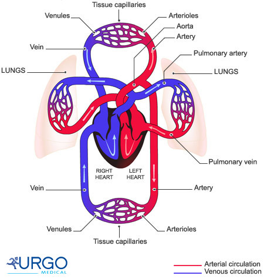

- Blood arranged in 3 main cycles below:
- **cardiac circulation:** pathway of blood within heart
- **pulmonary circulation:** pathway of blood from heart to lungs
- **systemic circulation:** pathway of blood from heart to rest of body

## Transport Vessels

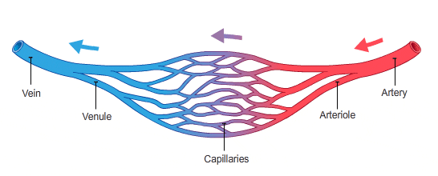

- **Arteries** and **arterioles** *(small arteries)* carry blood away from heart
	- oxygenated blood
	- pulmonary arteries carry deoxygenated blood to lungs
- **Veins** and **venules** *(small veins)* carry blood toward heart
	- deoxygenated blood
	- pulmonary veins carry oxygenated blood to heart
- **blood vessel:** a tube for blood to circulate through
- Pulmonary cycle breaks oxygenated-deoxygenated trend
- Blood travels from arteries &rarr; capillaries &rarr; veins
- As blood travels through capillaries, pressure drops

## Arteries

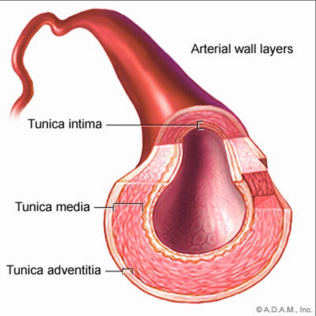

- **arteries:** thick, elastic, muscular transport vessels that carry blood away from heart
- Act as conduits for blood between heart and capillaries
- Act as a pressure reservoir to force blood into arterioles
- Dampens changes in blood pressure and flow caused by the heart
- Controls distribution of blood to different capillary networks by closing some arteries
- Walls of arteries made of epithelial tissue wrapped in layers of smooth muscle and connective tissue
- Blood pressure depends on...
	- the volume of blood in the arteries
	- properties of arterial walls

## Veins

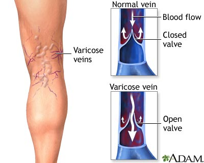

- **veins:** transport vessels that carry blood towards heart
- Large inside diamater
- Lack elasticity
- Large volume, low pressure systems
- Storage reservoir for blood
- Blood moves back to heart by gravity and skeletal muscle contractions
	- exercise is important
- Valves in veins prevent blood from flowing backwards
- *Varicose veins:* a disease where the valves in the veins do not function properly

## Capillaries

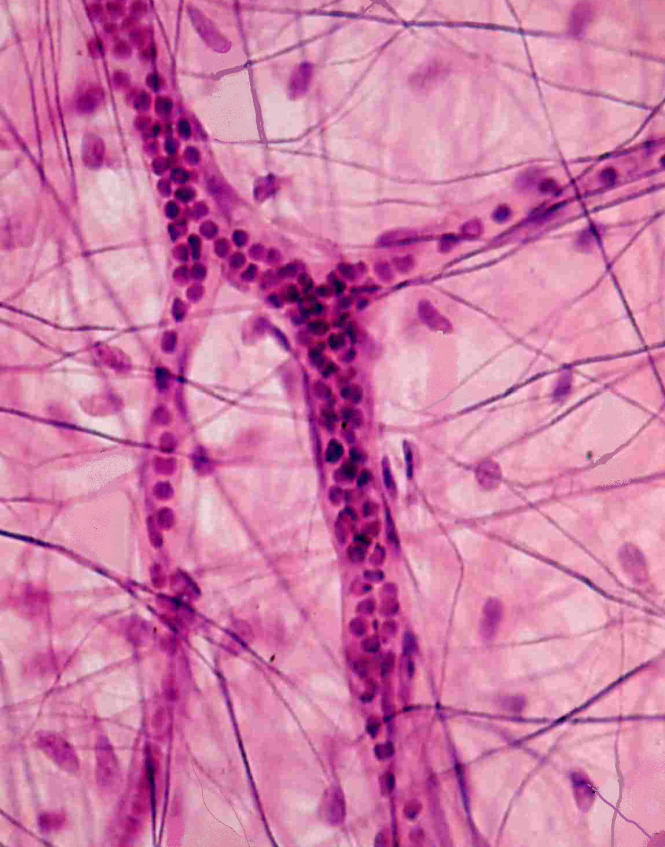

*Line 1 blood cell thick are capillaries*

- **capillaries:** smallest (microscopic) blood vessels where nutrient and gas exchange between blood and body occurs
- Diameter just large enough for 1 blood cell to pass through
- High surface area, resembles network of tiny tubes
- Capillary wall regulates movement of fluids and nutrients into and out of blood
- Walls consist of very thin layer of epithelial tissue in moist membrane

## Blood: The Transport Medium

- **tissue:** collection of cells that have specialized tasks
- **blood:** transport tissue of oxygen and nutrients
	- Body contains ~4-6 L of blood
	- also transports wastes out of system
- Composed of 2 phases
	- **plasma:** liquid part of blood (55% of blood)
		- ~90% water
		- ~10% of plasma: proteins, dissolved nutrients, wastes
	- solid cells (45% of blood)

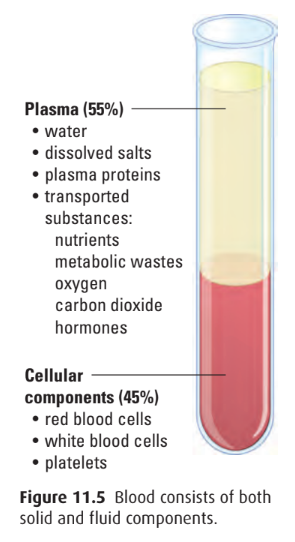

### Erythrocytes: Red Blood Cells (RBCs)

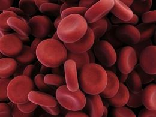

- **red blood cells (RBCs):** cells that carry oxygen from lungs to all tissues of body
	- 1 mm3 of blood (1 drop) &approx; 5 mil. RBCs
	- proper name: *erectocytes*
- 44% of blood volume
- Bags of hemoglobin, made in bone marrow
- **hemoglobin:** protein that binds oxygen in the lungs and releases it throughout body
	- Each cell packed w/ 280M haemoglobin molecules
	- Haemoglobin takes up and releases oxygen
	- Oxygen bonds to Fe in hemoglobin, giving blood red colour
- Specialized for oxygen transport
- Produced in bone marrow
- Mature cells have no nuclei
- Lifespan: 3-4 mo.
- Factors that influence oxygen-haemoglobin binding
	- *Low oxygen partial pressure:* weakened bond, quick release
	- *Increased blood acidity:* weakened bond, quick release
	- *Cooler temperature:* strengthened bond, slow release
	- Carbon dioxide also binds w/ haemoglobin

*Haemoglobin binding diagram*

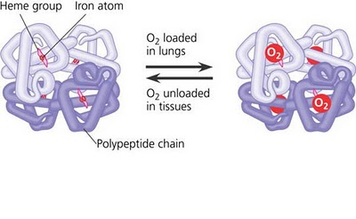

### Leukocytes: White Blood Cells (WBCs)

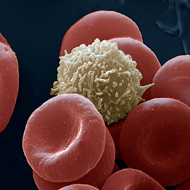

- **white blood cells (WBCs):** cells that guard against infection, fight parasites, and attack bacteria
	- proper name: *leukocytes*
- 1% of total blood volume under normal, healthy conditions
- Protect body from infection
- Not constrained to blood vessels, can move through vessel walls as needed
- Keep their nuclei unlike RBCs
- 2 important types
	- macrophages
	- lymphocytes
- **Macrophages** may pass through capillary wall by amoeboid movements
	- to digest pathogens by phagocytosis
	- Part of innate immune response: general defence

#### Lymphocytes

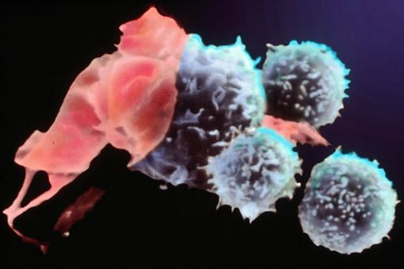

- **Lymphocytes** part of acquired immune response
- Enable body to recognize and fend off pathogens
- 2 types
	- T cells (from thymus gland)
	- B cells (from bone marrow)
- Allow body to become immune to certain pathogens
- **antibodies:** Y-shaped proteins w/ a region that is variable in structure
- Variable region recognizes antigen carried on invading pathogens
- B cells remain in blood after an infection ready to trigger another immune response

### Platelets

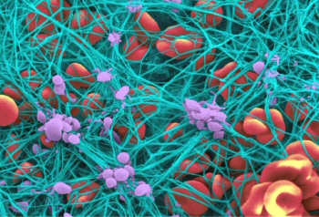

- **platelets:** cell fragments involved in clotting of blood
	- originate when cytoplasm of certain bone marrow cells divides
	- 1 mm3 of blood &approx; 250k-500k platelets
- Platelets mainly produced in bone marrow
- After injury, broken blood vessels attract platelets to site of injury
- Platelets rupture and release substances that combine with other clotting factors in plasma
- Enzymatic reactions produce fibrin that forms a mesh preventing blood cells from escaping
- **fibrin:** strand-like protein involved in clotting
- Network builds up into a scab
	- Protects area while new tissue develops

## Nutrient Exchange Between Blood and Cells

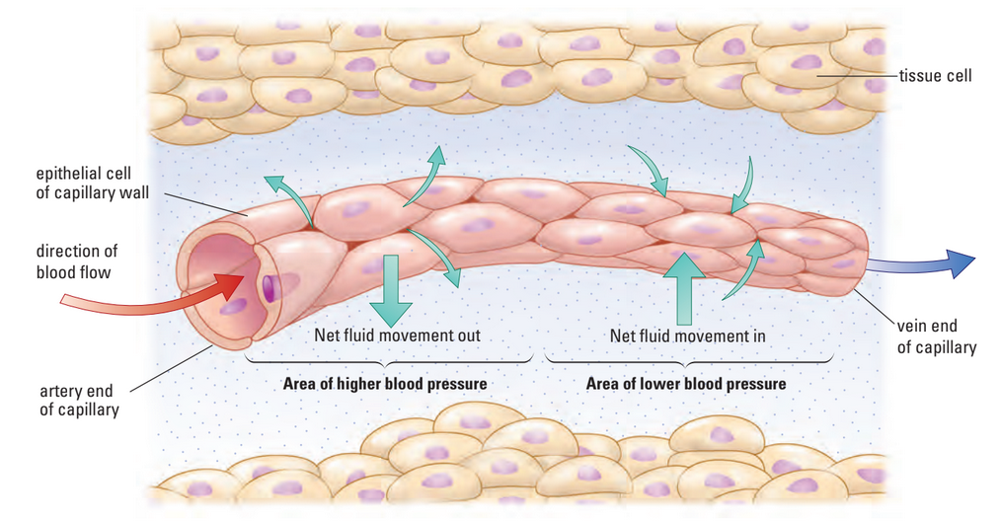

- **diffusion:** process where molecules move across a membrane from area of high concentration to low conc.
- **diffusion gradient:** gradual change in concentration of solutes in a solution as a func. of dist. through solution
	- i.e. if blood in capillary contains higher conc. of O2 than fluid next to it...
	- ... oxygen moves to fluid by diffusion (spont.)
- Capillaries no more farther than 10&mu;m from body cell
- Nutrients, gases, and wastes diffuse between capillaries and body cells
- Body tissues are surrounded by fluid that acts as a medium for molecular exchange.
- Molecules in capillaries must first enter the surrounding fluid before entering cells
- Small molecules (e.g., oxygen and carbon dioxide) move by diffusion:
	- Oxygen diffuses from blood → fluid → cells
	- Carbon dioxide diffuses from cells → fluid → blood
- Larger molecules require other transport processes to cross membranes
- **blood pressure:** force exerted by blood on artery walls which drives:
	- Blood flow through arteries and capillaries
	- Movement of substances across capillary walls
- Nutrients and gases diffuse into cells from the fluid.
- Cellular wastes diffuse out of cells into the fluid and then into the blood.
- Blood transports wastes to organs for excretion from the body.