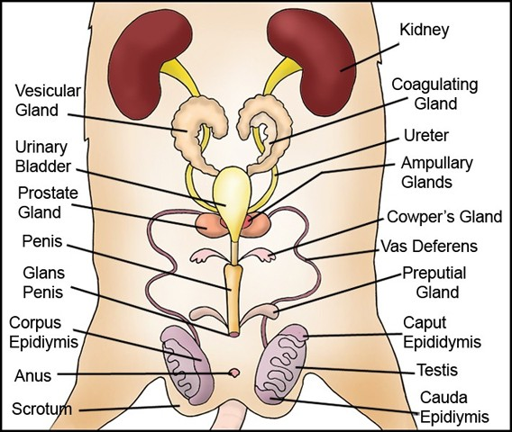

# C3.X - Rat Anatomy

## Important Features / Organs

### External Features (EF)

1. head (cranial)
2. neck (cervical)
3. trunk
	1. (a) thoracic
	2. (b) abdominal
	3. (c) sacral
4. tail
	1. contains **caudal vein**
5. nostrils
6. lips
7. teeth
8. eyes
9. eyelid
10. *vibrissae*
11. *pinnae*
12. digital pads
13. foot pads
14. urethral aperture ♀
15. vaginal aperture ♀
16. urogenital aperture ♂
17. scrotum ♂
18. anus
19. mammary *papillae* ♀

### Digestive System (DS)

1. incisors
2. molars
3. tongue
4. submaxillary glands
5. sublingual glands
6. hard palate
7. soft palate
8. pharynx
9. *diastema*
10. esophagus
11. liver (incl. 4 lobes)
12. bile duct
13. stomach
14. cardiac sphincter
15. pyloric sphincter
16. *rugae*
17. duodenum (small intestine)
18. jejunum (small intestine)
19. ileum (small intestine)
20. mesentry
21. caecum (large instestine)
22. colon (large intestine)
23. rectum
24. pancreas
25. pancreatic duct

### Respiratory System (RS)

1. glottis
2. epiglottis
3. trachea
4. pleura
5. larynx
6. bronchi
7. bronchiole
8. left lung
9. right ling
10. thyroid gland (also in endocrine)

### Circulatory System (CS)

1. heart
2. pericardium
3. atria (heart)
4. ventricles (heart)
5. *vena cavae*
6. pulmonary veins
7. pulomnary artery
8. thoracic aorta
9. abdominal aorta
10. internal jugular vein
11. external jugular vein
12. common carotid arteries
	1. (a) left
	2. (b) right
13. renal veins
14. renal artery
15. hepatic portal vein
16. spleen

### Endocrine System (EnS)

1. thyroid gland
2. adipose tissue (musculoskeletal system mainly)

### Excretory Sytem (ES)

1. kidney
2. bladder

### Reproductive System (RpS)

1. prostate gland ♂
2. penis ♂
3. *testis* ♂
4. epididymis ♂
5. *vas deferens* ♂
6. uterus ♀
7. oviduct ♀
8. ovary ♀
9. vagina ♀
10. clitoris ♀

## Diagrams

### External Features

### Guiding Diagrams (used to make final diagrams)

#### Digestive System (DS) + Bits of RS and CS

#### Circulatory System (CS) Arteries

#### Circulatory System (CS) Veins

#### Reproductive System (RS), Male ♂

#### Reproductive System (RS), Female ♀

#### Liver Lobes

### Rat Anatomy 1, Mainly DS

### Rat Anatomy 2, Mainly CS

### Rat Anatomy 3

### Rat Anatomy 4

i tried my best

## Useful Source

[Click here if you need a reference](https://docs.google.com/document/d/1UDbFE59hF-kAtIRHR6Y67BMAM0b_dFumeaYHb7dk1F4/edit?tab=t.0)

## Sources

- https://quizlet.com/91781328/anatomy-external-rat-anatomy-flash-cards/
- https://us-static.z-dn.net/files/d37/0b939f1d6162d74bb68f1e1cd41ec671.gif
- https://ratguide.com/breeding/anatomy/male_reproductive_system.php
- https://ratguide.com/breeding/anatomy/female_reproductive_system.php