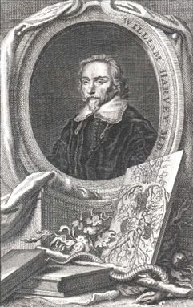

# C4.1 - Genetic Continuity

## Historical Information

- Since ancient times, people have recognized that certain traits are passed down along family lines
- A trait is any characteristic that can be passed or inherited from parent to offspring

## Genetics in Prehistory

People have been experimenting in genetics for tens of thousands of years

## The First Genetic Experiment

- Domestication of the family dog, *Canis familiaris*
- Mankind's oldest and best friend
- Over thousands of years, certain traits such as temperament and body size were selected for

## Agricultural Crops

Humans domesticate crops such as:

- barley
- wheat
- rice
- corn
- started agricultural revolution

## Early Views of Inheritance

### Aristotle (384-322 BC)

- Pangenes in blood contain a memory of each structure of human body
- "Bloodlines"
- "Blood relative"

### William Harvey (1578-1657)

Human embryos form in stages like any other animal such as frogs or fish

### Anton van Leeuwenhoek (1632-1723)

 - Observed human semen
 - Thought they represented preformed embryos
 - Father of microscopy

## Gregor Mendel (1822-1884)

- Christian monk
- Experimented w/ pea plants
- Proposed theory of particulate inheritance
	- modern concept of the gene
- Traits are determined by discrete units that are inherited intact through the generations

## Modern Genetics

DNA discovered to be the molecule responsible for genetic information in 1950s

## Biotechnology

- Human Genome Project complete sequence for entire human genome
- Has allowed rapid advancement in medicine, agriculture