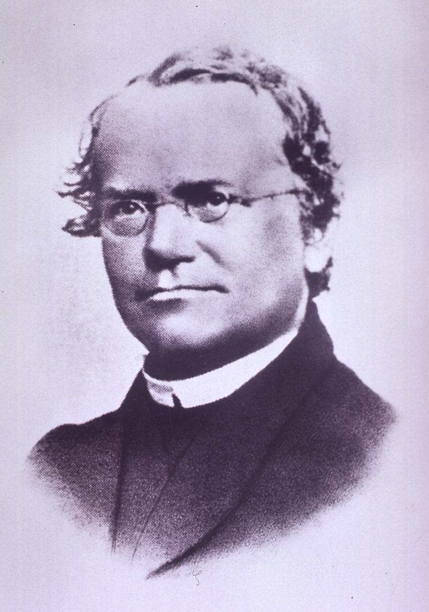
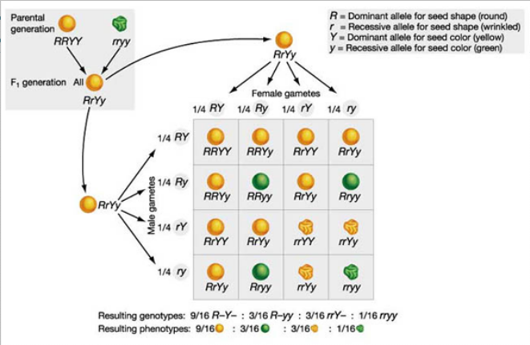
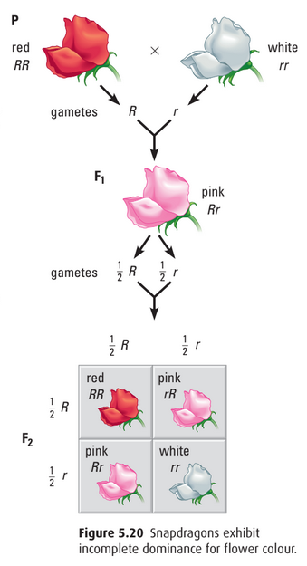
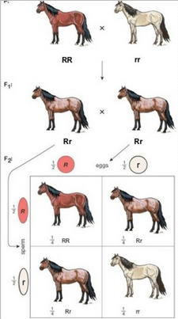

# C4.2 - Inheritance Patterns

## Intro to Mendelian Genetics

- Mid 19th century
- Gregor Mendel experimented with pea plants and discovered the basis of inheritance
- Mendel examined 7 diff. traits w/ 2 possible variations
- Obtained purebred plants that were true breeding
- **purebred traits:** organisms that share similar traits
- **true breeding:** traits constant throughout generations
- Pea plants excellent for study bcz. of:
	- availability
	- ease of growth
	- self-pollination
	- easily identifiable traits

## Genetic Terminology

- **P generation:** parent / base generation
- **F1 generation:** first filial generation (offspring from parent cross)
- **F2 generation:** F1 generation cross w/ themselves
- **hybrid:** cross between two different purebreds
- **monohybrid:** hybrid cross involving only one trait
- **trait:** characteristic of an organism
- **dominant trait:** trait that is always expressed (capital letter for genotype)
- **recessive trait:** trait that is present but not expressed (lowercase for genotype letter)
- **gene:** part of a chromosome that governs a trait
	- **gene:** units of inherited information that carry a code for specific traits or functions
- **allele:** a gene in an alternate form
- **homozygous:** purebred for a trait (all dominant or all recessive traits)
- **genotype:** genetic makeup of the organism
- **phenotype:** appearance of the trait in the organism (tall)

## The Principle of Dominance

When individuals of contrasting traits are crossed, only the dominant trait will be expressed.

## Crosses Involving One Trait (monohybrid cross)

- F2 generation has a 3:1 trait ratio
- 75% of offspring looking like one parent from P gen.
- 25% of offspring looking like other parent
- Inherited traits determined by pair of factors (genes)

## The Law of Segregation

Factors segregate in the gametes (sex cells), with
one in each gamete.

## Crosses Involving Two Traits (Dihybrid Cross)

- Phenotypic ratio of 9:3:3:1 common to other traits
	- Allowed Mendel to deduce law of independent assortment
- Test cross performed same way as monohybrid cross
	- w/ individual homozygous recessive for both traits

## The Law of Independent Assortment

The inheritance of alleles for one trait does not influence the inheritance of alleles for another trait.

## Other Patterns of Inheritance

Many traits not inherited in simple dominant / recessive relationship

### Incomplete Dominance

- Neither allele is dominant
- Offspring phenotype is halfway between parents
- Blending occurs in heterozygous offspring
- Does not display a Mendelian ratio

### Co-Dominance

- Both alleles are dominant
- Phenotype shows both characteristics
- i.e. chicken plumage, roan colour in horses

### Multiple Access

- **multiple access:** Genes have >2 alleles
- i.e. human blood types

|Phenotype (blood type)|Genotype|
|-|-|
|A|IA IA / IA i|
|B|IB IB / IB i|
|AB|IA IB|
|O|ii|

## Mendel's Significance

- 1865: "Experiments on Plant Hybridization" presented to Brunn National History Society
	- showed that it was possible to study biological processes by using genetic processes
	- function of genes themselves can be found by study of alleles
	- far-reaching ramifications in agriculture and medicine

### Mendel's Legacy

- His work went unrecognized for 35 years
	- Reason: Biology could not provide any real evidence for physical units within cells
	- ... that could correspond to Mendel’s genetic particles
- **"My time will come"**
	- Mendel quote above Mendel museum in Brno