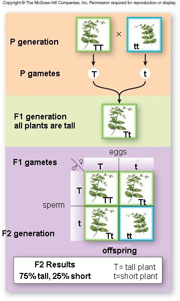

# C4.2 - Inheritance Patterns

## Intro to Mendelian Genetics

- Mid 19th century
- Gregor Mendel experimented with pea plants and discovered the basis of inheritance
- Mendel examined 7 diff. traits w/ 2 possible variations
- Obtained purebred plants that were true breeding
- Also conducted series of cross-fertilization experiments
- **inheritance patterns:** predictable patterns seen in transmission of traits from one generation to the next
- **hereditary:** inherited
- **purebred traits:** organisms that share similar traits
- **true breeding:** traits constant throughout generations when self-fertilized
	- when self-fertilized, it produces offspring identical in appearance to itself gen. after gen.
- Pea plants excellent for study bcz. of:
	- availability
	- ease of growth
	- self-pollination
	- easily identifiable traits

## Genetic Terminology

- **cross-fertilization:** sperm from one species fertilizes eggs 
- **P generation:** parent / base generation
- **F1 generation:** first filial generation (offspring from parent cross)
	- F stands for *filius* / *filia* (Latin son / daughter)
- **F2 generation:** F1 generation cross w/ themselves
- **hybrid:** cross between two different purebreds
- **monohybrid:** hybrid cross involving only one trait
- **dihybrid:** hybrid cross involving two traits
- **trait:** characteristic of an organism
- **dominant trait:** trait that is always expressed (capital letter for genotype)
- **recessive trait:** trait that is present but not expressed (lowercase for genotype letter)
- **gene:** part of a chromosome that governs a trait
	- **gene:** units of inherited information that carry a code for specific traits or functions
- **allele:** a gene in an alternate form
- **homozygous:** purebred for a trait (all dominant or all recessive traits)
- **heterozygous:** share a dominant and a recessive gene
- **genotype:** genetic makeup of the organism
- **phenotype:** appearance of the trait in the organism (tall)

## Mendelian Model of Inheritance

*Inheritance Patterns Observed by Mendel*

1. Genes can exist in different forms
	- i.e. peas have yellow-seed allele and green-seed allele
	- i.e. pea seed colour genes: yellow and green
2. For each gene, an individual organism inherits two alleles, one from each parent.
	- if 2 alleles same: **homozygous**
	- if 2 alleles different: **heterozygous**
3. An allele may be expressed as a trait or else hidden in a heterozygous allele
	- **dominant** allele determines the trait of heterozygous individual
	- **recessive** allele not expressed in heterozygous individual
	- 2 copies of recessive allele = expression of recessive trait
4. Each [[c4.4-cell-cycle|gamete]] carries only one allele for each hereditary trait
	- ... due to separation of allele pairs when gametes form
	- allele pairs reformed in fertilization

## Test Cross

**test cross:** cross of individual of own genotype but dominant phenotype w/ homozygous recessive individual

## The Principle of Dominance

When individuals of contrasting traits are crossed, only the dominant trait will be expressed.

## Crosses Involving One Trait (monohybrid cross)

- **monohybrid:** hybrid cross involving only one trait
- F2 generation has a 3:1 trait ratio
- 75% of offspring looking like one parent from P gen.
- 25% of offspring looking like other parent
- Inherited traits determined by pair of factors (genes)
- Probability displayed in **Punnet square** *(see F1 gametes)*
- **Punnett square:** diagram that shows the expected proportions of all possible outcomes of genetic cross
	- named after English geneticist Reginald C. Punnett (1875-1967)

|Phenotypes|Genotypes|
|-|-|
|3 tall|1 *TT*, 2 *Tt*|
|1 short|1 *tt*|

## The Law of Segregation

Factors (two alleles) segregate in the gametes (sex cells), with one in each gamete.

*Segregation in meiosis*

## Crosses Involving Two Traits (Dihybrid Cross)

- **dihybrid:** hybrid cross involving two traits
- Phenotypic ratio of 9:3:3:1 common to other traits
	- Allowed Mendel to deduce law of independent assortment
- Test cross performed same way as monohybrid cross
	- w/ individual homozygous recessive for both traits

|Phenotype|Genotype|
|-|-|
|9 round, yellow seeds|1 *RRYY*, 2 *RRYy*, 2 *RrYY*, 4 *RrYy*|
|3 round, green seeds|1 *RRyy*, 2 *Rryy*|
|3 wrinkled, yellow seeds|1 *rrYY*, 2 *rrYy*|
|1 wrinkled, green seed|1 *rryy*|

## The Law of Independent Assortment

The inheritance of alleles for one trait does not influence the inheritance of alleles for another trait.

## Other Patterns of Inheritance

Many traits not inherited in simple dominant / recessive relationship

### Incomplete Dominance

- **complete dominance:** one allele is expressed while the other isn't
- **incomplete dominance:** pattern where phenotype of heterozygous individual falls between 2 parental phenotypes
- Neither allele is dominant
- Offspring phenotype is halfway between parents
- Blending occurs in heterozygous offspring
- Does not display a Mendelian ratio

### Co-Dominance

- **co-dominance:** both alleles are dominant
- Phenotype shows both characteristics
- i.e. chicken plumage, roan colour in horses / cattle

### Multiple Access

- **multiple access:** Genes have >2 alleles
- i.e. human blood types

|Phenotype (blood type)|Genotype|
|-|-|
|A|IA IA / IA i|
|B|IB IB / IB i|
|AB|IA IB|
|O|ii|

## Traits Influenced by Multiple Genes

- **polygenic:** trait influenced by two or more genes
	- i.e. eye colour, skin colour, height of humans
	- most individuals in population will have intermediate phenotype

## Environment

- genotypes not affected by environment
- **environment;** conditions in which a cell or organism lives
- phenotypes (expression) may change depending on environment
	- i.e. tree's shape, size, and colour (sunlight and humidity)
	- i.e. flower colour (nutrients and pH of soil)
	- i.e. fur colour affected by temp. in Siamese cats
- In Humans
	- blood-cell counts
	- cholesterol levels
	- factors: infection, physical activity, altitude, diet, lifestyle, stress, toxins

## Mendel's Significance

- 1865: "Experiments on Plant Hybridization" presented to Brunn National History Society
	- showed that it was possible to study biological processes by using genetic processes
	- function of genes themselves can be found by study of alleles
	- far-reaching ramifications in agriculture and medicine

### Mendel's Legacy

- His work went unrecognized for 35 years
	- Reason: Biology could not provide any real evidence for physical units within cells
	- ... that could correspond to Mendel’s genetic particles
- **"My time will come"**
	- Mendel quote above Mendel museum in Brno