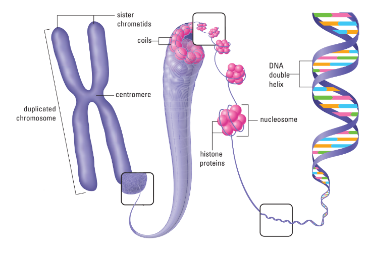

# C4.3 - Human Genetics & DNA

## Introduction

- Mendel’s Laws also apply to humans
- Inheritance in humans is a challenge to reconstruct
- Mutations in human DNA result in defective proteins
- Mutation may be
	- useful — *positive mutation*
	- harmful — *negative mutation*
	- with no effect — *neutral mutation*

## The Genetic Material

**deoxyribonucleic acid (DNA):** molecule that composes genetic material

### Packaging of DNA

- **chromatin:** mass of long fibers of DNA and protein (not usually visible w/ light microscope)
- **chromosome:** condensed DNA molecule that is visible under light microscope
	- 46 chromosomes in humans
	- 78 chromosomes in dogs
- DNA tightly coiled around proteins called **histones** 
- The DNA and histone packages form structures resembling beads, called **nucleosomes**

### Structure of DNA

- 1950s: Rosalind Franklin used X-ray crystallography to study DNA
- She found DNA had a helical shape
- Watson and Crick used her data to model DNA as a double helix
- Their model had sugar-phosphate backbones outside, nitrogenous bases inside

### Components of Model

- DNA consists of long chain of subunits called **nucleotides**
- Parts of *nucleotides*
	- **deoxyribose:** ring-shaped sugar
	- phosphate group
	- **nitrogenous base:** single / double ring of carbon and nitrogen atoms
- 4 Types of Nucleotides
	- differ only in their nitrogenous bases
	- **pyrimidines:** single-ring structures
		- thymine (T) and cytosine (C)
	- **purines:** larger, double-ring structures
		- adenine (A) and guanine (G)
- Molecular arrangement
	- Nucleotides are linked by covalent bonds between sugar and phosphate
	- **sugar-phosphate backbone:** repeating pattern of sugar-phosphate
	- **base pair:** bonds between specific nucleotides to hold them together
		- **complementary bases:** nucleotides that hold each other
		- A pairs to T
		- C pairs to G
		- hold DNA together
		- causes the DNA to twist into a double helix
	- Knowing one strand's sequence lets you determine the other
	- This explains how DNA is copied and passed on

### DNA Sequences

- nucleotides can form countless sequences of varying lengths
- sequences store genetic information that codes for proteins and cell functions

*DNA strand*

## Autosomal Recessive Inheritance

- **autosomal recessive inheritance:** recessive (masked) alleles carried on autosomes, **not** sex chromosomes
- **autosomes:** non-sex chromosomes, usually numbered
- harmful recessive mutations may persist masked by dominant trait
- i.e. Tay-Sachs disease
	- individuals lack lipid-degrading enzyme, fatal
- i.e. Albinism
	- eyes, skin, hair lack pigment melanin
	- individuals lack melanin-producing enzymes

## Codominant Inheritance

**codominant inheritance:** form of inheritance where two different forms of an allele are expressed equally

### Sickle-Cell Anemia

- individuals have hemoglobin defect
- **hemoglobin:** oxygen-carrying molecule in RBCs
- RBCs malformed and are prone to clogging capillaries starving tissues of oxygen
- HbA HbA: normal, RBCs often never sickle
- HbS HbS: severe, often fatal anemia, RBCs have sickle shape
- HbA HbS: no anemia; RBCs sickle only under low-oxygen conditions
- recessive gene may give **heterozygous advantage** to carriers
	- disorder found more frequently in African malarial zones

## Autosomal Dominant Inheritance

- **autosomal dominant inheritance:** dominant alleles carried on autosomes
- result from chance mutations;
- or symptoms arise after child-bearing age
- i.e. Huntington's Disease
	- deterioration of brain tissue
	- symptoms appear after age 35
	- genetic test available

## Incomplete Dominance

- **incomplete dominance:** phenotype midway between dominant and recessive
- i.e. hypercholesterolemia
	- individuals lack LDL receptor protein
	- results in high cholesterol levels
- Incomplete Dominance = Codominance?

## Sex-Linked Recessive Inheritance

- **sex-linked recessive inheritance:** recessive alleles carried over through sex chromosomes
- **sex chromosomes:** chromosomes that determine an individual's sex
- first discovered by Morgan in fruit flies
- trait carried mostly on X chromosome, seldom on Y
- much more prevalent in male populations
- crosses can be visualized with Punnet squares

### i.e. Colorblindness

*Ishihara colorblind test*

- affects 8% of men and 0.04% of women
- alleles for red and green found on X, but red is defective
- colorblind men cannot distinguish between red and green

### i.e. Hemophilia

- **hemophilia:** blood clotting disorder
- individuals lack clotting factors
- 3 forms
	- A — Factor XIII
	- B — Factor IX
	- C — Factor XI
- mild cuts or bruises may lead to extreme joint pain or death
- treated w/ injection of clotting factors
- tainted blood scandal
- studied in pedigree of Queen Victoria's family

#### Queen Victoria's Family Tree

## Genetic Testing

- **carrier testing:** test to determine if an individual carries a copy of a mutation that his / her children could inherit
- **presymptomaticing:** test that predicts the likelihood of developing a genetic condition
	- i.e. looking at family history
- **diagnostic genetic testing:** tests that confirms a diagnosis when symptoms for a particular genetic condition are present

### Prenatal Testing

- human embryo becomes fetus ~7 weeks after fertilization
- **prenatal testing:** test that detects small-scale mutations or chromosomal alterations in a fetus
- conditions often screened for
	- *spina bifida:* birth defect involving incomplete development of spinal cord
		- may result in protrusion from opening in spine
	- Down syndrome
- **amniocentesis:** prenatal screening performed between 14th to 20th week of pregnancy *(from textbook)*
	- physician inserts needle into mother's uterus
	- extracts some of amniotic fluid surrounding developing fetus
	- fetal cells tested for genetic disorders
- **chorionic villus sampling (CVS):** fetal testing of chorionic villi
	- **chorionic villi:** fingerlike projections that protrude from tissue surrounding fetus
	- physician extracts small sample of chorionic villi
	- by inserting narrow, flexible tube into mother's uterus
	- conducted as early as 8th week of pregnancy
- Risks of Complication
	- maternal bleeding
	- miscarriage
	- premature birth
	- usually conducted only if there is high risk of genetic disorder

### Newborn Screening

- **newborn screening:** testing a newborn infant for genetic disorders
- can detect some genetic disorders at birth through simple tests performed in hospitals
- screened for *phenylketonuria (PKU)*
	- inherited disorder
	- inability to break down naturally occurring amino acid phenylalanine
	- accumulation of phenylalanine may lead to severe developmental delays
	- diet low in phenylalanine usually sufficient to prevent onset of developmental delays