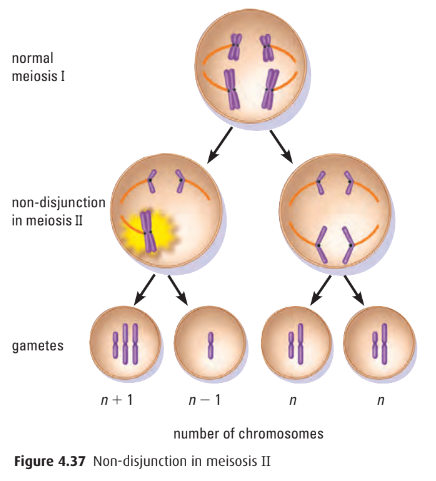

# C4.4 - Cell Cycle and Cellular Division

## Overview

- all cells come from pre-existing cells
	- conditions no longer favourable for abiogenesis
- two processes: *mitosis* and *meiosis*
- Reasons for Division
	- healing
	- tissue repair
	- growth
	- reproduction

## The Cell Cycle

- life of cell divided into stages
- cell cycle divided into interphase and division
- **interphase:** phase involving cell growth, duplication of chromosomes, prep. for cell division

### Interphase

- cell may spend as much as *90% of cell cycle* in interphase
- cell carries out metabolic processes and performs its reg. cellular activities
- **G1 phase**
	- cell prep. for division by
		- increasing protein supply
		- creating more cytoplasmic organelles
		- growing in size
- **S phase**
	- S stands for DNA *synthesis*
	- DNA of chromosomes duplicated
	- **chromatin:** mass of DNA and protein
	- **chromatid:** condensed chromatin fibers
	- **sister chromatid:** two identical joined copies of chromatids
	- **centromere:** region where 2 chromatids are joined tightly together
- **G2 Phase**
	- G stands for *gap*
	- cell "double checks" duplicated chromosomes for error
	- makes any needed repairs

## Mitosis (M Phase)

- **mitosis:** the stage of which the cell divides asexually
- **asexual reproduction:** reproduction of cells from one source
- Mother cell divides into two identical daughter cells
- Process found in unicellular and multicellular organisms
	- **somatic cells:** body cells
- involves division of nuclear material
- nuclear materials contains chromosomes
- **chromosomes:** condensed DNA
- chromosomes contain 2 identical sister chromatids held together w/ a centromere

### Prophase

*Early prophase, both images*

- chromosomes shorten and thicken, becoming visible
- sister chromatids still connected
- nuclear membrane dissolves
- nucleolus disappears
- **centriole:** organelle in animal cell responsible for producing and handling spindle fibers
- centrioles migrate to opposite poles
	- only in animal cells
- **spindle fibres** (a.k.a. *microtubules*) start to form
	- sister chromatids attach to spindle fibers

*Late prophase*

### Metaphase

- spindle fibers fully attached to centromeres
- spindle fibers pull on chromosomes
- chromosomes line up in middle of cell (equator)

### Anaphase

- spindle fibers pull chromosomes apart
- centromere splits and attached spindle fibers shorten
- pulls centromeres to opposite cell poles

### Telophase

- chromatids reach opposite ends of cell
- chromosomes begin to uncoil and turn back into chromatin
- nuclear membrane reforms
- cytokinesis begins (usually w/ telophase)

### Cytokinesis (not part of M)

- **cytokinesis:** division of cytoplasm and organelles
- in animals, occurs along cleavage furrow
	- ring of protein under plasma membrane contracts
	- ...making cleavage furrow deeper
	- **cleavage furrow:** region between 2 splitting animal cells *(refer to above diagram)*
- in plants, cell wall forms via cell plate between 2 daughter cells

### Errors in Mitosis

- mutations can disrupt normal process of mitosis
- mutations may arise through contact w/ carcinogens
- **carcinogen:** agents that cause cancer
	- may incl. toxic chemicals
	- radiation
	- viruses
- **oncogene:** gene w/ potential to cause cancer
- if certain oncogenes are altered, mitosis spirals out control resulting in tumour that can be...
	- **benign tumour:** non-cancerous tumour
	- **malignant tumor:** cancerous tumour
- oncogenes may also cause protein synthesis to increase unregulated

## Meiosis

- **sexual reproduction:** process in which 2 parents provide genetic material in order to produce offspring
- **meiosis:** form of cell division that produces 4 cells, each containing 1/2 the chromosomes as parent cell
- **karyotype:** display of all the chromosomes in a cell / individual (p. 108)
- many multicellular organisms, including humans reproduce sexually resulting in a combination of traits
- sex cells divide differently so that when a male and a female sex cell fuse,
	- they have the correct number of chromosomes

### Sex Cells (Gametes)

- **gametes:** male and female sex cells
	- $n$ or haploid, 23 in humans
	- $n=23$
- **zygote:** fused cell (sperm + egg)
	- $2n$ or diploid, 46 in humans
	- $2n=46$
- **homologous chromosomes** *(a.k.a. homologs):* chromosomes of each matching pair inherited from mother and father
	- each member of pair carries same series of genes controlling same inherited traits
- **diploid:** two sets of chromosomes ($2n$)
- **haploid:** single set of chromosomes ($n$)
- 2 cell divisions in meiosis
	- Meiosis I
	- Meiosis II

### Meiosis I (Reduction)

#### Interphase

Similar to mitosis

#### Prophase I

- most lengthy and complex phase
- homologous chromosomes line up
	- each duplicated chromosome pairs w/ corresponding homologous chromosome
	- result: tetrad
	- **tetrad:** 4 chromatids
- homologs contain same genes but are not identical
	- they may contain different alleles
- homologs then do *genetic recombination*
	- **genetic recombination:** exchange of DNA segments between homologs
- **independent assortment** of originally maternal and paternal DNA
- **independent assortment:** way in which chromosomes distributes during meiosis (random)

#### Crossing Over

- **crossing over:** exchange of genetic material between homologs
- crossing over occurs contributing to genetic variation
- **chiasmata:** visual manifestations of crossovers
	- Greek: crosses

#### Metaphase I

- spindle fibers attach to centromere
- homologous pairs pulled to equator where they line up together side by side

#### Anaphase I

- homologous chromosomes separate from tetrad and moves to opposite poles
- centromere does not divide as in mitosis
- sister chromatids remain attached at centromeres
- one chromosome from each pair now at each pole

#### Telophase I

- chromosomes uncoil
- spindle fibres disappear
- cytoplasm divides
- nuclear membrane reforms
- daughter cells diploid ($2n$)
- does not occur in all cells
	- if not, cell goes directly into meiosis II

### Meiosis II (Division)

#### Interkinesis

- period of rest, some growth
- chromosomal duplication does not occur

#### Meiosis II

- identical to mitosis
- daughter cells divide again
- 4 haploid cells ($n$) results (gametes)

## Errors in Meiosis

- **nondisjunction:** failure of chromosomes to separate properly during anaphase I or II
	- result: chromosome may be added or deleted from a gamete
	- can result in trisomy
	- cause not fully known
- **trisomy:** zygote has extra chromosome (3 copies of particular chromosome)
	- i.e. trisomy 21 or Down Syndrome
	- **Down syndrome:** condition which individual carries extra copy of chromosome 21
		- mild to severe developmental delays
		- characteristic facial features
		- below avg. height
		- may also incl. heart defects and impaired immune sys.
- **polyploidy:** organisms contain >2 sets of chromosomes
	- rare in animals
	- i.e. seedless grapes and watermelon

*The chance of having a baby with Down syndrome increases w/ the mother's age*

### Changes in Chromosome Structure

- **mutation:** any change to DNA of cell
- may spontaneously occur at any stage of development
- may or may not produce viable offspring depending on degree or severity

### Deletion of Deficiency

- **deletion:** portion of chromosome deleted
- causes: viruses, radiations, mutagens
- i.e. *Cri du chat* disorder
	- seg. of chromosome 5 missing
	- cancer cells often show chromosomal deletions

### Duplication

- **duplication:** gene sequence repeats in one or several chromosomes
- i.e. Fragile X Syndrome
	- duplication of genes in X chromosome
	- results in mental impairment and autism-like symptoms
	- affects 1/4,000 males and 1/8,000 females
	- leading cause of inherited mental impairment

### Inversion

- **inversion:** reversal of fragment of original chromosome
- 2 breaks occur in chromosome
- gene segment separates from chromosome and reinserts itself in reverse order
- generally viable and show no phenotypic abnormalities

### Translocation

- **translocation:** fragment of one homolog attaches to nonhomologous chromosome
- 2 nonhomologous chromosomes exchange parts
- most common are reciprocal translocations
- one segment is exchanged directly with another
- i.e. semisterility
	- half of gametes lethal to zygote
- i.e. Robertsonian translocation
	- 5% of all Down syndrome individuals
		- translocation Down syndrome
		- translocation between chr. 21 and a14
	- translocation of part of chromosome 14 and 21

## Sources

- https://cdn-academy.pressidium.com/academy/wp-content/uploads/2021/12/Stages-of-Mitosis.png