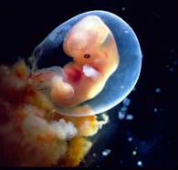
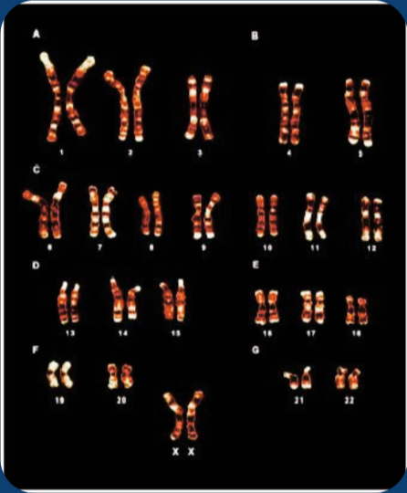
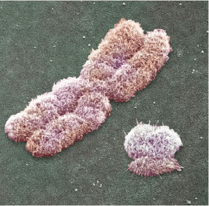
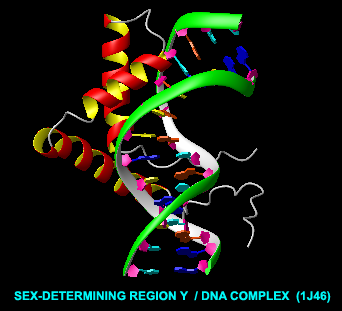
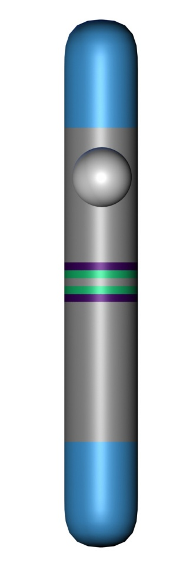
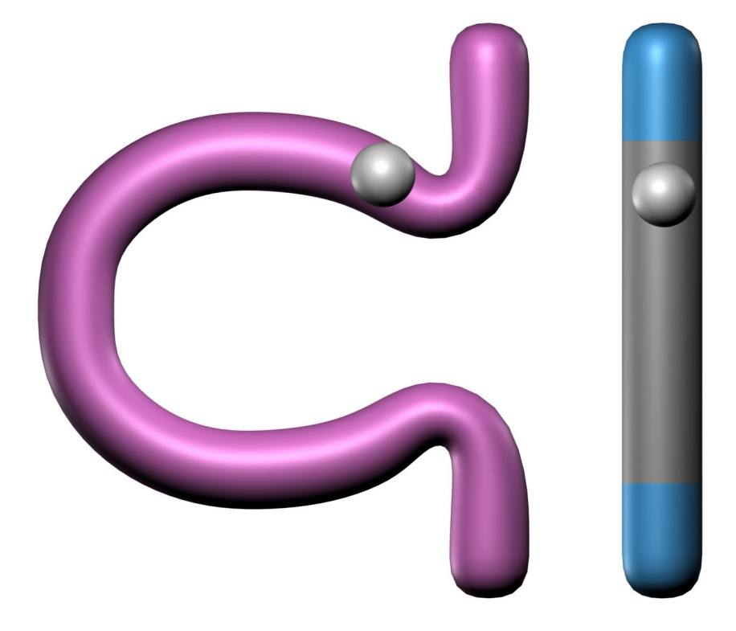
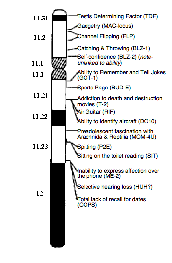
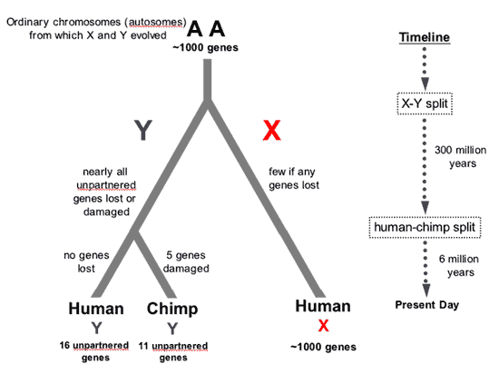
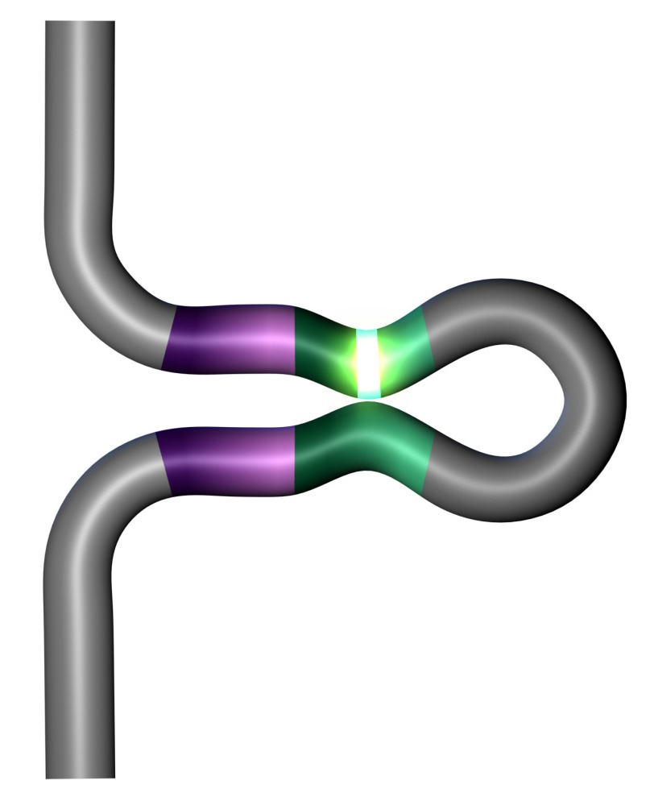

# C4.5 - The Nature of Sex

## Term Differentiation

- **sex:** biological term for male / female
- **gender:** societal term for male / female
- **sperm:** small gamete, male
- **pollen:** small gamete, male, plants
- **egg:** large gamete, female

## Sex Determination

- human sex distinguished at birth
- external sexual structures

### 6 Week Old Fetus

- no anatomic sexual difference
- bipotential gland
- in presence of hormones, gonad develops into
	- testes (male)
	- ovaries (female)

## Early Views of Sex Determination

- Aristotle summarized that sex is determined from
	- father's temperature; and
	- level of excitement
	- during sexual intercourse
- Apparently, higher temp. and excitement produced boys

### Advances?

- Sex and blending
- 1890s: sex determination during pregnancy and other environ. factors
	- what about fraternal twins?
- **fraternal twins:** twins where one is boy, other is girl

## 20th Century: Study of Chromosomes

*Chromosomes with XX sex pair*

- hereditary roles of chromosomes understood
- 1916: fruit flies
	- females: XX
	- males: XO or XY (O is placeholder)
- 1923: human sex chromosomes discovered

### Further Study

- 1959: Turner syndrome (XO)
	- very skinny
	- masculinized females
- Klinefelter (XXY)
	- feminized males
- sex determined by presence of Y chromosome

### Exceptions

*X chromosome (left) and Y chromosome (right)*

- XX Male
	- male sex structures
	- no sperm / eggs
- XY Female
	- female sex structures
	- no sperm / eggs
- 1 / 20,000 individuals

### Sex-Determining Gene

- XX male: carries part of Y on X
- XY female: missing SRY from Y
- Gene: Sex-determining region Y (SRY)

### Further Test

- mouse experiment
- XX egg injected w/ SRY gene &rarr; *transgenic egg*
	- implanted in uterus
- XX mouse born
	- appears male

## Y Chromosome

- broadly divided into 2 functional regions
- reg. 1: **recombinant regions**
	- at extreme tips of chromosome
- reg. 2: **non-recombinant region**
	- does not exchange genetic information with X

### Y Clones

- Implications for inheritance of Y along male lines
- Y reproduced clonally
- Allows genetic analysis of male line
- Y-chromosomal Adam, 60 000 years b.p.

### Genes on the Y

- contains other genes besides SRY
- cell housekeeping (16 genes)
- have counterparts on X
- sperm production
	- i.e. DAZ
	- 9 families
- total: 26 genes and gene families
- 1% of total genome

### Evolution of Y Chromosome

- sex determined by temp. in mammalian ancestor
- autosomes only
- X and Y nearly identical
- Y chromosomes 300 my in the making

### Rise of SRY

- SRY arises as mutation in X
- SRY commandeers X autosome
- Y stops swapping genes w/ X
- proto X and proto Y

### Development of Y

- Y undergoes series of inversions (internal recombination)
- results in removal of genes
- Y shortens
- cannot recombine w/ X (except at tips)
- Y periodically renewed by other autosome genes
- DAZL (spermatogenesis) gene donated from autosome
	- now called DAZ
	- 4 copies

## Sex Determination in Other Animals

### Reptiles

- **ectothermic:** cold-blooded
- temperature-dependent sex determination
- crocodiles
	- warm temps: males ♂
	- cool temps: females ♀
- turtles
	- warm temps: females ♀
	- cool temps: males ♂

### Birds

- **endothermic:** warm-blooded
- ZZ: males ♂
- ZY: females ♀
- actual mode of sex determ. unclear
- may be analogous to mammals

### Other Mammals

- endothermic
- **monotremes:** duck-billed platypus
	- 10 sex chromosomes
	- female: XXXXXXXXXX ♀
	- male: YYYYYXXXXX ♂
- complex segregation during meiosis

### Sex Determination in Mammals Evolutionarily

- Sex chromosomes necessary for mammals and other endothermic animals
- Mammals develop internally
	- exceptions: platypus
- Confers advantage onto offspring
- Temperature-related sex determination impossible