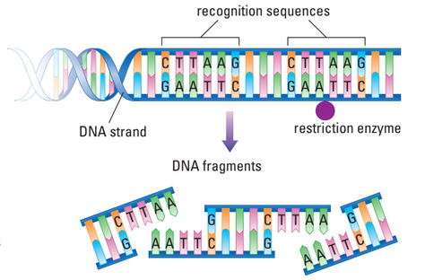
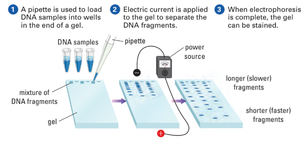
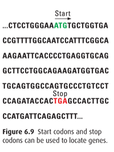
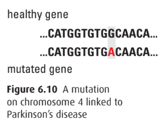
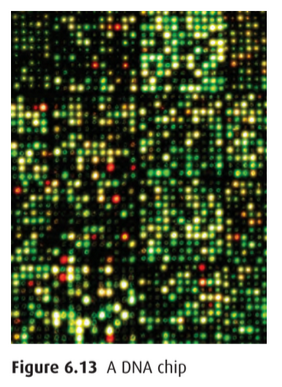
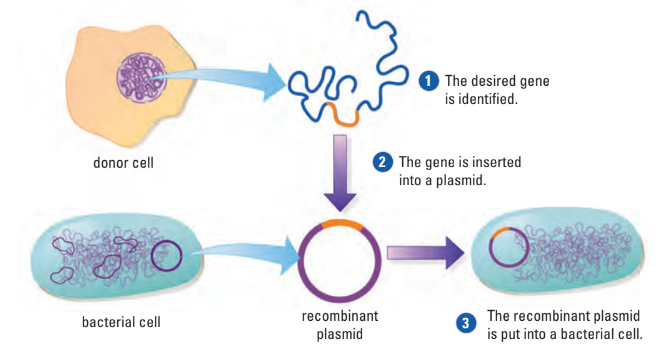
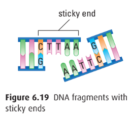
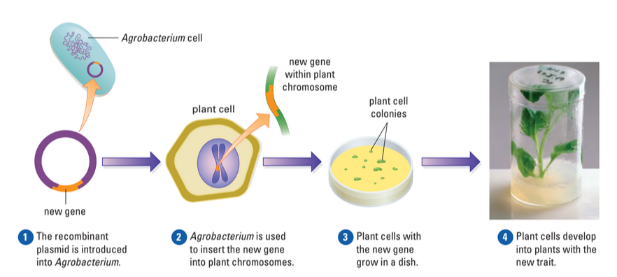
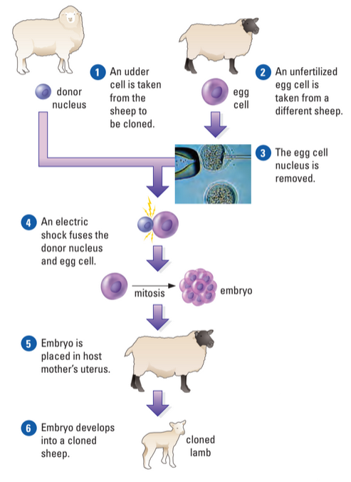
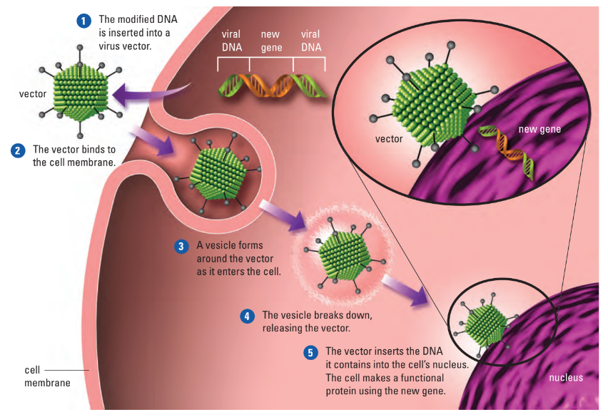

# C4.6 - Genetic Research

## Genomes

### Dissecting Genomes

- **genome:** full DNA sequence of an organism
- 1st draft of the human genome was completed in June 2000
	- results were published in *Nature and Science*
- the DNA sequenced came from multiple individuals
- only 1.5–2% of the genome contains actual genes
	- other 98% includes repeats, regulatory regions, and viral DNA

### Manipulating DNA

- most DNA molecules very long
	- must be cut into smaller pieces before analysis
	- "molecular scissors" to cut DNA: bacteria
- **restriction enzymes:** bacterial proteins that cut DNA wherever a particular nucleotide sequence occurs
	- **restriction fragments:** pieces of DNA cut out using restriction enzymes

#### Gel Electrophoresis

- once DNA cut, pieces sorted and analyzed using **gel electrophoresis**
- DNA gel (looks like gelatin slab) porous
- DNA fragments added to one end of gel
- electric current applied
- DNA negatively charged &rarr; move towards positive end
	- smaller fragments move faster
	- produces a band when done
- "DNA fingeprint"

#### DNA Sequencing

- **DNA sequencing:** determining the order of nucleotides in DNA
	- completing the human genome required hundreds of automated machines
	- machines use robotics to handle DNA
	- computer programs analyze sequencing data
- newer technologies are faster and more efficient
	- nucleotides are labeled with fluorescent dyes
	- DNA strands are separated and one is used as a template
	- complementary strand is built one nucleotide at a time
	- a flash of light signals which nucleotide is added
	- system records the sequence based on the light

### Bioinformatics

- **bioinformatics:** science of handling and analyzing biological data
- involves creation, devel., and operation of
	- databases
	- and other computational tools
	- to collect, organize, and interpret data
- i.e. nucleotide sequences stored in searchable DBs
	- researches then use programs to recognize and align overlapping nucleotide sequences
- DNA sequences from Human Genome Project housed in GenBank (public access)

#### Some Completed Genomes

| Species                                  | Genome Size (Base Pairs)  | Approximate Number of Genes  |
|------------------------------------------|---------------------------|------------------------------|
| *Haemophilus influenzae* (bacterium)     | 1.8 million               | 1,700                        |
| *Escherichia coli* (bacterium)           | 4.6 million               | 4,400                        |
| *Saccharomyces cerevisiae* (yeast)       | 12 million                | 6,200                        |
| *Caenorhabditis elegans* (nematode)      | 96 million                | 19,000                       |
| *Arabidopsis thaliana* (mustard plant)   | 125 million               | 25,500                       |
| *Drosophila melanogaster* (fruit fly)    | 170 million               | 13,700                       |
| *Oryza sativa* (rice plant)              | 470 million               | 60,000                       |
| *Mus musculus* (mouse)                   | 2.6 billion               | 30,000                       |
| *Rattus norvegicus* (lab rat)            | 2.8 billion               | 25,000                       |
| *Macaca mulatta* (macaque)               | 2.9 billion               | 22,000                       |
| *Pan troglodytes* (chimpanzee)           | 3.1 billion               | 22,000                       |
| *Homo sapiens* (human)                   | 3.2 billion               | 21,000                       |

### Genomics

- **genomics:** study of genomes
- goal of genomics: map location of genes within genome
	- key identifier regions used to map genes; incl.
		- switches that turn genes on or off
		- start codons at beginning of genes
		- stop codons at end of genes

- coding regions of genes contain instructions for making proteins
	- i.e. alpha globulin gene has a coding region for hemoglobin
- noncoding regions help locate genes but their roles are not fully known
- gene mapping helps identify disease-related genes
	- i.e. Parkinson's disease which affects brain cell function
	- symptoms include tremors, speech problems, and muscle rigidity
	- before the Human Genome Project, genetic links to Parkinson's were unclear
	- researchers compared DNA of people with and without Parkinson's
	- a mutation in a specific gene was found in many affected individuals
	- this gene is also linked to Alzheimer's disease
	- other gene mutations connected to Parkinson's have been found

### Model Organisms

- cross-species comparisons help reveal gene functions
- similar gene sequences in different species suggest similar roles
- human genes can be studied by comparing them to known mouse genes
- genes related to smell in rats and song-learning in birds are similar to a human gene linked to Parkinson's
- studying these animals gives clues about gene function in humans
- this knowledge supports the development of treatments and cures
- functional genomics focuses on understanding gene functions
- researchers use model organisms like mice to study gene inheritance
- common model organisms include *E. coli*, *C. elegans*, yeast, fruit flies, and mice
- mice are especially useful because their development and genetics are well understood
- mice and humans have similar genome sizes and gene counts
- most human genes have a matching gene in mice

### Applying Genomics

- **DNA chip:** small glass wafer or slide spotted with an array of single-stranded DNA fragments
	- some spots, i.e. could contain DNA w/ cystic fibrosis causing mutations
- DNA chip process
	1. person provides DNA sample
	2. sample cut into pieces
	3. pieces tagged w/ fluorescent dye to make series of probes
	4. wherever there is match between probe and spot of DNA on chip, probe will bind
	5. fluorescent tag marks spot
- Uses
	- DNA chips can be made to span large regions of human genome
	- personalized health care
	- i.e. sequencing rice genome to make rice more nutritious

## Genetic Engineering

### Biotechnology

- **biotechnology:** use of organisms to make useful products
	- i.e. prod. of vaccines, antibiotics, hormones, food products, enzymes in detergents
- **genetic engineering:** intentional production of new genes and alternation of genomes by sub. / intro. of new genetic material
	- i.e. altering *E. coli* to make blue dye for jeans

### Genetic Recombination

- 1940s: American scientists Joshua Lederberg and Edward Tatum demonstrated that 2 bacterial cells form a direct connection
	- *transfer of DNA*
	- viruses can also carry bacterial genes from one bacteria to another
- **recombinant DNA technology:** combination of genes from diff. sources into single DNA molecule

### Making Recombinant DNA

- **plasmid:** small circular DNA molecule separate from larger bacterial chromosome
	- bacteria share plasmids
- Steps for Making
	- plasmid removed from bacterial cell
	- desired gene inserted into plasmid
	- **recombinant plasmid:** modified plasmid w/ desired gene inserted
	- recombinant plasmid put back into bacterial cell

#### "Cutting and Pasting" DNA

- making a recombinant plasmid involves cutting and pasting DNA
- desired gene is cut from a longer DNA strand using restriction enzymes
- restriction enzymes make staggered cuts creating sticky ends
- sticky ends are single-stranded and can bind to complementary sequences
- sticky ends help join plasmid DNA with other DNA fragments
- **DNA ligase** pastes the sticky ends together to form a complete molecule
- ***Cloning Recombinant DNA***
	- **gene cloning:** process of putting recombinant plasmid into bacterial cell to make copies of particular gene

## Applications

### Genetically Modified Organisms (GMOs)

- **genetically modified organism:** organism w/ genetic material that has been altered through genetic engineering
- **transgenic:** acquired genes from different type of organism
- i.e. GMO bacteria *Caulobacter crescentus* w/ surface molecules that bind heavy metals
	- remove heavy metals from drinking water

### Producing Genetically Modified Plants

- recombinant DNA used to improve crop traits
- GM plants can have delayed ripening, better nutrition, stress tolerance, or disease resistance
- genetic engineering often replaces traditional breeding
- most useful when traits are controlled by few genes
- new plants can be grown from a single adult plant cell
- engineered cells can grow into full plants with new traits
- *Agrobacterium* plasmids used to insert genes into plant cells
- transgenic plants include tomato, potato, tobacco, soybean, walnut, apple
- DNA gun can insert genes into plants like corn

#### Pest-Resistant Crops

- i.e. incorporation of genes for bacterial toxin produced by *Bacillus thuringiensis*
- BT kills specific insects like corn borers and cotton bollworms
	- w/o harming humans or most other animals
	- upon ingestion, insect's enzymes convert toxin into smth. that kills it
- other useful traits
	- tolerance to herbicides (weed killers)
	- resistance to viral infections

#### Plants as Factories

- GM plants used for making
	- pharmaceuticals
	- industrial products
	- biofuels
- i.e. GM safflowers (*Charthamus tinctorius*)
	- produces wide variety of products
	- like easily purifiable insulin
	- insulin extracted from oily seeds of plant

### Producing Genetically Modified Animals

- more difficult than GM plants
- **in vitro fertilization:** fertilizing an egg in a test tube or laboratory dish, then transferring embryo to uterus (womb)
- many attempts needed before fertilized egg incorporates DNA from another source

#### Farm Animals and "Pharming"

- some goals: better-quality wool, leaner meat, fast-growing fish
- **"pharming":** producing pharmaceuticals from transgenic animals
	- most cases: add gene for desired human protein to genome of farm mammal
	- added in such a way so that desired protein secreted via milk
	- good method when human gene not expressed well in bacteria

### Animal Cloning

- entire genomes can be cloned, not just individual genes
- first cloned mammal was Dolly the sheep in 1996
- since then, many mammals have been cloned including goats, cows, pigs, and cats
- animal cloning uses **nuclear transplantation**
	- donor nucleus replaces nucleus of an unfertilized egg
	- egg develops into a clone with the same genome as the donor
- cloning from somatic cells has low success and health risks
- cloning can mass-produce animals with desired traits
- faster than traditional breeding
- useful for preserving traits in GM animals without further genetic changes

*Process of cloning a sheep*

### Regulating Use of GMOs

- concerns exist about safety of GM crops and animals
- GM salmon might escape and compete with wild salmon
- GM crops could transfer genes to wild plants
- herbicide resistance could create hard-to-control super weeds
- GM plants sometimes found in non-GM fields
- pest-resistant GM crops not shown to pose major health or environmental risks
- strict regulations recommended for growing and using GM crops
- potential unknown risks to human health from GM products
- some consumers want clear labelling of GM foods
- pharmaceuticals from transgenic animals may differ from natural proteins
- GM proteins used in food or medicine must be tested for safety
- testing ensures GMOs don’t cause allergic or harmful reactions

#### Regulatory Agencies

- governments worldwide working to ensure biotech safety
- Canadian Food Inspection Agency (CFIA) regulates environmental release of novel plants in Ca.
- CFIA and Health Canada assess safety of biotech agricultural products
	- includes food for people and feed for livestock
- product developers must follow regulations and guidelines
- detailed product information must be submitted for evaluation

### Genetic Technology in Medical Research

- model organisms used to study gene function and develop therapies
- genes can be added or deleted at specific genome locations
- knockout mice have a gene intentionally disabled
- knockout technique helps identify gene functions
- altered mice are bred to create lines with specific traits
- knockout mice used to study obesity by targeting the ob gene
- mice with mutated ob gene overeat and become obese
- ob gene codes for leptin, a protein that signals fullness to the brain
- leptin affects fat and glucose metabolism
- research on leptin supports development of treatments for obesity disorders
- knockout mice also help study inherited diseases
- used to test new drugs and therapies

### Gene Therapy

- one form of treatment for one suffering from disease caused by missing / malfunctioning gene
- **gene therapy:** process of supplementing or replacing gene in order to treat medical condition
- gene therapy involves delivering functional genes to affected cells
	- i.e. viruses can be engineered to carry therapeutic genes
	- modified viruses insert the gene into the patient’s DNA
	- other delivery methods include transplants, injections, and inhalers
- gene therapy being studied for diseases like Huntington’s, skin cancer, and cystic fibrosis
- therapies are experimental and high-risk
- challenges include targeting the right cells and ensuring long-term effectiveness
- researchers aim to make delivery methods safe and reliable

*Process of gene therapy using a virus*